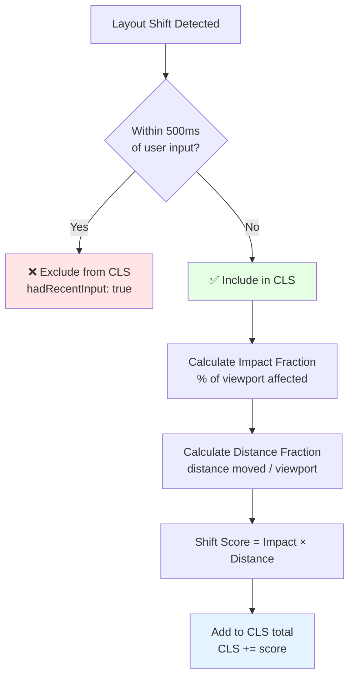
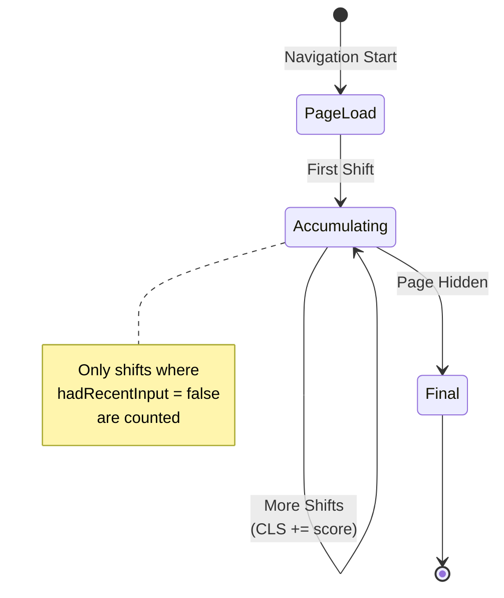

# Cumulative Layout Shift (CLS)

### Overview

Quick check for [Cumulative Layout Shift](https://web.dev/articles/cls), a Core Web Vital that measures visual stability. CLS tracks how much the page layout shifts unexpectedly during its lifetime, providing a single score that represents the cumulative impact of all unexpected layout shifts.

**Why this matters:**

Unexpected layout shifts are frustrating and can cause users to click the wrong element or lose their reading position. CLS directly impacts user experience and is a ranking factor for Google Search. Common causes include images without dimensions, web fonts, and dynamically injected content.

**CLS Rating Thresholds:**

| Rating | Score | Meaning |
|--------|-------|---------|
| 🟢 Good | ≤ 0.1 | Stable, minimal shifting |
| 🟡 Needs Improvement | ≤ 0.25 | Noticeable shifting |
| 🔴 Poor | > 0.25 | Significant layout instability |

> **Need to debug?** Use [Layout Shift Tracking](/Interaction/Layout-Shift-Loading-and-Interaction) to identify which elements are causing shifts.

### Snippet

```js copy
// CLS Quick Check
// https://webperf-snippets.nucliweb.net

(() => {
  let cls = 0;

  const valueToRating = (score) =>
    score <= 0.1 ? "good" : score <= 0.25 ? "needs-improvement" : "poor";

  const RATING = {
    good: { icon: "🟢", color: "#0CCE6A" },
    "needs-improvement": { icon: "🟡", color: "#FFA400" },
    poor: { icon: "🔴", color: "#FF4E42" },
  };

  const logCLS = () => {
    const rating = valueToRating(cls);
    const { icon, color } = RATING[rating];
    console.log(
      `%cCLS: ${icon} ${cls.toFixed(4)} (${rating})`,
      `color: ${color}; font-weight: bold; font-size: 14px;`
    );
  };

  const observer = new PerformanceObserver((list) => {
    for (const entry of list.getEntries()) {
      if (!entry.hadRecentInput) {
        cls += entry.value;
      }
    }
  });

  observer.observe({ type: "layout-shift", buffered: true });

  // Show current CLS
  logCLS();

  // Update on visibility change (final CLS)
  document.addEventListener("visibilitychange", () => {
    if (document.visibilityState === "hidden") {
      observer.takeRecords();
      console.log("%c📊 Final CLS (on page hide):", "font-weight: bold;");
      logCLS();
    }
  });

  // Expose function for manual check
  window.getCLS = () => {
    logCLS();
    return cls;
  };

  console.log(
    "   Call %cgetCLS()%c anytime to check current value.",
    "font-family: monospace; background: #f3f4f6; padding: 2px 4px;",
    ""
  );
})();
```

### Understanding CLS

CLS measures the sum of all unexpected layout shifts that occur during the page's lifetime:

```
CLS = Σ (impact fraction × distance fraction)
```

- **Impact fraction**: How much of the viewport was affected
- **Distance fraction**: How far elements moved

**What's excluded:**
- Shifts within 500ms of user input (`hadRecentInput: true`)
- Shifts caused by scroll anchoring

**CLS Calculation Flow:**



**CLS Lifecycle:**



### Common Causes

| Cause | Solution |
|-------|----------|
| Images without dimensions | Add `width` and `height` attributes |
| Ads/embeds without space | Reserve space with CSS |
| Dynamic content injection | Reserve space or insert below fold |
| Web fonts (FOIT/FOUT) | Use `font-display: optional` or `size-adjust` |

### Further Reading

- [Cumulative Layout Shift (CLS)](https://web.dev/articles/cls) | web.dev
- [Optimize CLS](https://web.dev/articles/optimize-cls) | web.dev
- [Layout Shift Tracking](/Interaction/Layout-Shift-Loading-and-Interaction) | Detailed debugging snippet
