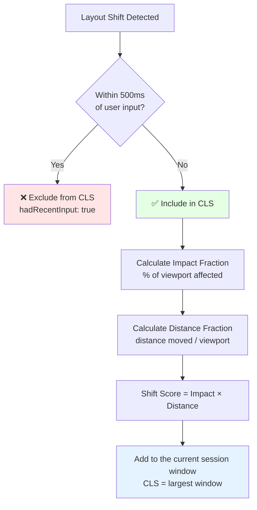
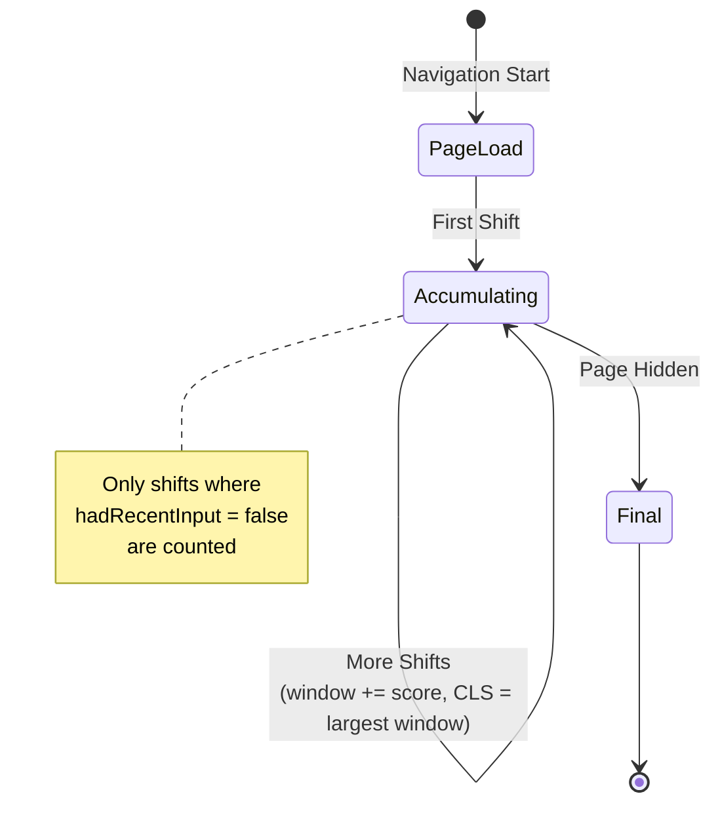

import snippet from '../../snippets/CoreWebVitals/CLS.js?raw'
import { Snippet } from '../../components/Snippet'
import { Callout } from 'nextra/components'

# Cumulative layout shift (CLS)

Quick check for [Cumulative Layout Shift](https://web.dev/articles/cls), a Core Web Vital that measures visual stability. CLS tracks how much the page layout shifts unexpectedly during its lifetime, providing a single score that represents the largest burst of unexpected layout shifts.

### Why this matters

Unexpected layout shifts are frustrating and can cause users to click the wrong element or lose their reading position. CLS directly impacts user experience and is a ranking factor for Google Search. Common causes include images without dimensions, web fonts, and dynamically injected content.

### CLS rating thresholds

| Rating | Score | Meaning |
|--------|-------|---------|
| 🟢 Good | ≤ 0.1 | Stable, minimal shifting |
| 🟡 Needs Improvement | ≤ 0.25 | Noticeable shifting |
| 🔴 Poor | > 0.25 | Significant layout instability |

<Callout type="info">
**Need to debug?** Use [Layout Shift Tracking](/Interaction/Layout-Shift-Loading-and-Interaction) to identify which elements are causing shifts.
</Callout>

### Snippet

<Snippet code={snippet} />

### Understanding CLS

CLS groups unexpected layout shifts into session windows and reports the largest window. A window starts at a shift and continues while each new shift arrives less than 1 second after the previous one, up to 5 seconds in total. The score of a window is the sum of its shift scores:

```
shift score = impact fraction × distance fraction
CLS = max over session windows of Σ shift scores
```

- **Impact fraction**: How much of the viewport was affected
- **Distance fraction**: How far elements moved

### What's excluded
- Shifts within 500ms of user input (`hadRecentInput: true`)
- Shifts caused by scroll anchoring

### CLS calculation flow


```mermaid
flowchart TD
    Start[Layout Shift Detected] --> Recent{Within 500ms<br/>of user input?}

    Recent -->|Yes| Exclude[❌ Exclude from CLS<br/>hadRecentInput: true]
    Recent -->|No| Calculate[✅ Include in CLS]

    Calculate --> Impact[Calculate Impact Fraction<br/>% of viewport affected]
    Impact --> Distance[Calculate Distance Fraction<br/>distance moved / viewport]
    Distance --> Score[Shift Score = Impact × Distance]
    Score --> Accumulate[Add to the current session window<br/>CLS = largest window]

    style Exclude fill:#FFE5E5
    style Calculate fill:#E5FFE5
    style Accumulate fill:#E5F2FF
```

### CLS lifecycle


```mermaid
stateDiagram-v2
    [*] --> PageLoad: Navigation Start
    PageLoad --> Accumulating: First Shift
    Accumulating --> Accumulating: More Shifts<br/>(window += score, CLS = largest window)
    Accumulating --> Final: Page Hidden
    Final --> [*]

    note right of Accumulating
        Only shifts where<br/>hadRecentInput = false<br/>are counted
    end note
```

### Common causes

| Cause | Solution |
|-------|----------|
| Images without dimensions | Add `width` and `height` attributes |
| Ads/embeds without space | Reserve space with CSS |
| Dynamic content injection | Reserve space or insert below fold |
| Web fonts (FOIT/FOUT) | Use `font-display: optional` or `size-adjust` |

### Browser support

| API | Chrome | Firefox | Safari | Edge |
|-----|--------|---------|--------|------|
| Layout Instability API | ✅ 77 | ❌ | ❌ | ✅ 79 |
| PerformanceObserver | ✅ 52 | ✅ 57 | ✅ 11 | ✅ 79 |

### Further reading

- [Cumulative Layout Shift (CLS)](https://web.dev/articles/cls) | web.dev
- [Optimize CLS](https://web.dev/articles/optimize-cls) | web.dev
- [Layout Shift Tracking](/Interaction/Layout-Shift-Loading-and-Interaction) | Detailed debugging snippet
