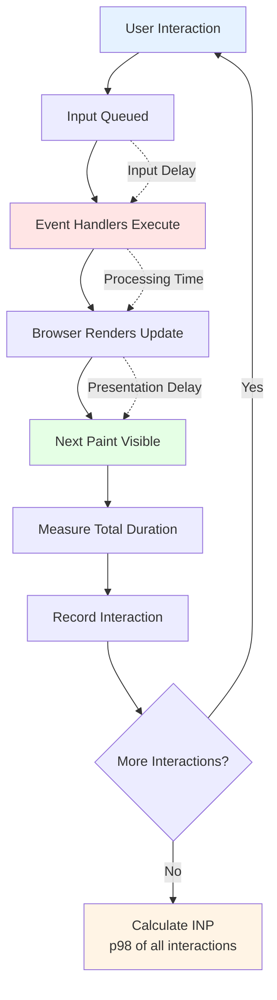

# Interaction to Next Paint (INP)

### Overview

Tracks [Interaction to Next Paint](https://web.dev/articles/inp), a Core Web Vital that measures responsiveness. INP evaluates how quickly a page responds to user interactions throughout the entire page visit, replacing First Input Delay (FID) as a Core Web Vital in March 2024.

**Why this matters:**

INP directly measures user frustration. When users click a button and nothing happens for seconds, they abandon tasks. Unlike FID which only measured first interaction, INP tracks ALL interactions, making it a more comprehensive responsiveness metric and a key ranking factor for Google Search.

**INP Rating Thresholds:**

| Rating | Time | Meaning |
|--------|------|---------|
| 🟢 Good | ≤ 200ms | Responsive, feels instant |
| 🟡 Needs Improvement | ≤ 500ms | Noticeable delay |
| 🔴 Poor | > 500ms | Slow, frustrating experience |

> **Need to debug?** Use [Long Animation Frames](/Interaction/Long-Animation-Frames) to identify which scripts are blocking interactions.

**INP Measurement Approach:**



**INP vs FID Comparison:**

| Aspect | FID (Old) | INP (New) |
|--------|-----------|-----------|
| **Interactions measured** | Only first interaction | All interactions |
| **What's measured** | Input delay only | Full duration to paint |
| **Calculation** | Single value | 98th percentile |
| **Reflects real UX** | Partial | Complete |
| **Status** | Deprecated (March 2024) | Active Core Web Vital |

### Snippet

```js copy
// INP (Interaction to Next Paint) Tracking
// https://webperf-snippets.nucliweb.net

(() => {
  const interactions = [];
  let inpValue = 0;
  let inpEntry = null;

  const valueToRating = (ms) =>
    ms <= 200 ? "good" : ms <= 500 ? "needs-improvement" : "poor";

  const RATING = {
    good: { icon: "🟢", color: "#0CCE6A" },
    "needs-improvement": { icon: "🟡", color: "#FFA400" },
    poor: { icon: "🔴", color: "#FF4E42" },
  };

  const formatMs = (ms) => `${Math.round(ms)}ms`;

  // Calculate INP (98th percentile of all interactions)
  const calculateINP = () => {
    if (interactions.length === 0) return { value: 0, entry: null };

    // Sort by duration
    const sorted = [...interactions].sort((a, b) => b.duration - a.duration);

    // Get 98th percentile (or worst if < 50 interactions)
    const index = interactions.length < 50
      ? 0
      : Math.floor(interactions.length * 0.02);

    return {
      value: sorted[index].duration,
      entry: sorted[index],
    };
  };

  // Format interaction name
  const getInteractionName = (entry) => {
    const target = entry.target;
    if (!target) return entry.name;

    let selector = target.tagName.toLowerCase();
    if (target.id) selector += `#${target.id}`;
    else if (target.className && typeof target.className === "string") {
      const classes = target.className.trim().split(/\s+/).slice(0, 2).join(".");
      if (classes) selector += `.${classes}`;
    }

    return `${entry.name} → ${selector}`;
  };

  // Get phase breakdown (requires LoAF support)
  const getPhaseBreakdown = (entry) => {
    const phases = {
      inputDelay: 0,
      processingTime: 0,
      presentationDelay: 0,
    };

    if (entry.processingStart && entry.processingEnd) {
      phases.inputDelay = entry.processingStart - entry.startTime;
      phases.processingTime = entry.processingEnd - entry.processingStart;
      phases.presentationDelay = entry.duration - phases.inputDelay - phases.processingTime;
    }

    return phases;
  };

  // Observer for interactions
  const observer = new PerformanceObserver((list) => {
    for (const entry of list.getEntries()) {
      // Only track interactions with interactionId (meaningful interactions)
      if (!entry.interactionId) continue;

      // Avoid duplicate entries for the same interaction
      const existing = interactions.find(
        (i) => i.interactionId === entry.interactionId
      );

      if (!existing || entry.duration > existing.duration) {
        // Remove old entry if exists
        if (existing) {
          const idx = interactions.indexOf(existing);
          interactions.splice(idx, 1);
        }

        interactions.push({
          name: entry.name,
          duration: entry.duration,
          startTime: entry.startTime,
          interactionId: entry.interactionId,
          target: entry.target,
          processingStart: entry.processingStart,
          processingEnd: entry.processingEnd,
          formattedName: getInteractionName(entry),
          phases: getPhaseBreakdown(entry),
          entry,
        });
      }

      // Recalculate INP
      const result = calculateINP();
      inpValue = result.value;
      inpEntry = result.entry;
    }
  });

  // Observe event timing
  observer.observe({
    type: "event",
    buffered: true,
    durationThreshold: 16, // Only interactions > 16ms (1 frame)
  });

  // Log INP summary
  const logINP = () => {
    const rating = valueToRating(inpValue);
    const { icon, color } = RATING[rating];

    console.group(
      `%cINP: ${icon} ${formatMs(inpValue)} (${rating})`,
      `color: ${color}; font-weight: bold; font-size: 14px;`
    );

    console.log("");
    console.log(`%c📊 Analysis:`, "font-weight: bold;");
    console.log(`   Total interactions tracked: ${interactions.length}`);
    console.log(`   INP (98th percentile): ${formatMs(inpValue)}`);

    if (inpEntry) {
      console.log("");
      console.log(`%c🎯 Worst Interaction (INP):`, "font-weight: bold; color: ${color};");
      console.log(`   Event: ${inpEntry.formattedName}`);
      console.log(`   Duration: ${formatMs(inpEntry.duration)}`);

      // Element attribution
      if (inpEntry.target) {
        console.log(`   Target Element:`, inpEntry.target);

        // Get element path for better context
        const getElementPath = (el) => {
          if (!el) return "";
          const parts = [];
          let current = el;
          while (current && current !== document.body && parts.length < 5) {
            let selector = current.tagName.toLowerCase();
            if (current.id) selector += `#${current.id}`;
            else if (current.className && typeof current.className === "string") {
              const classes = current.className.trim().split(/\s+/).slice(0, 2).join(".");
              if (classes) selector += `.${classes}`;
            }
            parts.unshift(selector);
            current = current.parentElement;
          }
          return parts.join(" > ");
        };

        const path = getElementPath(inpEntry.target);
        if (path) {
          console.log(`   Element Path: ${path}`);
        }
      }

      // Phase breakdown
      const phases = inpEntry.phases;
      if (phases.inputDelay > 0) {
        console.log("");
        console.log(`%c⏱️ Phase Breakdown:`, "font-weight: bold;");
        console.log(`   Input Delay: ${formatMs(phases.inputDelay)}`);
        console.log(`   Processing Time: ${formatMs(phases.processingTime)}`);
        console.log(`   Presentation Delay: ${formatMs(phases.presentationDelay)}`);

        // Visual bar
        const total = inpEntry.duration;
        const barWidth = 40;
        const inputBar = "▓".repeat(Math.round((phases.inputDelay / total) * barWidth));
        const processBar = "█".repeat(Math.round((phases.processingTime / total) * barWidth));
        const presentBar = "░".repeat(Math.round((phases.presentationDelay / total) * barWidth));
        console.log(`   ${inputBar}${processBar}${presentBar}`);
        console.log("   ▓ Input  █ Processing  ░ Presentation");
      }

      // Recommendations based on phases
      if (inpValue > 200 && phases.inputDelay > 0) {
        console.log("");
        console.log("%c💡 Recommendations:", "color: #3b82f6; font-weight: bold;");

        if (phases.inputDelay > 100) {
          console.log("   • High input delay - Break up long tasks before interaction");
        }
        if (phases.processingTime > 200) {
          console.log("   • Long processing time - Optimize event handlers");
          console.log("   • Consider debouncing, use requestIdleCallback for non-critical work");
        }
        if (phases.presentationDelay > 100) {
          console.log("   • High presentation delay - Reduce render complexity");
          console.log("   • Batch DOM updates, use content-visibility");
        }
      }
    }

    // Slow interactions breakdown
    const slowInteractions = interactions
      .filter((i) => i.duration > 200)
      .sort((a, b) => b.duration - a.duration)
      .slice(0, 10);

    if (slowInteractions.length > 0) {
      console.log("");
      console.log(`%c🐌 Slow Interactions (> 200ms):`, "color: #ef4444; font-weight: bold;");
      console.table(
        slowInteractions.map((i) => ({
          Event: i.formattedName,
          "Duration (ms)": Math.round(i.duration),
          "Start Time (ms)": Math.round(i.startTime),
        }))
      );

      // Show element attribution for top 3
      console.log("");
      console.log(`%c🎯 Element Attribution (top 3):`, "font-weight: bold;");
      slowInteractions.slice(0, 3).forEach((interaction, idx) => {
        console.log(`   ${idx + 1}. ${interaction.formattedName} (${Math.round(interaction.duration)}ms)`);
        if (interaction.target) {
          console.log(`      Element:`, interaction.target);
        } else {
          console.log(`      Element: (no target available)`);
        }
      });
    }

    // Interaction types breakdown
    const byType = {};
    interactions.forEach((i) => {
      const type = i.name;
      if (!byType[type]) {
        byType[type] = { count: 0, totalDuration: 0, maxDuration: 0 };
      }
      byType[type].count++;
      byType[type].totalDuration += i.duration;
      byType[type].maxDuration = Math.max(byType[type].maxDuration, i.duration);
    });

    if (Object.keys(byType).length > 0) {
      console.log("");
      console.log(`%c📋 By Interaction Type:`, "font-weight: bold;");
      console.table(
        Object.entries(byType).map(([type, stats]) => ({
          Type: type,
          Count: stats.count,
          "Avg (ms)": Math.round(stats.totalDuration / stats.count),
          "Max (ms)": Math.round(stats.maxDuration),
        }))
      );
    }

    // General recommendations if no phases available
    if (inpValue > 200 && (!inpEntry || !inpEntry.phases || inpEntry.phases.inputDelay === 0)) {
      console.log("");
      console.log("%c💡 Recommendations:", "color: #3b82f6; font-weight: bold;");
      console.log("   • Break up long tasks using scheduler.yield() or setTimeout");
      console.log("   • Optimize event handlers - reduce computation time");
      console.log("   • Consider debouncing for frequent events");
      console.log("   • Move heavy work to Web Workers");
      console.log("   • Use requestIdleCallback for non-critical work");

      console.log("");
      console.log("   Run getINPDetails() for full interaction list");
      console.log("   Use Long Animation Frames snippet to identify blocking scripts");
    }

    console.groupEnd();
  };

  // Expose function to check INP anytime
  window.getINP = () => {
    const result = calculateINP();
    inpValue = result.value;
    inpEntry = result.entry;
    logINP();
    return { value: inpValue, rating: valueToRating(inpValue) };
  };

  // Expose function to get all interactions
  window.getINPDetails = () => {
    console.group("%c📊 All Interactions Detail", "font-weight: bold; font-size: 14px;");

    if (interactions.length === 0) {
      console.log("   No interactions recorded yet.");
      console.groupEnd();
      return [];
    }

    const sorted = [...interactions].sort((a, b) => b.duration - a.duration);

    console.log("");
    console.log("%cInteraction Summary:", "font-weight: bold;");
    console.table(
      sorted.map((i, idx) => ({
        "#": idx + 1,
        Event: i.formattedName,
        "Duration (ms)": Math.round(i.duration),
        "Start (ms)": Math.round(i.startTime),
        "Input Delay": Math.round(i.phases.inputDelay),
        Processing: Math.round(i.phases.processingTime),
        Presentation: Math.round(i.phases.presentationDelay),
      }))
    );

    // Show element attribution for all interactions
    console.log("");
    console.log("%c🎯 Element Attribution:", "font-weight: bold;");

    const maxToShow = Math.min(sorted.length, 15); // Show up to 15
    sorted.slice(0, maxToShow).forEach((interaction, idx) => {
      const phases = interaction.phases;
      const hasPhases = phases.inputDelay > 0;

      console.group(
        `${idx + 1}. ${interaction.formattedName} - ${Math.round(interaction.duration)}ms`
      );

      if (interaction.target) {
        console.log("Element:", interaction.target);

        // Get element path for better identification
        const getPath = (el) => {
          if (!el) return "";
          const parts = [];
          let current = el;
          while (current && current !== document.body && parts.length < 5) {
            let selector = current.tagName.toLowerCase();
            if (current.id) selector += `#${current.id}`;
            else if (current.className && typeof current.className === "string") {
              const classes = current.className.trim().split(/\s+/).slice(0, 2).join(".");
              if (classes) selector += `.${classes}`;
            }
            parts.unshift(selector);
            current = current.parentElement;
          }
          return parts.join(" > ");
        };

        const path = getPath(interaction.target);
        if (path) {
          console.log("Path:", path);
        }
      } else {
        console.log("Element: (no target available)");
      }

      if (hasPhases) {
        console.log(
          `Phases: Input ${Math.round(phases.inputDelay)}ms | ` +
          `Processing ${Math.round(phases.processingTime)}ms | ` +
          `Presentation ${Math.round(phases.presentationDelay)}ms`
        );
      }

      console.groupEnd();
    });

    if (sorted.length > maxToShow) {
      console.log(`   ... and ${sorted.length - maxToShow} more interactions`);
    }

    console.groupEnd();
    return sorted;
  };

  // Log on page hide (final INP)
  document.addEventListener("visibilitychange", () => {
    if (document.visibilityState === "hidden") {
      observer.takeRecords();
      const result = calculateINP();
      inpValue = result.value;
      inpEntry = result.entry;

      console.log("%c📊 Final INP (on page hide):", "font-weight: bold;");
      logINP();
    }
  });

  console.log("%c⚡ INP Tracking Active", "font-weight: bold; font-size: 14px;");
  console.log("   Interactions with duration > 16ms will be tracked.");
  console.log(
    "   Call %cgetINP()%c to see current INP value.",
    "font-family: monospace; background: #f3f4f6; padding: 2px 4px;",
    ""
  );
  console.log(
    "   Call %cgetINPDetails()%c for full interaction list.",
    "font-family: monospace; background: #f3f4f6; padding: 2px 4px;",
    ""
  );
})();
```

### Understanding INP

**What makes a good INP:**

INP measures the latency of ALL user interactions during the page's lifetime. Unlike FID (which only measured first input delay), INP captures:

- All clicks, taps, and key presses
- The full duration from input to visual update
- The 98th percentile (worst case for most users)

**INP has three phases:**

| Phase | Description | Common causes of delay |
|-------|-------------|----------------------|
| **Input Delay** | Time from user action to handler start | Long tasks blocking main thread |
| **Processing Time** | Event handler execution | Heavy computation, DOM manipulation |
| **Presentation Delay** | Time to render update | Large render tree, forced layouts |

**INP updates throughout the page lifetime:**

- INP is calculated from all interactions
- Takes the 98th percentile duration
- For pages with < 50 interactions, uses the worst interaction
- Final INP reported when page is hidden

### Common Causes of Poor INP

| Cause | Detection | Solution |
|-------|-----------|----------|
| Long tasks | High input delay | Break tasks with `scheduler.yield()`, move to Workers |
| Heavy event handlers | High processing time | Debounce, defer non-critical work |
| Forced layouts | High presentation delay | Batch DOM reads/writes, use `content-visibility` |
| Third-party scripts | Scripts blocking interactions | Defer scripts, use facades for embeds |
| Large DOM | Slow rendering | Virtualize lists, lazy load components |

### Interpreting Results

**Output Overview:**

The snippet provides comprehensive INP analysis including:

- **INP Value**: 98th percentile of all interactions with color-coded rating
- **Worst Interaction**: The interaction that defines your INP score
- **Element Attribution**: Target element and DOM path (e.g., `div.container > button#submit`)
- **Phase Breakdown**: Input delay, processing time, and presentation delay with visual bar
- **Slow Interactions**: Top 10 slowest interactions with their target elements
- **Interaction Types**: Summary by event type (click, keydown, etc.)
- **Actionable Recommendations**: Specific advice based on bottleneck phase

**Phase Analysis:**

If your INP is poor (> 500ms), check which phase dominates:

- **Input Delay > 50%**: Main thread is blocked before handlers run
  - Solution: Break up long tasks, reduce JavaScript execution time

- **Processing Time > 50%**: Event handlers are slow
  - Solution: Optimize handler logic, debounce events, use Web Workers

- **Presentation Delay > 50%**: Rendering is slow
  - Solution: Reduce render complexity, batch updates, avoid forced layouts

**Element Attribution:**

The snippet identifies which specific DOM element caused each interaction:

```
🎯 Worst Interaction (INP):
   Event: click → button.btn.btn-primary
   Duration: 384ms
   Target Element: <button class="btn btn-primary">Submit</button>
   Element Path: div#form-container > form.checkout-form > button.btn.btn-primary

⏱️ Phase Breakdown:
   Input Delay: 45ms
   Processing Time: 298ms
   Presentation Delay: 41ms
```

This helps you:
- **Identify the culprit**: Know exactly which button, input, or link is slow
- **Reproduce locally**: Navigate to the element in the DOM inspector
- **Track patterns**: See if all interactions on certain elements are slow

**Interaction Types:**

Different interaction types have different performance profiles:

| Type | Typical Duration | Optimization Focus |
|------|------------------|-------------------|
| `pointerdown` | 16-32ms | Usually fast, check for prevent-default issues |
| `click` | 50-200ms | Optimize click handlers, avoid heavy DOM updates |
| `keydown` | 32-100ms | Debounce text input, defer validation |
| `pointerup` | 16-50ms | Usually fast unless triggering complex actions |

### Browser Support

| Browser | INP Support | Event Timing API | Phase Breakdown |
|---------|-------------|------------------|-----------------|
| Chrome 96+ | ✅ | ✅ | ✅ |
| Edge 96+ | ✅ | ✅ | ✅ |
| Firefox | ❌* | Partial | ❌ |
| Safari | ❌* | ❌ | ❌ |

\* Firefox and Safari don't support `interactionId` yet. The snippet will track events but won't group them into interactions correctly.

### Troubleshooting

**"No interactions recorded"**

- Cause: Page hasn't had meaningful interactions yet
- Solution: Interact with the page (clicks, keypresses) then run `getINP()`

**"All interactions show 0ms for phases"**

- Cause: Browser doesn't support detailed phase breakdown
- Solution: Use Chrome 96+ for full support. The total duration is still accurate.

**"INP keeps changing"**

- This is expected! INP is calculated from all interactions as a 98th percentile
- It will update as more interactions occur
- The final value is reported when the page is hidden

**"Want to see real-time updates?"**

```js copy
// Log INP after each interaction
setInterval(() => {
  const result = getINP();
  // Check console
}, 2000);
```

### Integration with RUM

Example integration with popular RUM tools:

```js copy
// Google Analytics 4
window.getINP = () => {
  const result = calculateINP();
  gtag('event', 'web_vitals', {
    metric_name: 'INP',
    value: Math.round(result.value),
    rating: valueToRating(result.value),
  });
  return result;
};

// DataDog RUM
window.getINP = () => {
  const result = calculateINP();
  window.DD_RUM.addTiming('inp', result.value);
  return result;
};

// New Relic
window.getINP = () => {
  const result = calculateINP();
  window.newrelic.addPageAction('webVitals', {
    metric: 'INP',
    value: result.value,
  });
  return result;
};
```

### Further Reading

- [Interaction to Next Paint (INP)](https://web.dev/articles/inp) | web.dev
- [Optimize INP](https://web.dev/articles/optimize-inp) | web.dev
- [Event Timing API](https://developer.mozilla.org/en-US/docs/Web/API/PerformanceEventTiming) | MDN
- [Long Animation Frames](/Interaction/Long-Animation-Frames) | Detailed script attribution
