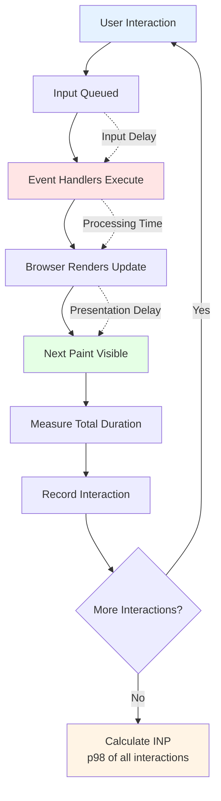

import snippet from '../../snippets/CoreWebVitals/INP.js?raw'
import { Snippet } from '../../components/Snippet'

# Interaction to Next Paint (INP)

### Overview

Tracks [Interaction to Next Paint](https://web.dev/articles/inp), a Core Web Vital that measures responsiveness. INP evaluates how quickly a page responds to user interactions throughout the entire page visit, replacing First Input Delay (FID) as a Core Web Vital in March 2024.

**Why this matters:**

INP directly measures user frustration. When users click a button and nothing happens for seconds, they abandon tasks. Unlike FID which only measured first interaction, INP tracks ALL interactions, making it a more comprehensive responsiveness metric and a key ranking factor for Google Search.

**INP Rating Thresholds:**

| Rating | Time | Meaning |
|--------|------|---------|
| 🟢 Good | ≤ 200ms | Responsive, feels instant |
| 🟡 Needs Improvement | ≤ 500ms | Noticeable delay |
| 🔴 Poor | > 500ms | Slow, frustrating experience |

> **Need to debug?** Use [Long Animation Frames](/Interaction/Long-Animation-Frames) to identify which scripts are blocking interactions.

**INP Measurement Approach:**



**INP vs FID Comparison:**

| Aspect | FID (Old) | INP (New) |
|--------|-----------|-----------|
| **Interactions measured** | Only first interaction | All interactions |
| **What's measured** | Input delay only | Full duration to paint |
| **Calculation** | Single value | 98th percentile |
| **Reflects real UX** | Partial | Complete |
| **Status** | Deprecated (March 2024) | Active Core Web Vital |

### Snippet

<Snippet code={snippet} />

### Understanding INP

**What makes a good INP:**

INP measures the latency of ALL user interactions during the page's lifetime. Unlike FID (which only measured first input delay), INP captures:

- All clicks, taps, and key presses
- The full duration from input to visual update
- The 98th percentile (worst case for most users)

**INP has three phases:**

| Phase | Description | Common causes of delay |
|-------|-------------|----------------------|
| **Input Delay** | Time from user action to handler start | Long tasks blocking main thread |
| **Processing Time** | Event handler execution | Heavy computation, DOM manipulation |
| **Presentation Delay** | Time to render update | Large render tree, forced layouts |

**INP updates throughout the page lifetime:**

- INP is calculated from all interactions
- Takes the 98th percentile duration
- For pages with < 50 interactions, uses the worst interaction
- Final INP reported when page is hidden

### Common Causes of Poor INP

| Cause | Detection | Solution |
|-------|-----------|----------|
| Long tasks | High input delay | Break tasks with `scheduler.yield()`, move to Workers |
| Heavy event handlers | High processing time | Debounce, defer non-critical work |
| Forced layouts | High presentation delay | Batch DOM reads/writes, use `content-visibility` |
| Third-party scripts | Scripts blocking interactions | Defer scripts, use facades for embeds |
| Large DOM | Slow rendering | Virtualize lists, lazy load components |

### Interpreting Results

**Output Overview:**

The snippet provides comprehensive INP analysis including:

- **INP Value**: 98th percentile of all interactions with color-coded rating
- **Worst Interaction**: The interaction that defines your INP score
- **Element Attribution**: Target element and DOM path (e.g., `div.container > button#submit`)
- **Phase Breakdown**: Input delay, processing time, and presentation delay with visual bar
- **Slow Interactions**: Top 10 slowest interactions with their target elements
- **Interaction Types**: Summary by event type (click, keydown, etc.)
- **Actionable Recommendations**: Specific advice based on bottleneck phase

**Phase Analysis:**

If your INP is poor (> 500ms), check which phase dominates:

- **Input Delay > 50%**: Main thread is blocked before handlers run
  - Solution: Break up long tasks, reduce JavaScript execution time

- **Processing Time > 50%**: Event handlers are slow
  - Solution: Optimize handler logic, debounce events, use Web Workers

- **Presentation Delay > 50%**: Rendering is slow
  - Solution: Reduce render complexity, batch updates, avoid forced layouts

**Element Attribution:**

The snippet identifies which specific DOM element caused each interaction:

```
🎯 Worst Interaction (INP):
   Event: click → button.btn.btn-primary
   Duration: 384ms
   Target Element: <button class="btn btn-primary">Submit</button>
   Element Path: div#form-container > form.checkout-form > button.btn.btn-primary

⏱️ Phase Breakdown:
   Input Delay: 45ms
   Processing Time: 298ms
   Presentation Delay: 41ms
```

This helps you:
- **Identify the culprit**: Know exactly which button, input, or link is slow
- **Reproduce locally**: Navigate to the element in the DOM inspector
- **Track patterns**: See if all interactions on certain elements are slow

**Interaction Types:**

Different interaction types have different performance profiles:

| Type | Typical Duration | Optimization Focus |
|------|------------------|-------------------|
| `pointerdown` | 16-32ms | Usually fast, check for prevent-default issues |
| `click` | 50-200ms | Optimize click handlers, avoid heavy DOM updates |
| `keydown` | 32-100ms | Debounce text input, defer validation |
| `pointerup` | 16-50ms | Usually fast unless triggering complex actions |

### Browser Support

| Browser | INP Support | Event Timing API | Phase Breakdown |
|---------|-------------|------------------|-----------------|
| Chrome 96+ | ✅ | ✅ | ✅ |
| Edge 96+ | ✅ | ✅ | ✅ |
| Firefox | ❌* | Partial | ❌ |
| Safari | ❌* | ❌ | ❌ |

\* Firefox and Safari don't support `interactionId` yet. The snippet will track events but won't group them into interactions correctly.

### Troubleshooting

**"No interactions recorded"**

- Cause: Page hasn't had meaningful interactions yet
- Solution: Interact with the page (clicks, keypresses) then run `getINP()`

**"All interactions show 0ms for phases"**

- Cause: Browser doesn't support detailed phase breakdown
- Solution: Use Chrome 96+ for full support. The total duration is still accurate.

**"INP keeps changing"**

- This is expected! INP is calculated from all interactions as a 98th percentile
- It will update as more interactions occur
- The final value is reported when the page is hidden

**"Want to see real-time updates?"**

```js copy
// Log INP after each interaction
setInterval(() => {
  const result = getINP();
  // Check console
}, 2000);
```

### Integration with RUM

Example integration with popular RUM tools:

```js copy
// Google Analytics 4
window.getINP = () => {
  const result = calculateINP();
  gtag('event', 'web_vitals', {
    metric_name: 'INP',
    value: Math.round(result.value),
    rating: valueToRating(result.value),
  });
  return result;
};

// DataDog RUM
window.getINP = () => {
  const result = calculateINP();
  window.DD_RUM.addTiming('inp', result.value);
  return result;
};

// New Relic
window.getINP = () => {
  const result = calculateINP();
  window.newrelic.addPageAction('webVitals', {
    metric: 'INP',
    value: result.value,
  });
  return result;
};
```

### Further Reading

- [Interaction to Next Paint (INP)](https://web.dev/articles/inp) | web.dev
- [Optimize INP](https://web.dev/articles/optimize-inp) | web.dev
- [Event Timing API](https://developer.mozilla.org/en-US/docs/Web/API/PerformanceEventTiming) | MDN
- [Long Animation Frames](/Interaction/Long-Animation-Frames) | Detailed script attribution
