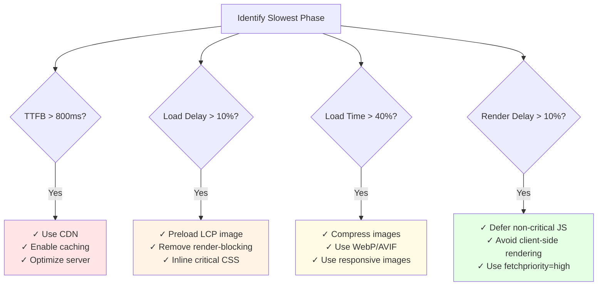

import snippet from '../../snippets/CoreWebVitals/LCP-Sub-Parts.js?raw'
import { Snippet } from '../../components/Snippet'

# LCP Sub-Parts

### Overview

Breaks down [Largest Contentful Paint](https://web.dev/articles/lcp) into its four phases to identify optimization opportunities. Understanding which phase is slowest helps you focus your optimization efforts where they'll have the most impact. Based on the [Web Vitals Chrome Extension](https://chrome.google.com/webstore/detail/web-vitals/ahfhijdlegdabablpippeagghigmibma).

**Why this matters:**

LCP is a critical Core Web Vital that measures when the largest content element becomes visible. By breaking it into sub-parts, you can pinpoint exactly where delays occur and apply targeted optimizations instead of guessing.

**The four phases of LCP:**

| Sub-part | What it measures | Common causes |
|----------|------------------|---------------|
| **Time to First Byte** | Server response time | Slow server, no CDN, no caching |
| **Resource Load Delay** | Time from TTFB until LCP resource starts loading | Render-blocking resources, late discovery |
| **Resource Load Time** | Time to download the LCP resource | Large images, slow connection, no compression |
| **Element Render Delay** | Time from download complete to paint | Client-side rendering, render-blocking JS |

**Optimization priority:**

| Phase | Target | How to optimize |
|-------|--------|-----------------|
| TTFB | < 800ms | Use CDN, optimize server, enable caching |
| Load Delay | < 10% of LCP | Preload LCP image, remove render-blocking resources |
| Load Time | < 40% of LCP | Compress images, use modern formats (WebP, AVIF) |
| Render Delay | < 10% of LCP | Inline critical CSS, defer non-critical JS |

> **Quick check:** Use [LCP](/CoreWebVitals/LCP) for a simple LCP value and element identification.

### Snippet

<Snippet code={snippet} />

### Understanding the Results

**Sub-Parts Table:**

| Column | Description |
|--------|-------------|
| Sub-part | Phase name (⚠️ marks the slowest) |
| Time | Duration in milliseconds |
| % | Percentage of total LCP |
| Status | ✅ OK or 🔴 Over target |

**Visual Bar:**

Shows time distribution across the four phases:
- █ TTFB (server response)
- ▓ Load Delay (discovery to request)
- ▒ Load Time (download)
- ░ Render Delay (paint)

**Performance Timeline:**

The snippet adds measures to the Performance API. To see them:
1. Open DevTools → Performance tab
2. Reload the page
3. Look for "Time to First Byte", "Resource Load Delay", etc. in the timeline

### Optimization Checklist

| If slowest is... | Check these |
|------------------|-------------|
| **TTFB** | Server response time, CDN, caching headers |
| **Load Delay** | Preload hints, render-blocking resources, late `` in HTML |
| **Load Time** | Image size, format, compression, CDN |
| **Render Delay** | JavaScript blocking, CSS parsing, client-side rendering |

**Optimization Decision Tree:**

### Further Reading

- [Optimize LCP](https://web.dev/articles/optimize-lcp) | web.dev
- [LCP breakdown](https://web.dev/articles/optimize-lcp#lcp-breakdown) | web.dev
- [Preload critical assets](https://web.dev/articles/preload-critical-assets) | web.dev
- [LCP Quick Check](/CoreWebVitals/LCP) | Simple LCP measurement
