import snippet from '../../snippets/Interaction/Interactions.js?raw'
import { Snippet } from '../../components/Snippet'

# Interactions

### Overview

Tracks all user interactions in real-time to help debug and improve [Interaction to Next Paint (INP)](https://web.dev/articles/inp). INP measures responsiveness by tracking the latency of all interactions during a page visit. This snippet breaks down each interaction into three phases to identify bottlenecks. Based on the [Web Vitals Chrome Extension](https://chrome.google.com/webstore/detail/web-vitals/ahfhijdlegdabablpippeagghigmibma).

**Why this matters:**

INP is a Core Web Vital that directly affects user experience. Slow interactions make your site feel sluggish and frustrating. By identifying which phase causes delays (input delay, processing, or presentation), you can apply targeted optimizations to make your site feel more responsive.

**INP Rating Thresholds:**

| Rating | Duration | Meaning |
|--------|----------|---------|
| 🟢 Good | ≤ 200ms | Fast, responsive interaction |
| 🟡 Needs Improvement | ≤ 500ms | Noticeable delay |
| 🔴 Poor | > 500ms | Frustrating delay |

**INP Sub-Parts:**

Every interaction consists of three phases:

| Sub-part | What it measures | Common causes of delays |
|----------|------------------|------------------------|
| **Input Delay** | Time from user input to processing start | Long tasks blocking main thread |
| **Processing Time** | Event handler execution | Complex JavaScript, slow handlers |
| **Presentation Delay** | Rendering after processing | Large DOM updates, layout thrashing |

```mermaid
sequenceDiagram
    participant User
    participant Browser as Main Thread
    participant Handler as Event Handler
    participant Renderer

    User->>Browser: Click/Tap/Keypress
    Note over Browser: ⏳ Input Delay<br/>(waiting for main thread)

    Browser->>Handler: Start processing
    Note over Handler: ⚙️ Processing Time<br/>(event handler execution)
    Handler->>Handler: Run JavaScript
    Handler->>Handler: Update state

    Handler->>Renderer: Request render
    Note over Renderer: 🎨 Presentation Delay<br/>(render + paint)
    Renderer->>Renderer: Layout calculation
    Renderer->>Renderer: Paint

    Renderer-->>User: Visual feedback

    Note over User,Renderer: Total = Input Delay + Processing Time + Presentation Delay
```

```mermaid
flowchart LR
    Start([👆 User<br/>Input]) --> Phase1["⏳ Input Delay<br/><small>Waiting for main thread</small>"]
    Phase1 --> Phase2["⚙️ Processing Time<br/><small>Event handler execution</small>"]
    Phase2 --> Phase3["🎨 Presentation Delay<br/><small>Render + Paint</small>"]
    Phase3 --> End([✅ Visual<br/>Feedback])

    style Phase1 fill:#FFE5E5,stroke:#FF4444,stroke-width:2px
    style Phase2 fill:#E5F2FF,stroke:#4488FF,stroke-width:2px
    style Phase3 fill:#E5FFE5,stroke:#44AA44,stroke-width:2px
    style End fill:#F0F0F0,stroke:#666,stroke-width:3px
```

> **Tip:** The sub-part with the longest duration is usually where to focus optimization efforts.

### Snippet

<Snippet code={snippet} />

### Understanding the Results

**Real-time Output:**

Each interaction logs:
- Duration with rating indicator (🟢/🟡/🔴)
- Target element
- Event type (click, keydown, etc.)
- Sub-parts breakdown with percentages
- Visual bar showing time distribution
- Optimization hints for slow interactions

**Summary Function:**

Call `getInteractionSummary()` in the console to see:

| Metric | Description |
|--------|-------------|
| Total interactions | Number of tracked interactions |
| Worst | Longest interaction duration |
| P75 (INP) | 75th percentile - this is your INP score |
| Average | Mean duration across all interactions |
| By rating | Count of good/needs-improvement/poor |

### Optimizing Each Sub-Part

| Sub-part | Problem | Solutions |
|----------|---------|-----------|
| **Input Delay** | Long tasks block main thread | Break up long tasks, yield to main thread, use `scheduler.yield()` |
| **Processing Time** | Slow event handlers | Optimize handlers, debounce, use web workers |
| **Presentation Delay** | Expensive rendering | Reduce DOM size, avoid layout thrashing, use `content-visibility` |

**Optimization Decision Tree:**

```mermaid
flowchart TD
    Start[INP > 200ms?] --> Analyze{Identify longest<br/>sub-part}

    Analyze --> InputDelay{Input Delay<br/>is longest?}
    Analyze --> ProcessTime{Processing Time<br/>is longest?}
    Analyze --> PresDelay{Presentation Delay<br/>is longest?}

    InputDelay -->|Yes| InputFix["⚡ Break up long tasks<br/>⚡ Use scheduler.yield()<br/>⚡ Defer non-critical work<br/>⚡ Use requestIdleCallback"]

    ProcessTime -->|Yes| ProcessFix["🔧 Optimize event handlers<br/>🔧 Debounce rapid events<br/>🔧 Move work to Web Workers<br/>🔧 Reduce JavaScript complexity"]

    PresDelay -->|Yes| PresFix["🎨 Reduce DOM updates<br/>🎨 Avoid layout thrashing<br/>🎨 Use content-visibility<br/>🎨 Batch DOM changes"]

    style InputFix fill:#FFE5E5
    style ProcessFix fill:#E5F2FF
    style PresFix fill:#E5FFE5
```

### Further Reading

- [Interaction to Next Paint (INP)](https://web.dev/articles/inp) | web.dev
- [Optimize INP](https://web.dev/articles/optimize-inp) | web.dev
- [Find slow interactions](https://web.dev/articles/find-slow-interactions-in-the-field) | web.dev
- [Web Vitals Extension](https://chrome.google.com/webstore/detail/web-vitals/ahfhijdlegdabablpippeagghigmibma) | Chrome Web Store
