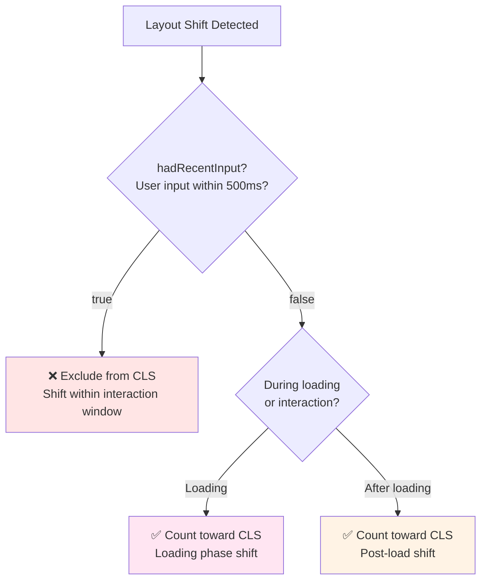

# Layout Shift Tracking

### Overview

Tracks all layout shifts during page load and user interaction, identifying the elements causing [Cumulative Layout Shift (CLS)](https://web.dev/articles/cls). This debugging-focused snippet logs every shift with detailed information about which elements moved and when.

**Why this matters:**

While the [CLS quick check](/CoreWebVitals/CLS) gives you a score, this snippet helps you debug **which specific elements** are causing layout shifts. It shows you the exact selectors, movement distances, and whether shifts were excluded due to user input. This is essential for fixing CLS issues.

**CLS Rating Thresholds:**

| Rating | CLS Score | Meaning |
|--------|-----------|---------|
| 🟢 Good | ≤ 0.1 | Minimal, stable layout |
| 🟡 Needs Improvement | ≤ 0.25 | Noticeable shifting |
| 🔴 Poor | > 0.25 | Significant layout instability |

**What causes layout shifts:**

| Cause | Example | Solution |
|-------|---------|----------|
| Images without dimensions | `` | Add `width` and `height` attributes |
| Ads/embeds without reserved space | Dynamic ad injection | Reserve space with CSS |
| Dynamically injected content | Banners, notifications | Reserve space or use transforms |
| Web fonts causing FOIT/FOUT | Font swap changes text size | Use `font-display: optional` or size-adjust |
| DOM updates above viewport | Content inserted above current scroll | Insert below or use transforms |

> **Note:** Shifts with `hadRecentInput: true` (within 500ms of user input) are excluded from CLS, as they're considered expected by the user.

**Layout Shift Phases:**


**CLS Counting Logic:**



### Snippet

```js copy
// Layout Shift Tracking
// https://webperf-snippets.nucliweb.net

(() => {
  // CLS thresholds
  const valueToRating = (score) =>
    score <= 0.1 ? "good" : score <= 0.25 ? "needs-improvement" : "poor";

  const RATING_COLORS = {
    good: "#0CCE6A",
    "needs-improvement": "#FFA400",
    poor: "#FF4E42",
  };

  const RATING_ICONS = {
    good: "🟢",
    "needs-improvement": "🟡",
    poor: "🔴",
  };

  // Track all shifts
  let totalCLS = 0;
  const allShifts = [];
  const elementShifts = new Map(); // Track shifts per element

  const getElementSelector = (element) => {
    if (!element) return "(unknown)";
    if (element.id) return `#${element.id}`;
    if (element.className && typeof element.className === "string") {
      const classes = element.className.trim().split(/\s+/).slice(0, 2).join(".");
      if (classes) return `${element.tagName.toLowerCase()}.${classes}`;
    }
    return element.tagName?.toLowerCase() || "(unknown)";
  };

  const observer = new PerformanceObserver((list) => {
    for (const entry of list.getEntries()) {
      // Only count shifts without recent input for CLS
      const countedForCLS = !entry.hadRecentInput;

      if (countedForCLS) {
        totalCLS += entry.value;
      }

      // Get affected elements
      const sources = entry.sources || [];
      const elements = sources.map((source) => ({
        element: source.node,
        selector: getElementSelector(source.node),
        previousRect: source.previousRect,
        currentRect: source.currentRect,
      }));

      // Track per-element shifts
      elements.forEach((el) => {
        if (!elementShifts.has(el.selector)) {
          elementShifts.set(el.selector, { count: 0, totalShift: 0, element: el.element });
        }
        const data = elementShifts.get(el.selector);
        data.count++;
        data.totalShift += entry.value;
      });

      const shift = {
        value: entry.value,
        countedForCLS,
        elements,
        time: entry.startTime,
        entry,
      };
      allShifts.push(shift);

      // Log significant shifts (> 0.001)
      if (entry.value > 0.001) {
        const rating = valueToRating(totalCLS);
        const icon = countedForCLS ? RATING_ICONS[rating] : "⚪";
        const clsColor = RATING_COLORS[rating];

        console.groupCollapsed(
          `%c${icon} Layout Shift: ${entry.value.toFixed(4)}${countedForCLS ? "" : " (not counted - user input)"}`,
          `font-weight: bold; color: ${countedForCLS ? clsColor : "#888"};`
        );

        console.log(`%cCumulative CLS: ${totalCLS.toFixed(4)}`, `color: ${clsColor}; font-weight: bold;`);
        console.log(`   Time: ${Math.round(entry.startTime)}ms`);
        console.log(`   Had recent input: ${entry.hadRecentInput ? "Yes (excluded from CLS)" : "No"}`);

        if (elements.length > 0) {
          console.log("");
          console.log("%cElements that shifted:", "font-weight: bold;");

          elements.forEach((el, i) => {
            console.log(`   ${i + 1}. ${el.selector}`, el.element);
            if (el.previousRect && el.currentRect) {
              const dx = el.currentRect.x - el.previousRect.x;
              const dy = el.currentRect.y - el.previousRect.y;
              const dw = el.currentRect.width - el.previousRect.width;
              const dh = el.currentRect.height - el.previousRect.height;

              const changes = [];
              if (Math.abs(dx) > 0) changes.push(`x: ${dx > 0 ? "+" : ""}${Math.round(dx)}px`);
              if (Math.abs(dy) > 0) changes.push(`y: ${dy > 0 ? "+" : ""}${Math.round(dy)}px`);
              if (Math.abs(dw) > 0) changes.push(`width: ${dw > 0 ? "+" : ""}${Math.round(dw)}px`);
              if (Math.abs(dh) > 0) changes.push(`height: ${dh > 0 ? "+" : ""}${Math.round(dh)}px`);

              if (changes.length > 0) {
                console.log(`      Movement: ${changes.join(", ")}`);
              }
            }
          });
        } else {
          console.log("   (No source elements captured)");
        }

        console.groupEnd();
      }
    }
  });

  observer.observe({ type: "layout-shift", buffered: true });

  // Summary function
  window.getLayoutShiftSummary = () => {
    console.group("%c📊 Layout Shift Summary", "font-weight: bold; font-size: 14px;");

    const rating = valueToRating(totalCLS);
    const icon = RATING_ICONS[rating];
    const color = RATING_COLORS[rating];

    // CLS Score
    console.log("");
    console.log("%cCLS Score:", "font-weight: bold;");
    console.log(
      `   ${icon} %c${totalCLS.toFixed(4)} (${rating})`,
      `color: ${color}; font-weight: bold; font-size: 16px;`
    );

    // Statistics
    const countedShifts = allShifts.filter((s) => s.countedForCLS);
    const excludedShifts = allShifts.filter((s) => !s.countedForCLS);

    console.log("");
    console.log("%cStatistics:", "font-weight: bold;");
    console.log(`   Total shift events: ${allShifts.length}`);
    console.log(`   Counted for CLS: ${countedShifts.length}`);
    console.log(`   Excluded (user input): ${excludedShifts.length}`);

    if (countedShifts.length > 0) {
      const largest = Math.max(...countedShifts.map((s) => s.value));
      console.log(`   Largest single shift: ${largest.toFixed(4)}`);
    }

    // Top shifting elements
    if (elementShifts.size > 0) {
      console.log("");
      console.log("%c🎯 Top Shifting Elements:", "font-weight: bold; color: #ef4444;");

      const sortedElements = Array.from(elementShifts.entries())
        .sort((a, b) => b[1].totalShift - a[1].totalShift)
        .slice(0, 5);

      const tableData = sortedElements.map(([selector, data]) => ({
        Element: selector,
        "Shift Count": data.count,
        "Total Impact": data.totalShift.toFixed(4),
      }));

      console.table(tableData);

      console.log("");
      console.log("%c🔎 Inspect elements:", "font-weight: bold;");
      sortedElements.forEach(([selector, data], i) => {
        console.log(`   ${i + 1}. ${selector}`, data.element);
      });
    }

    // Timeline
    if (countedShifts.length > 0) {
      console.log("");
      console.log("%c⏱️ Shift Timeline:", "font-weight: bold;");

      const significant = countedShifts.filter((s) => s.value > 0.001);
      if (significant.length > 0) {
        const timelineData = significant.map((s) => ({
          "Time (ms)": Math.round(s.time),
          Value: s.value.toFixed(4),
          Elements: s.elements.map((e) => e.selector).join(", ") || "(unknown)",
        }));
        console.table(timelineData);
      } else {
        console.log("   No significant shifts (all < 0.001)");
      }
    }

    // Recommendations
    if (rating !== "good") {
      console.log("");
      console.log("%c💡 Recommendations:", "font-weight: bold; color: #3b82f6;");
      console.log("   • Add width/height attributes to images and videos");
      console.log("   • Reserve space for ads, embeds, and dynamic content");
      console.log("   • Use CSS aspect-ratio for responsive elements");
      console.log("   • Avoid inserting content above existing content");
      console.log("   • Use transform animations instead of layout-triggering properties");
    }

    console.groupEnd();

    return {
      cls: totalCLS,
      rating,
      shiftCount: countedShifts.length,
      topElements: Array.from(elementShifts.entries())
        .sort((a, b) => b[1].totalShift - a[1].totalShift)
        .slice(0, 5)
        .map(([selector, data]) => ({ selector, ...data })),
    };
  };

  // Initial message
  const rating = valueToRating(totalCLS);
  const icon = RATING_ICONS[rating];

  console.log("%c📐 Layout Shift Tracking Active", "font-weight: bold; font-size: 14px;");
  console.log(`   Current CLS: ${icon} ${totalCLS.toFixed(4)}`);
  console.log("   Interact with the page to see new shifts.");
  console.log(
    "   Call %cgetLayoutShiftSummary()%c for full analysis.",
    "font-family: monospace; background: #f3f4f6; padding: 2px 4px;",
    ""
  );
})();
```

### Understanding the Results

**Real-time Output:**

Each significant layout shift (> 0.001) logs:
- Shift value with cumulative CLS and rating
- Whether it counts toward CLS (excluded if user input within 500ms)
- Elements that shifted with their movement details
- Clickable element references for inspection

**Summary Function:**

Call `getLayoutShiftSummary()` in the console to see:

| Section | Description |
|---------|-------------|
| CLS Score | Final cumulative score with rating |
| Statistics | Total shifts, counted vs excluded |
| Top Shifting Elements | Elements causing the most shift, sorted by impact |
| Shift Timeline | When shifts occurred and what caused them |
| Recommendations | Specific fixes based on your CLS score |

### Common Fixes

| Problem | Detection | Solution |
|---------|-----------|----------|
| Images without dimensions | `` in shifting elements | Add `width="X" height="Y"` attributes |
| Fonts causing reflow | Text elements shifting | Use `font-display: optional` or `size-adjust` |
| Dynamic content | Elements inserted at top | Reserve space or insert below fold |
| Ads/embeds | Third-party containers shifting | Use `min-height` to reserve space |

### Further Reading

- [Cumulative Layout Shift (CLS)](https://web.dev/articles/cls) | web.dev
- [Optimize CLS](https://web.dev/articles/optimize-cls) | web.dev
- [Debug layout shifts](https://web.dev/articles/debug-layout-shifts) | web.dev
- [Layout Instability API](https://developer.mozilla.org/en-US/docs/Web/API/LayoutShift) | MDN
