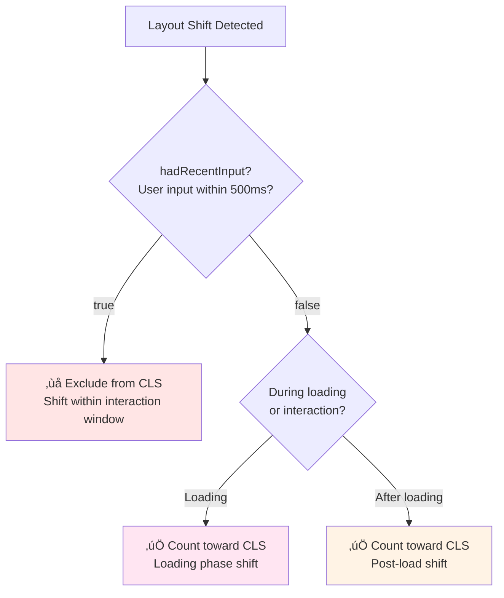

import snippet from '../../snippets/Interaction/Layout-Shift-Loading-and-Interaction.js?raw'
import { Snippet } from '../../components/Snippet'

# Layout Shift Tracking

### Overview

Tracks all layout shifts during page load and user interaction, identifying the elements causing [Cumulative Layout Shift (CLS)](https://web.dev/articles/cls). This debugging-focused snippet logs every shift with detailed information about which elements moved and when.

**Why this matters:**

While the [CLS quick check](/CoreWebVitals/CLS) gives you a score, this snippet helps you debug **which specific elements** are causing layout shifts. It shows you the exact selectors, movement distances, and whether shifts were excluded due to user input. This is essential for fixing CLS issues.

**CLS Rating Thresholds:**

| Rating | CLS Score | Meaning |
|--------|-----------|---------|
| 🟢 Good | ≤ 0.1 | Minimal, stable layout |
| 🟡 Needs Improvement | ≤ 0.25 | Noticeable shifting |
| 🔴 Poor | > 0.25 | Significant layout instability |

**What causes layout shifts:**

| Cause | Example | Solution |
|-------|---------|----------|
| Images without dimensions | `` | Add `width` and `height` attributes |
| Ads/embeds without reserved space | Dynamic ad injection | Reserve space with CSS |
| Dynamically injected content | Banners, notifications | Reserve space or use transforms |
| Web fonts causing FOIT/FOUT | Font swap changes text size | Use `font-display: optional` or size-adjust |
| DOM updates above viewport | Content inserted above current scroll | Insert below or use transforms |

> **Note:** Shifts with `hadRecentInput: true` (within 500ms of user input) are excluded from CLS, as they're considered expected by the user.

**Layout Shift Phases:**

```mermaid
flowchart LR
    Start([Page<br/>Load]) --> Loading["📄 Loading Phase<br/><small>Initial layout shifts<br/>✅ Count toward CLS</small>"]
    Loading --> Interact[👆 User<br/>Interaction]
    Interact --> Window["⏱️ 500ms Window<br/><small>❌ Shifts excluded</small>"]
    Window --> After["⏳ After Window<br/><small>✅ Count toward CLS</small>"]

    style Loading fill:#E5FFE5,stroke:#44AA44,stroke-width:2px
    style Window fill:#FFE5E5,stroke:#FF4444,stroke-width:2px
    style After fill:#FFFBE5,stroke:#FF8800,stroke-width:2px
```

**CLS Counting Logic:**

### Snippet

<Snippet code={snippet} />

### Understanding the Results

**Real-time Output:**

Each significant layout shift (> 0.001) logs:
- Shift value with cumulative CLS and rating
- Whether it counts toward CLS (excluded if user input within 500ms)
- Elements that shifted with their movement details
- Clickable element references for inspection

**Summary Function:**

Call `getLayoutShiftSummary()` in the console to see:

| Section | Description |
|---------|-------------|
| CLS Score | Final cumulative score with rating |
| Statistics | Total shifts, counted vs excluded |
| Top Shifting Elements | Elements causing the most shift, sorted by impact |
| Shift Timeline | When shifts occurred and what caused them |
| Recommendations | Specific fixes based on your CLS score |

### Common Fixes

| Problem | Detection | Solution |
|---------|-----------|----------|
| Images without dimensions | `` in shifting elements | Add `width="X" height="Y"` attributes |
| Fonts causing reflow | Text elements shifting | Use `font-display: optional` or `size-adjust` |
| Dynamic content | Elements inserted at top | Reserve space or insert below fold |
| Ads/embeds | Third-party containers shifting | Use `min-height` to reserve space |

### Further Reading

- [Cumulative Layout Shift (CLS)](https://web.dev/articles/cls) | web.dev
- [Optimize CLS](https://web.dev/articles/optimize-cls) | web.dev
- [Debug layout shifts](https://web.dev/articles/debug-layout-shifts) | web.dev
- [Layout Instability API](https://developer.mozilla.org/en-US/docs/Web/API/LayoutShift) | MDN
