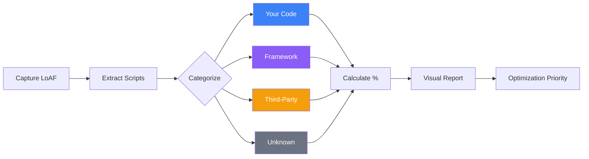

# Long Animation Frames Script Attribution

Analyzes and visualizes which scripts are responsible for blocking the main thread. This snippet categorizes blocking time by script origin (your code, framework, third-party, extensions) and provides actionable insights for optimization.

**Why Script Attribution Matters:**

- Identify if blocking comes from your code vs third-parties
- Prioritize optimization efforts on the biggest offenders
- Separate framework overhead from application code
- Track third-party impact on performance
- Segment RUM data by script category

**What you'll see:**

- Blocking time breakdown by script category (first-party, framework, third-party, unknown)
- Top blocking scripts ranked by total duration
- Visual ASCII chart showing contribution percentages
- Specific file names and function names responsible
- Actionable recommendations based on data



## Overview

**Purpose**: Provide detailed attribution of main thread blocking to specific scripts, categorized by origin and ranked by impact.

**Key Features**:

1. **Automatic Categorization**: Classifies scripts as first-party, framework, third-party, or unknown
2. **Visual Breakdown**: ASCII charts showing percentage contribution
3. **Top Offenders**: Ranked list of scripts by total blocking time
4. **Actionable Insights**: Specific recommendations based on findings
5. **RUM Integration**: Export data in format ready for analytics

**Use Cases**:

- Performance audits: "Where should we optimize first?"
- Third-party analysis: "Is our analytics/ads slowing us down?"
- Framework cost: "How much overhead does React/Vue add?"
- Before/after comparisons: "Did our optimization work?"

## Script Attribution Analysis

### Snippet

```js copy
// Long Animation Frames - Script Attribution Analysis
// https://webperf-snippets.nucliweb.net

const analyzeScriptAttribution = async (durationSeconds = 10) => {
  // Check browser support
  if (!PerformanceObserver.supportedEntryTypes?.includes("long-animation-frame")) {
    console.log("%c⚠️ Long Animation Frames not supported", "color: #f59e0b; font-weight: bold;");
    console.log("Chrome 116+ required. See Browser Support section below.");
    return;
  }

  console.log(
    "%c⏳ Collecting Long Animation Frames...",
    "color: #3b82f6; font-weight: bold; font-size: 14px;",
  );
  console.log(
    `Monitoring for ${durationSeconds} seconds. Interact with the page for better data.\n`,
  );

  const frames = [];

  const observer = new PerformanceObserver((list) => {
    list.getEntries().forEach((entry) => {
      frames.push({
        duration: entry.duration,
        blockingDuration: entry.blockingDuration || 0,
        scripts: (entry.scripts || []).map((s) => ({
          sourceURL: s.sourceURL || "unknown",
          sourceFunctionName: s.sourceFunctionName || "anonymous",
          invoker: s.invoker || "unknown",
          duration: s.duration || 0,
        })),
      });
    });
  }).observe({ type: "long-animation-frame", buffered: true });

  // Collect for specified duration
  await new Promise((resolve) => setTimeout(resolve, durationSeconds * 1000));
  observer.disconnect();

  if (frames.length === 0) {
    return console.log("%c✅ No long frames detected", "color: #22c55e; font-weight: bold;");
  }

  const allScripts = frames.flatMap((f) => f.scripts);
  const totalBlocking = frames.reduce((sum, f) => sum + f.blockingDuration, 0);
  const totalDuration = frames.reduce((sum, f) => sum + f.duration, 0);

  const categorize = (url) => {
    const u = url.toLowerCase();
    const origin = location.origin.toLowerCase();
    if (u === "" || u === "unknown") return "unknown";
    if (
      ["react", "vue", "angular", "svelte", "framework", "chunk", "webpack", "vite"].some((fw) =>
        u.includes(fw),
      )
    )
      return "framework";
    if (
      [
        "google-analytics",
        "gtag",
        "gtm",
        "analytics",
        "facebook",
        "twitter",
        "ads",
        "cdn",
        "unpkg",
        "jsdelivr",
        "segment",
        "amplitude",
      ].some((tp) => u.includes(tp))
    )
      return "third-party";
    if (u.startsWith("chrome-extension://") || u.startsWith("moz-extension://")) return "extension";
    if (u.startsWith("http") && !u.includes(origin.replace(/^https?:\/\//, "")))
      return "third-party";
    return "first-party";
  };

  const byCategory = {
    "first-party": { duration: 0, count: 0 },
    framework: { duration: 0, count: 0 },
    "third-party": { duration: 0, count: 0 },
    extension: { duration: 0, count: 0 },
    unknown: { duration: 0, count: 0 },
  };

  allScripts.forEach((script) => {
    const cat = categorize(script.sourceURL);
    byCategory[cat].duration += script.duration;
    byCategory[cat].count++;
  });

  const byFile = {};
  allScripts.forEach((script) => {
    const file = script.sourceURL.split("/").pop() || "unknown";
    if (!byFile[file])
      byFile[file] = {
        duration: 0,
        count: 0,
        category: categorize(script.sourceURL),
        functions: [],
      };
    byFile[file].duration += script.duration;
    byFile[file].count++;
    byFile[file].functions.push({
      name: script.sourceFunctionName,
      invoker: script.invoker,
      duration: script.duration,
    });
  });

  const topFiles = Object.entries(byFile)
    .sort((a, b) => b[1].duration - a[1].duration)
    .slice(0, 10);

  console.log("%c━━━━━━━━━━━━━━━━━━━━━━━━━━━━━━━━━━━━━━━━━━━━━━", "color: #6b7280;");
  console.log("%c📊 Blocking Time by Category", "font-weight: bold; font-size: 13px;");
  console.log("");

  const categories = [
    { name: "Your Code", key: "first-party", icon: "🔵", color: "#3b82f6" },
    { name: "Framework", key: "framework", icon: "🟣", color: "#8b5cf6" },
    { name: "Third-Party", key: "third-party", icon: "🟠", color: "#f59e0b" },
    { name: "Extensions", key: "extension", icon: "🟤", color: "#92400e" },
    { name: "Unknown", key: "unknown", icon: "⚫", color: "#6b7280" },
  ];

  const totalScript = Object.values(byCategory).reduce((sum, cat) => sum + cat.duration, 0);

  categories.forEach(({ name, key, icon, color }) => {
    const data = byCategory[key];
    const pct = totalScript > 0 ? (data.duration / totalScript) * 100 : 0;
    if (data.duration > 0) {
      const barLen = Math.round(pct / 2);
      const bar = "█".repeat(barLen) + "░".repeat(Math.max(0, 50 - barLen));
      console.log(
        `%c${icon} ${name.padEnd(12)} %c${bar} %c${pct.toFixed(1)}% %c(${data.duration.toFixed(0)}ms, ${data.count} scripts)`,
        `color: ${color}; font-weight: bold;`,
        `color: ${color};`,
        `color: ${color}; font-weight: bold;`,
        "color: #6b7280;",
      );
    }
  });

  console.log("");
  console.log(
    `%cTotal Script: ${totalScript.toFixed(0)}ms | Blocking: ${totalBlocking.toFixed(0)}ms | Duration: ${totalDuration.toFixed(0)}ms`,
    "color: #6b7280;",
  );
  console.log(`%cFrames captured: ${frames.length}`, "color: #6b7280;");

  console.log("");
  console.log("%c━━━━━━━━━━━━━━━━━━━━━━━━━━━━━━━━━━━━━━━━━━━━━━", "color: #6b7280;");
  console.log("%c🔥 Top 10 Blocking Scripts", "font-weight: bold; font-size: 13px;");
  console.log("");

  topFiles.forEach(([file, data], idx) => {
    const pct = totalScript > 0 ? (data.duration / totalScript) * 100 : 0;
    const icon = categories.find((c) => c.key === data.category)?.icon || "⚫";
    console.group(
      `%c${idx + 1}. ${icon} ${file} %c(${data.duration.toFixed(0)}ms, ${pct.toFixed(1)}%)`,
      "font-weight: bold;",
      "color: #6b7280;",
    );
    console.log(`Category: ${data.category}`);
    console.log(`Executions: ${data.count}`);
    console.log(`Avg duration: ${(data.duration / data.count).toFixed(0)}ms`);
    const topFns = data.functions.sort((a, b) => b.duration - a.duration).slice(0, 3);
    if (topFns.length > 0) {
      console.log("Top functions:");
      topFns.forEach((fn, i) =>
        console.log(`  ${i + 1}. ${fn.name} (${fn.duration.toFixed(0)}ms) - ${fn.invoker}`),
      );
    }
    console.groupEnd();
  });

  console.log("");
  console.log("%c✅ Analysis complete!", "color: #22c55e; font-weight: bold;");

  // Return data
  return {
    summary: { frameCount: frames.length, totalDuration, totalBlocking, totalScript },
    byCategory,
    topScripts: topFiles
      .slice(0, 5)
      .map(([name, data]) => ({ file: name, category: data.category, duration: data.duration })),
  };
};

// Auto-run with default 10 seconds
analyzeScriptAttribution();
```

## Quick Tips

**Custom collection duration:**

The script runs for 10 seconds by default. You can specify a different duration:

```javascript
// Quick 3-second check
analyzeScriptAttribution(3);

// Extended 20-second analysis
analyzeScriptAttribution(20);

// Or use default (10 seconds)
analyzeScriptAttribution();
```

**Already have some interactions?**

Since the script uses `buffered: true`, it captures frames that already occurred. If you've been interacting with the page, you'll see data immediately even with shorter durations.

**Re-run the analysis:**

The function is available in the console, so you can run it multiple times to compare different scenarios:

```javascript
// After feature A
await analyzeScriptAttribution(5);

// After feature B
await analyzeScriptAttribution(5);
```

## Understanding the Output

### Category Definitions

| Category           | What it includes                              | Optimization Responsibility                                       |
| ------------------ | --------------------------------------------- | ----------------------------------------------------------------- |
| **🔵 Your Code**   | Same-origin scripts you deployed              | ✅ **You can fix** - Your optimization target                     |
| **🟣 Framework**   | React, Vue, Angular, build tool chunks        | 🟡 **Partially controllable** - Framework choice + usage patterns |
| **🟠 Third-Party** | Analytics, ads, CDN scripts, external APIs    | ⚠️ **Limited control** - Can defer, replace, or remove            |
| **🟤 Extensions**  | Browser extensions (adblockers, etc.)         | ❌ **No control** - User's environment                            |
| **⚫ Unknown**     | Inline scripts, eval(), no source attribution | 🔍 **Need investigation** - Likely your code                      |

### Reading the Visual Chart

```
🔵 Your Code      ████████████████████░░░░░░░░░░░░ 40.2% (235ms, 3 scripts)
🟣 Framework      ████████████████████████████░░░░ 55.8% (326ms, 8 scripts)
🟠 Third-Party    ██░░░░░░░░░░░░░░░░░░░░░░░░░░░░░░  4.0% (23ms, 2 scripts)
```

**What this tells you:**

- **Bar length** = Percentage of total script execution time
- **Percentage** = Contribution to blocking (prioritization metric)
- **Duration** = Absolute time spent (optimization potential)
- **Script count** = Number of individual script executions

**In this example:**

- Framework is taking &gt;50% → Investigate React re-renders
- Your code is 40% → Largest controllable opportunity
- Third-party is &lt;5% → Not the problem

### Interpreting Recommendations

**Priority levels:**

| Priority      | When Shown                                       | Action Required                                                   |
| ------------- | ------------------------------------------------ | ----------------------------------------------------------------- |
| 🔴 **High**   | &gt;30% from your code                           | **Immediate action** - Largest impact opportunity                 |
| 🟠 **Medium** | &gt;40% from framework, &gt;20% from third-party | **Plan optimization** - Significant but requires careful approach |
| 🟡 **Low**    | Minor contributors                               | **Monitor** - Optimize if easy wins available                     |
| ℹ️ **Info**   | Extensions or environmental                      | **Document** - Track in RUM, no code changes needed               |

### RUM Data Structure

The exported `rumData` object structure:

```javascript
{
  timestamp: "2024-01-15T10:30:00.000Z",
  summary: {
    frameCount: 11,
    totalDuration: 1200,      // Total frame time
    totalBlockingTime: 450,   // Time blocking input
    totalScriptTime: 584,     // Total JS execution
  },
  byCategory: {
    "first-party": { duration: 235, percentage: 40.2, count: 3 },
    "framework": { duration: 326, percentage: 55.8, count: 8 },
    "third-party": { duration: 23, percentage: 4.0, count: 2 },
    // ...
  },
  topScripts: [
    {
      file: "4617.de2e87c94f999416.js",
      category: "first-party",
      duration: 235,
      percentage: 40.2,
      executions: 2
    },
    // ...
  ]
}
```

**How to use in RUM:**

- **Segment by category %** - Track if third-party cost increases over time
- **Alert on spikes** - If first-party > 50%, investigate recent deploys
- **Compare P50/P95** - See if some users have worse attribution
- **A/B test impact** - Did removing analytics improve frameRate?

## Browser Support

| Feature                   | Chrome | Firefox | Safari | Edge |
| ------------------------- | ------ | ------- | ------ | ---- |
| **Long Animation Frames** | 116+   | ❌      | ❌     | 116+ |
| **Script Attribution**    | 116+   | ❌      | ❌     | 116+ |

**Fallback**: For browsers without LoAF, use the [Long Tasks API](/Interaction/LongTask) but you'll lose script attribution detail.

## Best Practices

### When to Run This Analysis

✅ **Good times:**

- During performance audits
- After major feature launches
- When investigating user complaints about sluggishness
- Before/after optimization to measure impact
- During development to catch regressions early

❌ **Avoid:**

- In production on every page load (use sampling)
- On low-end devices (adds overhead)
- Without user interaction (won't capture interaction frames)

### How to Get Good Data

1. **Interact with the page** - Click, scroll, type during the collection window (default: 10 seconds)
2. **Test realistic scenarios** - Open dropdowns, submit forms, load data
3. **Adjust duration as needed** - Use `analyzeScriptAttribution(3)` for quick checks, `analyzeScriptAttribution(20)` for comprehensive analysis
4. **Run multiple times** - Compare first load vs. cached, different user flows
5. **Compare environments** - Development vs. production builds
6. **Test on real devices** - Mobile performance often differs significantly
7. **Use buffered data** - The script captures frames that already occurred, so existing interactions count

### Integration Tips

```javascript
// Only run on a sample of users (10%) with short duration
if (Math.random() < 0.1) {
  analyzeScriptAttribution(5).then((data) => {
    sendToRUM(data);
  });
}

// Run after page is interactive
if (document.readyState === "complete") {
  analyzeScriptAttribution();
} else {
  window.addEventListener("load", () => {
    setTimeout(() => analyzeScriptAttribution(), 2000); // Wait 2s after load
  });
}

// Run on specific user interactions (quick check)
document.querySelector("#analyze-btn")?.addEventListener("click", () => {
  analyzeScriptAttribution(3).then((data) => {
    console.log("Quick analysis complete:", data);
  });
});

// Programmatic analysis with custom duration
async function checkPerformance() {
  const data = await analyzeScriptAttribution(5);
  if (data.byCategory["third-party"].duration > 1000) {
    console.warn("High third-party blocking time detected!");
  }
  return data;
}
```

## Real-World Examples

### Example 1: Framework-Heavy Application

```
📊 Blocking Time by Category

🔵 Your Code      ██████░░░░░░░░░░░░░░░░░░░░░░░░░░ 12.3% (89ms)
🟣 Framework      ████████████████████████████████ 78.9% (571ms)
🟠 Third-Party    ████░░░░░░░░░░░░░░░░░░░░░░░░░░░░  8.8% (64ms)
```

**Diagnosis**: Framework overhead is dominating (79%)
**Action**: Implement React.memo(), reduce re-renders, consider Preact

### Example 2: Third-Party Impact

```
📊 Blocking Time by Category

🔵 Your Code      ████████████░░░░░░░░░░░░░░░░░░░░ 24.5% (145ms)
🟣 Framework      ██████████░░░░░░░░░░░░░░░░░░░░░░ 20.1% (119ms)
🟠 Third-Party    ███████████████████████████░░░░░ 55.4% (328ms)
```

**Diagnosis**: Third-parties taking &gt;50% (analytics, ads, tracking)
**Action**: Defer non-critical scripts, use facades, consider alternatives

### Example 3: Balanced (Optimized)

```
📊 Blocking Time by Category

🔵 Your Code      ████████████░░░░░░░░░░░░░░░░░░░░ 25.0% (78ms)
🟣 Framework      ████████████████░░░░░░░░░░░░░░░░ 32.1% (100ms)
🟠 Third-Party    ████████████░░░░░░░░░░░░░░░░░░░░ 24.4% (76ms)
⚫ Unknown        ██████████░░░░░░░░░░░░░░░░░░░░░░ 18.5% (58ms)
```

**Diagnosis**: Well-distributed, no single category dominates
**Action**: Focus on absolute values - can all categories go lower?

## Further Reading

- [Long Animation Frames API](https://developer.mozilla.org/en-US/docs/Web/API/PerformanceLongAnimationFrameTiming) | MDN
- [Optimize long tasks](https://web.dev/articles/optimize-long-tasks) | web.dev
- [Script evaluation and long tasks](https://web.dev/articles/script-evaluation-and-long-tasks) | web.dev
- [Long Animation Frames Helpers](/Interaction/Long-Animation-Frames-Helpers) | This site
- [Third-party JavaScript](https://web.dev/articles/third-party-javascript) | web.dev
