import snippet from '../../snippets/Interaction/Long-Animation-Frames.js?raw'
import { Snippet } from '../../components/Snippet'

# Long Animation Frames (LoAF)

### Overview

Tracks [Long Animation Frames](https://developer.chrome.com/docs/web-platform/long-animation-frames) to identify JavaScript and rendering work that blocks the main thread. LoAF is the underlying API that powers INP debugging and provides detailed attribution for slow interactions.

**Why this matters:**

LoAF is the successor to the Long Tasks API and provides much more detailed information about what's blocking your page. It tells you exactly which scripts ran, how long they took, and whether they caused forced layouts. This is essential for debugging slow interactions and improving INP scores.

**What is a Long Animation Frame?**

A frame is considered "long" when it takes more than 50ms. The API provides detailed breakdown of where time is spent:

| Metric | Description |
|--------|-------------|
| **Duration** | Total frame time from start to render complete |
| **Blocking Duration** | Time exceeding 50ms threshold (impacts INP) |
| **Work Duration** | JavaScript execution time |
| **Render Duration** | Style calculation, layout, and paint |
| **Style & Layout Duration** | Time in style/layout specifically |

**LoAF vs Long Tasks:**

| Aspect | Long Tasks | Long Animation Frames |
|--------|------------|----------------------|
| Threshold | > 50ms | > 50ms |
| Script attribution | Limited | Full (invoker, source URL, function) |
| Render time | Not included | Included |
| Forced layouts | Not detected | Detected and measured |

> **Tip:** LoAF helps answer "Why was my interaction slow?" by showing exactly which scripts ran and how long each phase took.

**LoAF Timeline Breakdown:**

**Comparison: Long Tasks vs LoAF:**

```mermaid
graph TB
    subgraph LT[" Long Tasks API ❌ "]
        LT1["⏱️ Task > 50ms"]
        LT2["❓ Limited Attribution"]
        LT3["🚫 No Render Time"]
    end

    subgraph LA[" Long Animation Frames API ✅ "]
        LA1["⏱️ Frame > 50ms"]
        LA2["✅ Full Script Attribution"]
        LA3["🎨 Includes Render Time"]
        LA4["🔍 Detects Forced Layouts"]
    end

    LT -->|Replaced by| LA

    style LT fill:#FFE5E5,stroke:#FF4444,stroke-width:2px
    style LA fill:#E5FFE5,stroke:#44AA44,stroke-width:2px
```

### Snippet

<Snippet code={snippet} />

### Understanding the Results

**Real-time Output:**

Each blocking frame logs:
- Total duration and blocking duration with rating
- Time breakdown (Work vs Render)
- Visual bar showing time distribution
- Forced style/layout warnings
- Scripts with invoker, type, duration, and source
- Overlapping interactions (helps debug INP)

**Summary Function:**

Call `getLoAFSummary()` in the console to see:

| Section | Description |
|---------|-------------|
| Statistics | Total LoAFs, blocking time, worst frame |
| Top Scripts | Scripts consuming the most time |
| Forced Style/Layout | Total time spent in layout thrashing |
| Recommendations | Specific optimizations |

### Key Metrics Explained

| Metric | What it means | Target |
|--------|---------------|--------|
| **Blocking Duration** | Time > 50ms that blocks interactions | 0ms ideal |
| **Work Duration** | Time executing JavaScript | Minimize |
| **Forced Style & Layout** | Layout thrashing (read after write) | 0ms |
| **Script Duration** | Individual script execution time | < 50ms each |

### Common Patterns

| Pattern | Detection | Solution |
|---------|-----------|----------|
| Long script execution | High work duration | Break into smaller tasks, use workers |
| Layout thrashing | Forced S&L > 0 | Batch DOM reads before writes |
| Many small scripts | High script count | Consolidate event handlers |
| Render bottleneck | High render duration | Reduce DOM size, use content-visibility |

### Further Reading

- [Long Animation Frames API](https://developer.chrome.com/docs/web-platform/long-animation-frames) | Chrome Developers
- [Optimize long tasks](https://web.dev/articles/optimize-long-tasks) | web.dev
- [Avoid large, complex layouts](https://web.dev/articles/avoid-large-complex-layouts-and-layout-thrashing) | web.dev
- [LoAF explainer](https://github.com/nicnacs/nicnacs) | GitHub
