import snippet from '../../snippets/Interaction/LongTask.js?raw'
import { Snippet } from '../../components/Snippet'

# Long Tasks

### Overview

Tracks tasks that block the main thread for more than 50ms. Long tasks prevent the browser from responding to user input, causing poor [Interaction to Next Paint (INP)](https://web.dev/articles/inp) and sluggish user experience.

**Why this matters:**

When the main thread is blocked by a long task, the browser cannot respond to clicks, taps, or keyboard input. This creates a frustrating experience where the page feels "frozen". Long tasks are the primary cause of poor INP scores and should be broken up into smaller chunks.

> **Recommendation:** For better debugging, consider using [Long Animation Frames (LoAF)](/Interaction/Long-Animation-Frames) which provides full script attribution and render timing.

**Long Tasks vs Long Animation Frames:**

| Aspect | Long Tasks | LoAF |
|--------|------------|------|
| Threshold | > 50ms | > 50ms |
| Script attribution | Container only | Full (function, source URL) |
| Render time included | No | Yes |
| Forced layout detection | No | Yes |
| Browser support | Chrome 58+ | Chrome 123+ |

**When to use Long Tasks:**
- Broader browser support needed
- Simple detection of blocking work
- Legacy monitoring systems

**Severity thresholds:**

| Severity | Duration | Impact |
|----------|----------|--------|
| 🟢 Low | 50-100ms | Minor delay |
| 🟡 Medium | 100-150ms | Noticeable lag |
| 🟠 High | 150-250ms | Poor responsiveness |
| 🔴 Critical | > 250ms | Severe blocking |

### Snippet

<Snippet code={snippet} />

### Understanding the Results

**Real-time Output:**

Each long task logs:
- Duration and blocking time (time over 50ms)
- Severity indicator (🟢/🟡/🟠/🔴)
- Attribution (container type, if available)
- Running session totals

**Summary Function:**

Call `getLongTaskSummary()` in the console to see:

| Section | Description |
|---------|-------------|
| Statistics | Total tasks, blocking time, worst/average |
| By severity | Count at each severity level |
| Timeline | Top 10 longest tasks sorted by duration |
| Recommendations | Optimization suggestions |

### What is Blocking Time?

Blocking time is the portion of a long task that exceeds 50ms:

```
Task duration: 150ms
Blocking time: 150 - 50 = 100ms
```

Total Blocking Time (TBT) is a key metric for understanding main thread responsiveness.

**Blocking Time Visualization:**

```mermaid
flowchart LR
    Start([Task<br/>Start]) --> Normal["✅ First 50ms<br/><small>Non-blocking</small>"]
    Normal --> Threshold{50ms<br/>Threshold}
    Threshold --> Block["⚠️ Blocking Time<br/><small>Everything beyond 50ms</small>"]
    Block --> End([Task<br/>Complete])

    style Normal fill:#E5FFE5,stroke:#44AA44,stroke-width:2px
    style Threshold fill:#FFF3E5,stroke:#FF8800,stroke-width:2px
    style Block fill:#FFE5E5,stroke:#FF4444,stroke-width:2px
```



**Severity Levels:**

```mermaid
flowchart TB
    Task[Long Task Duration] --> Check{How long?}

    Check -->|50-100ms| Low["🟢 Low Severity<br/><small>Minor delay</small>"]
    Check -->|100-150ms| Medium["🟡 Medium Severity<br/><small>Noticeable lag</small>"]
    Check -->|150-250ms| High["🟠 High Severity<br/><small>Poor responsiveness</small>"]
    Check -->|> 250ms| Critical["🔴 Critical Severity<br/><small>Severe blocking</small>"]

    style Low fill:#E5FFE5,stroke:#44AA44,stroke-width:2px
    style Medium fill:#FFFBE5,stroke:#FFBB00,stroke-width:2px
    style High fill:#FFF3E5,stroke:#FF8800,stroke-width:2px
    style Critical fill:#FFE5E5,stroke:#FF4444,stroke-width:2px
```



### Limitations

The Long Tasks API provides limited information:

| Information | Available |
|-------------|-----------|
| Task duration | ✅ Yes |
| Start time | ✅ Yes |
| Container (iframe, window) | ✅ Yes |
| Script URL | ❌ No |
| Function name | ❌ No |
| Forced layout time | ❌ No |

For full script attribution, use [Long Animation Frames](/Interaction/Long-Animation-Frames).

### Further Reading

- [Long Tasks API](https://developer.mozilla.org/en-US/docs/Web/API/PerformanceLongTaskTiming) | MDN
- [Are long tasks the main thread is doing?](https://web.dev/articles/optimize-long-tasks) | web.dev
- [Total Blocking Time (TBT)](https://web.dev/articles/tbt) | web.dev
