import snippet from '../../snippets/Interaction/Scroll-Performance.js?raw'
import { Snippet } from '../../components/Snippet'

# Scroll Performance Analysis

### Overview

Measures scroll jank, frame drops, and event listener configuration to identify what makes scrolling feel laggy or unresponsive. Scroll jank — visible stuttering during scroll — is one of the most common UX problems on the web, especially on mobile.

**Why this matters:**

Scroll jank is caused by work blocking the compositor thread: non-passive event listeners, heavy JavaScript during scroll, or large layout-triggering DOM reads. Even a few dropped frames per second are noticeable to users and contribute to poor experience scores.

**What this snippet detects:**

| Problem | Detection Method |
|---------|-----------------|
| **Non-passive scroll listeners** | Monkey-patches `addEventListener` to catch future registrations |
| **Frame drops during scroll** | Measures `requestAnimationFrame` timing during active scroll |
| **CSS scroll configuration** | Audits `will-change`, `content-visibility`, `scroll-behavior` |

**FPS thresholds:**

| Rating | FPS | Frame time | Experience |
|--------|-----|------------|------------|
| 🟢 Good | ≥ 55 fps | ≤ 18ms | Smooth |
| 🟡 Needs improvement | 40–54 fps | 18–25ms | Minor jank |
| 🔴 Poor | < 40 fps | > 25ms | Visible stutter |

> **Note:** The passive listener detection only catches listeners registered **after** the snippet runs. Run it before interacting with the page for complete coverage.

### Snippet

<Snippet code={snippet} />

### Understanding the Results

**Real-time output:**

Each scroll session logs:
- Average and minimum FPS with rating indicator
- Total frames measured and number of drops
- Worst frame time compared to the 16.67ms target

Warnings appear immediately when a non-passive scroll listener is registered after the snippet loads.

**Summary function:**

Call `getScrollSummary()` after scrolling to see:

| Section | Description |
|---------|-------------|
| Scroll Sessions | Per-session FPS, drops, and rating |
| Passive Listeners | Non-passive handlers with element and event type |
| CSS Audit | `will-change`, `content-visibility`, `scroll-behavior` usage |
| Recommendations | Targeted fixes based on detected issues |

### Key Concepts

**Non-passive event listeners:**

By default, `scroll`, `wheel`, `touchstart`, and `touchmove` listeners can call `preventDefault()` to cancel the scroll. Because the browser cannot know in advance whether your code will call it, it must wait for JavaScript to finish before moving the page — blocking the compositor on every frame.

Marking a listener `passive: true` is a contract: you promise never to call `preventDefault()`. The browser can then move the page immediately on the compositor thread, without touching the main thread at all.

```mermaid
graph TB
    subgraph NP[" ❌ Non-passive (default) "]
        direction TB
        NP1["🖱️ User scrolls"] --> NP2["⏳ Wait for JS\n(main thread)"]
        NP2 --> NP3["🎨 Compositor moves page"]
        NP3 --> NP4["Frame rendered"]
    end

    subgraph P[" ✅ passive: true "]
        direction TB
        P1["🖱️ User scrolls"] --> P2["🎨 Compositor moves page\n(immediately)"]
        P1 --> P3["⚙️ JS runs in parallel\n(main thread)"]
        P2 --> P4["Frame rendered"]
        P3 --> P4
    end

    style NP fill:#FFE5E5,stroke:#FF4444,stroke-width:2px
    style P fill:#E5FFE5,stroke:#44AA44,stroke-width:2px
    style NP2 fill:#FFE5E5
    style P2 fill:#E5FFE5
    style P3 fill:#E5FFE5
```



```js
// Slow: browser must wait for JS on every scroll frame
element.addEventListener('scroll', handler)

// Fast: browser scrolls immediately, JS runs independently
element.addEventListener('scroll', handler, { passive: true })
```

**Frame drops:**

A frame drop occurs when the time between two `requestAnimationFrame` callbacks exceeds ~25ms (below 40fps). Common causes during scroll:

| Cause | Symptom | Fix |
|-------|---------|-----|
| Layout reads during scroll | High frame time | Batch reads with `requestAnimationFrame` |
| Heavy scroll event handlers | Consistent jank | Throttle or move to worker |
| Large unvirtualized lists | Jank on fast scroll | Virtual scrolling |
| Excessive compositor layers | Memory pressure jank | Reduce `will-change` usage |

**`content-visibility: auto`:**

Skips rendering work for off-screen content, reducing the amount the browser must recalculate during scroll on long pages. See the [Content Visibility](/Loading/Content-Visibility) snippet for detailed analysis.

### Further Reading

- [Passive event listeners](https://developer.chrome.com/docs/lighthouse/best-practices/uses-passive-event-listeners) | Chrome Lighthouse
- [content-visibility: the new CSS property that boosts your rendering performance](https://web.dev/articles/content-visibility) | web.dev
- [Avoid large, complex layouts](https://web.dev/articles/avoid-large-complex-layouts-and-layout-thrashing) | web.dev
- [will-change](https://developer.mozilla.org/en-US/docs/Web/CSS/will-change) | MDN
