# Scroll Performance Analysis

### Overview

Measures scroll jank, frame drops, and event listener configuration to identify what makes scrolling feel laggy or unresponsive. Scroll jank — visible stuttering during scroll — is one of the most common UX problems on the web, especially on mobile.

**Why this matters:**

Scroll jank is caused by work blocking the compositor thread: non-passive event listeners, heavy JavaScript during scroll, or large layout-triggering DOM reads. Even a few dropped frames per second are noticeable to users and contribute to poor experience scores.

**What this snippet detects:**

| Problem | Detection Method |
|---------|-----------------|
| **Non-passive scroll listeners** | Monkey-patches `addEventListener` to catch future registrations |
| **Frame drops during scroll** | Measures `requestAnimationFrame` timing during active scroll |
| **CSS scroll configuration** | Audits `will-change`, `content-visibility`, `scroll-behavior` |

**FPS thresholds:**

| Rating | FPS | Frame time | Experience |
|--------|-----|------------|------------|
| 🟢 Good | ≥ 55 fps | ≤ 18ms | Smooth |
| 🟡 Needs improvement | 40–54 fps | 18–25ms | Minor jank |
| 🔴 Poor | < 40 fps | > 25ms | Visible stutter |

> **Note:** The passive listener detection only catches listeners registered **after** the snippet runs. Run it before interacting with the page for complete coverage.

### Snippet

```js copy
// Scroll Performance Analysis
// https://webperf-snippets.nucliweb.net

(() => {
  const formatMs = (ms) => `${ms.toFixed(1)}ms`;
  const formatFps = (fps) => `${fps.toFixed(0)} fps`;

  const TARGET_FRAME_MS = 1000 / 60; // ~16.67ms at 60fps
  const DROP_THRESHOLD_MS = TARGET_FRAME_MS * 1.5; // ~25ms = below 40fps

  const RATING = {
    good: { icon: "🟢", color: "#0CCE6A", label: "Good" },
    "needs-improvement": { icon: "🟡", color: "#FFA400", label: "Needs Improvement" },
    poor: { icon: "🔴", color: "#FF4E42", label: "Poor" },
  };

  const fpsRating = (fps) =>
    fps >= 55 ? "good" : fps >= 40 ? "needs-improvement" : "poor";

  // ─── 1. PASSIVE EVENT LISTENER DETECTION ────────────────────────────────────
  // Detects scroll/touch listeners registered without { passive: true }.
  // Non-passive listeners delay scroll by forcing the browser to wait for JS.

  const nonPassiveListeners = [];
  const SCROLL_EVENT_TYPES = new Set([
    "scroll", "wheel", "touchstart", "touchmove", "touchend",
  ]);

  const _origAddEventListener = EventTarget.prototype.addEventListener;
  EventTarget.prototype.addEventListener = function (type, listener, options) {
    if (SCROLL_EVENT_TYPES.has(type)) {
      const isPassive =
        options === true
          ? false // old-style capture boolean, not passive
          : typeof options === "object" && options !== null
          ? options.passive === true
          : false;

      if (!isPassive) {
        const entry = {
          type,
          element: this.tagName || this.constructor?.name || "unknown",
          id: this.id || "",
          passive: false,
        };
        nonPassiveListeners.push(entry);
        console.warn(
          `%c⚠️ Non-passive "${type}" listener on <${entry.element}${
            entry.id ? `#${entry.id}` : ""
          }>`,
          "color: #FFA400; font-weight: bold;",
          this
        );
        console.warn(
          "   Fix: add { passive: true } to improve scroll performance."
        );
      }
    }
    return _origAddEventListener.call(this, type, listener, options);
  };

  // ─── 2. SCROLL FPS MEASUREMENT ──────────────────────────────────────────────
  // Tracks requestAnimationFrame timing during active scroll sessions.

  const sessions = [];
  let currentSession = null;
  let rafId = null;
  let lastFrameTime = null;
  let endTimer = null;

  const trackFrame = (now) => {
    if (!currentSession) return;
    if (lastFrameTime !== null) {
      const frameTime = now - lastFrameTime;
      currentSession.frames.push(frameTime);
      if (frameTime > DROP_THRESHOLD_MS) currentSession.drops++;
    }
    lastFrameTime = now;
    rafId = requestAnimationFrame(trackFrame);
  };

  const endSession = () => {
    if (!currentSession) return;
    cancelAnimationFrame(rafId);

    const { frames, drops } = currentSession;
    if (frames.length < 2) {
      currentSession = null;
      return;
    }

    const avgFrameTime = frames.reduce((a, b) => a + b, 0) / frames.length;
    const avgFps = 1000 / avgFrameTime;
    const minFps = 1000 / Math.max(...frames);
    const dropRate = (drops / frames.length) * 100;
    const rating = fpsRating(avgFps);
    const r = RATING[rating];

    const session = {
      avgFps,
      minFps,
      frames: frames.length,
      drops,
      dropRate,
      rating,
    };
    sessions.push(session);

    console.groupCollapsed(
      `%c${r.icon} Scroll: avg ${formatFps(avgFps)} — ${frames.length} frames, ${drops} drop(s)`,
      `font-weight: bold; color: ${r.color};`
    );
    console.table([
      {
        "Avg FPS": formatFps(avgFps),
        "Min FPS": formatFps(minFps),
        "Frames": frames.length,
        "Drops": drops,
        "Drop Rate": `${dropRate.toFixed(1)}%`,
        "Rating": r.label,
      },
    ]);
    if (drops > 0) {
      const worstMs = Math.max(...frames);
      console.log(
        `   Worst frame: ${formatMs(worstMs)} (target: ${formatMs(TARGET_FRAME_MS)})`
      );
    }
    console.groupEnd();

    currentSession = null;
    lastFrameTime = null;
  };

  window.addEventListener(
    "scroll",
    () => {
      if (!currentSession) {
        currentSession = { frames: [], drops: 0 };
        lastFrameTime = null;
        rafId = requestAnimationFrame(trackFrame);
      }
      clearTimeout(endTimer);
      endTimer = setTimeout(endSession, 200);
    },
    { passive: true }
  );

  // ─── 3. CSS SCROLL AUDIT ────────────────────────────────────────────────────
  // Checks CSS properties that affect scroll compositing and performance.

  const auditScrollCSS = () => {
    const results = {
      smoothScrollElements: [],
      willChangeElements: [],
      contentVisibilityElements: [],
      overscrollElements: [],
    };

    document.querySelectorAll("*").forEach((el) => {
      const cs = getComputedStyle(el);
      const label =
        el.tagName.toLowerCase() +
        (el.id ? `#${el.id}` : el.className
          ? `.${String(el.className).trim().split(/\s+/)[0]}`
          : "");

      if (cs.scrollBehavior === "smooth") {
        results.smoothScrollElements.push(label);
      }
      if (cs.willChange && cs.willChange !== "auto") {
        results.willChangeElements.push({ element: label, value: cs.willChange });
      }
      if (cs.contentVisibility && cs.contentVisibility !== "visible") {
        results.contentVisibilityElements.push({
          element: label,
          value: cs.contentVisibility,
        });
      }
      if (cs.overscrollBehavior && cs.overscrollBehavior !== "auto") {
        results.overscrollElements.push({
          element: label,
          value: cs.overscrollBehavior,
        });
      }
    });

    return results;
  };

  // ─── 4. SUMMARY ─────────────────────────────────────────────────────────────

  window.getScrollSummary = () => {
    console.group(
      "%c📜 Scroll Performance Summary",
      "font-weight: bold; font-size: 14px;"
    );

    // — Session stats
    if (sessions.length === 0) {
      console.log("   No scroll sessions recorded yet. Scroll the page first.");
    } else {
      const allFps = sessions.map((s) => s.avgFps);
      const overallAvg = allFps.reduce((a, b) => a + b, 0) / allFps.length;
      const worstAvg = Math.min(...allFps);
      const totalDrops = sessions.reduce((a, s) => a + s.drops, 0);

      console.log("%cScroll Sessions:", "font-weight: bold;");
      console.table(
        sessions.map((s, i) => ({
          "#": i + 1,
          "Avg FPS": formatFps(s.avgFps),
          "Min FPS": formatFps(s.minFps),
          "Drops": s.drops,
          "Drop Rate": `${s.dropRate.toFixed(1)}%`,
          "Rating": RATING[s.rating].icon + " " + RATING[s.rating].label,
        }))
      );
      console.log(`   Overall avg FPS: ${formatFps(overallAvg)}`);
      console.log(`   Worst session avg: ${formatFps(worstAvg)}`);
      console.log(`   Total frame drops: ${totalDrops}`);
    }

    // — Passive listeners
    console.log("");
    console.log("%cPassive Event Listeners:", "font-weight: bold;");
    if (nonPassiveListeners.length === 0) {
      console.log(
        "   ✅ No non-passive scroll listeners detected since snippet loaded."
      );
    } else {
      console.log(
        `   ❌ ${nonPassiveListeners.length} non-passive listener(s) found:`
      );
      console.table(nonPassiveListeners);
      console.log(
        "   Fix: addEventListener('scroll', fn, { passive: true })"
      );
    }

    // — CSS audit
    console.log("");
    console.log("%cCSS Scroll Audit:", "font-weight: bold;");
    const css = auditScrollCSS();

    if (css.contentVisibilityElements.length > 0) {
      console.log(
        `   ✅ content-visibility on ${css.contentVisibilityElements.length} element(s) — reduces off-screen layout cost.`
      );
    } else {
      console.log(
        "   ℹ️ content-visibility not used — consider it for long pages."
      );
    }

    if (css.smoothScrollElements.length > 0) {
      console.log(
        `   ℹ️ scroll-behavior: smooth on ${css.smoothScrollElements.length} element(s).`
      );
      console.log(
        "      Smooth scroll can cause jank if driven by JS instead of CSS."
      );
    }

    if (css.willChangeElements.length > 0) {
      console.log(
        `   ⚠️ will-change set on ${css.willChangeElements.length} element(s):`
      );
      console.table(css.willChangeElements);
      console.log(
        "      will-change creates compositor layers — use sparingly to avoid memory overhead."
      );
    }

    if (css.overscrollElements.length > 0) {
      console.log(
        `   ℹ️ overscroll-behavior set on ${css.overscrollElements.length} element(s):`
      );
      console.table(css.overscrollElements);
    }

    // — Recommendations
    const hasJank = sessions.some((s) => s.rating !== "good");
    const hasNonPassive = nonPassiveListeners.length > 0;

    if (hasJank || hasNonPassive) {
      console.log("");
      console.log(
        "%c💡 Recommendations:",
        "font-weight: bold; color: #3b82f6;"
      );
      if (hasNonPassive) {
        console.log(
          "   • Add { passive: true } to all scroll/touch event listeners"
        );
      }
      if (hasJank) {
        console.log("   • Avoid reading layout properties during scroll (getBoundingClientRect, offsetTop)");
        console.log("   • Debounce or throttle scroll event handlers");
        console.log("   • Move scroll-driven animations to CSS or use Animation Worklet");
        console.log("   • Use content-visibility: auto for long lists or off-screen sections");
        console.log("   • Prefer transform over top/left for animated elements during scroll");
      }
    }

    console.groupEnd();

    return {
      sessions,
      nonPassiveListeners: nonPassiveListeners.length,
      cssAudit: auditScrollCSS(),
    };
  };

  // ─── INIT ────────────────────────────────────────────────────────────────────

  console.log(
    "%c📜 Scroll Performance Analysis Active",
    "font-weight: bold; font-size: 14px;"
  );
  console.log(
    "   Scroll to measure FPS. Non-passive listener registrations will be warned."
  );
  console.log(
    "   Call %cgetScrollSummary()%c for the full report.",
    "font-family: monospace; background: #f3f4f6; padding: 2px 4px;",
    ""
  );
})();
```

### Understanding the Results

**Real-time output:**

Each scroll session logs:
- Average and minimum FPS with rating indicator
- Total frames measured and number of drops
- Worst frame time compared to the 16.67ms target

Warnings appear immediately when a non-passive scroll listener is registered after the snippet loads.

**Summary function:**

Call `getScrollSummary()` after scrolling to see:

| Section | Description |
|---------|-------------|
| Scroll Sessions | Per-session FPS, drops, and rating |
| Passive Listeners | Non-passive handlers with element and event type |
| CSS Audit | `will-change`, `content-visibility`, `scroll-behavior` usage |
| Recommendations | Targeted fixes based on detected issues |

### Key Concepts

**Non-passive event listeners:**

By default, `scroll`, `wheel`, `touchstart`, and `touchmove` listeners can call `preventDefault()` to cancel the scroll. Because the browser cannot know in advance whether your code will call it, it must wait for JavaScript to finish before moving the page — blocking the compositor on every frame.

Marking a listener `passive: true` is a contract: you promise never to call `preventDefault()`. The browser can then move the page immediately on the compositor thread, without touching the main thread at all.

```mermaid
graph TB
    subgraph NP[" ❌ Non-passive (default) "]
        direction TB
        NP1["🖱️ User scrolls"] --> NP2["⏳ Wait for JS\n(main thread)"]
        NP2 --> NP3["🎨 Compositor moves page"]
        NP3 --> NP4["Frame rendered"]
    end

    subgraph P[" ✅ passive: true "]
        direction TB
        P1["🖱️ User scrolls"] --> P2["🎨 Compositor moves page\n(immediately)"]
        P1 --> P3["⚙️ JS runs in parallel\n(main thread)"]
        P2 --> P4["Frame rendered"]
        P3 --> P4
    end

    style NP fill:#FFE5E5,stroke:#FF4444,stroke-width:2px
    style P fill:#E5FFE5,stroke:#44AA44,stroke-width:2px
    style NP2 fill:#FFE5E5
    style P2 fill:#E5FFE5
    style P3 fill:#E5FFE5
```



```js
// Slow: browser must wait for JS on every scroll frame
element.addEventListener('scroll', handler)

// Fast: browser scrolls immediately, JS runs independently
element.addEventListener('scroll', handler, { passive: true })
```

**Frame drops:**

A frame drop occurs when the time between two `requestAnimationFrame` callbacks exceeds ~25ms (below 40fps). Common causes during scroll:

| Cause | Symptom | Fix |
|-------|---------|-----|
| Layout reads during scroll | High frame time | Batch reads with `requestAnimationFrame` |
| Heavy scroll event handlers | Consistent jank | Throttle or move to worker |
| Large unvirtualized lists | Jank on fast scroll | Virtual scrolling |
| Excessive compositor layers | Memory pressure jank | Reduce `will-change` usage |

**`content-visibility: auto`:**

Skips rendering work for off-screen content, reducing the amount the browser must recalculate during scroll on long pages. See the [Content Visibility](/Loading/Content-Visibility) snippet for detailed analysis.

### Further Reading

- [Passive event listeners](https://developer.chrome.com/docs/lighthouse/best-practices/uses-passive-event-listeners) | Chrome Lighthouse
- [content-visibility: the new CSS property that boosts your rendering performance](https://web.dev/articles/content-visibility) | web.dev
- [Avoid large, complex layouts](https://web.dev/articles/avoid-large-complex-layouts-and-layout-thrashing) | web.dev
- [will-change](https://developer.mozilla.org/en-US/docs/Web/CSS/will-change) | MDN
