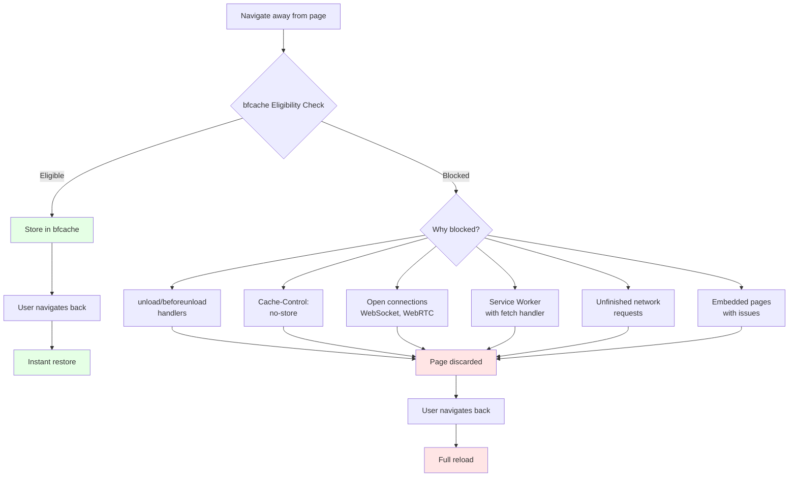

import snippet from '../../snippets/Loading/Back-Forward-Cache.js?raw'
import { Snippet } from '../../components/Snippet'

# Back/Forward Cache (bfcache)

### Overview

Analyzes [Back/Forward Cache (bfcache)](https://web.dev/articles/bfcache) to determine if your page is eligible for instant back/forward navigations. When bfcache works, users get instant (0ms) page loads when using browser back/forward buttons, dramatically improving perceived performance.

**Why this matters:**

bfcache is one of the most impactful performance optimizations available - it can make navigation instantaneous. However, many pages are unknowingly ineligible due to common patterns like `unload` handlers, `Cache-Control: no-store`, or ongoing network requests. This snippet helps identify why your page isn't being cached and how to fix it.

**bfcache Impact:**

| Navigation Type | Load Time | User Experience |
|----------------|-----------|-----------------|
| Normal navigation | 1-3s | Wait, spinner |
| bfcache restoration | 0ms | Instant |

**How bfcache works:**

```mermaid
sequenceDiagram
    participant U as User
    participant B as Browser
    participant P1 as Page A
    participant P2 as Page B

    U->>P1: Visit Page A
    Note over P1: Page loads normally

    U->>B: Navigate to Page B
    B->>B: Check bfcache eligibility
    alt Page is eligible
        B->>B: Store Page A in bfcache
        Note over B: Full page state preserved<br/>(DOM, JS state, scroll)
    else Page is ineligible
        B->>B: Discard Page A
        Note over B: Reasons logged
    end

    B->>P2: Load Page B
    Note over P2: User on Page B

    U->>B: Click Back button
    alt Page in bfcache
        B->>P1: Restore from bfcache
        Note over P1: Instant restoration (0ms)
        B->>P1: Fire pageshow event<br/>with persisted=true
    else Page not cached
        B->>P1: Full page reload
        Note over P1: Normal load (1-3s)
    end

    style B fill:#E5F2FF
```

**Common blocking reasons:**



### Snippet

<Snippet code={snippet} />

### Understanding bfcache

**What is bfcache:**

The back/forward cache (bfcache) stores a complete snapshot of a page when you navigate away. When you press the browser back button, the page is restored instantly from memory instead of reloading.

**Benefits:**

- **0ms navigation**: Instant page restoration
- **Preserved scroll position**: Users return to exact scroll position
- **Preserved form state**: Form inputs maintain their values
- **Preserved JavaScript state**: Variables, timers, everything intact

**When bfcache works:**

```
User flow with bfcache:
Page A → Page B → [Back] → Page A (instant, 0ms)

User flow without bfcache:
Page A → Page B → [Back] → Page A (full reload, 1-3s)
```

### Common Blockers and Solutions

| Blocker | Why it blocks | Solution |
|---------|--------------|----------|
| **unload event** | Can't be reliably replayed | Use `pagehide` or `visibilitychange` |
| **beforeunload** | Prevents navigation caching | Remove or use `pagehide` for cleanup |
| **Cache-Control: no-store** | Tells browser not to cache | Change to `no-cache` or `private` |
| **Open IndexedDB transaction** | State can't be serialized | Close transactions on `pagehide` |
| **WebSocket connection** | Can't be suspended | Close on `pagehide`, reconnect on `pageshow` |
| **Ongoing fetch/XHR** | Incomplete network state | Abort on `pagehide` |
| **BroadcastChannel** | Can't be suspended | Close on `pagehide` |

### Fixing Common Issues

#### Issue 1: unload/beforeunload handlers

**Bad:**
```javascript
window.addEventListener('unload', () => {
  saveData(); // Blocks bfcache
});

window.addEventListener('beforeunload', () => {
  return 'Are you sure?'; // Blocks bfcache
});
```

**Good:**
```javascript
window.addEventListener('pagehide', (event) => {
  // event.persisted tells you if page goes to bfcache
  if (event.persisted) {
    // Page will be cached, do minimal cleanup
    console.log('Page going to bfcache');
  } else {
    // Page being discarded, do full cleanup
    saveData();
  }
});
```

#### Issue 2: Cache-Control: no-store

**Bad:**
```html
<meta http-equiv="Cache-Control" content="no-store">
```

**Good:**
```html
<!-- Remove the meta tag entirely, or use: -->
<meta http-equiv="Cache-Control" content="no-cache">
```

#### Issue 3: Open WebSocket

**Bad:**
```javascript
const ws = new WebSocket('wss://example.com');
// Connection stays open, blocks bfcache
```

**Good:**
```javascript
const ws = new WebSocket('wss://example.com');

window.addEventListener('pagehide', () => {
  ws.close(); // Close on navigation
});

window.addEventListener('pageshow', (event) => {
  if (event.persisted) {
    // Reconnect after bfcache restore
    ws = new WebSocket('wss://example.com');
  }
});
```

#### Issue 4: IndexedDB

**Bad:**
```javascript
const request = indexedDB.open('myDB');
request.onsuccess = () => {
  const db = request.result;
  const transaction = db.transaction(['store'], 'readwrite');
  // Transaction stays open, blocks bfcache
};
```

**Good:**
```javascript
let db;
const request = indexedDB.open('myDB');
request.onsuccess = () => {
  db = request.result;
};

window.addEventListener('pagehide', () => {
  db?.close(); // Close connection
});
```

### Testing bfcache

**Method 1: Manual test (recommended)**

⚠️ **Important: Execution order matters!**

**Correct order:**
1. **First**: Open your page
2. **Second**: Run this snippet (to register event listeners)
3. **Third**: Navigate to another page (e.g., click a link)
4. **Fourth**: Press browser Back button
5. **Fifth**: Check console for results

**Why this order?** The snippet needs to be listening for the `pageshow` event with `persisted: true` to detect bfcache restoration. If you run the snippet *after* clicking Back, you'll miss the restoration event.

**If you run the snippet after navigating back:**
- ⚠️ You'll see a timing warning
- ❌ Won't detect if page was restored from bfcache
- ✅ Will still show `NotRestoredReasons` from that navigation
- ✅ Will still analyze current eligibility

**Output when run in correct order:**
```
⚡ Page restored from bfcache!
   Navigation was instant (0ms)
```

**Method 2: Chrome DevTools**

1. Open DevTools → Application tab
2. Click "Back/forward cache" in sidebar
3. Click "Test back/forward cache"
4. DevTools will navigate forward then back
5. See detailed blocking reasons

**Method 3: Chrome flags (for testing)**

Visit `chrome://flags/#back-forward-cache` and enable experimental features for testing.

### NotRestoredReasons API (Chrome 123+)

Chrome 123+ provides the detailed `notRestoredReasons` API that shows exactly why bfcache was blocked. This is the most accurate way to diagnose bfcache issues.

**API structure:**

```javascript
const navEntry = performance.getEntriesByType('navigation')[0];
if (navEntry.notRestoredReasons) {
  const reasons = navEntry.notRestoredReasons;

  // Page-level information
  console.log('Blocked:', reasons.blocked);        // boolean
  console.log('URL:', reasons.url);                // page URL
  console.log('Frame ID:', reasons.id);            // frame identifier
  console.log('Name:', reasons.name);              // frame name (if any)
  console.log('Source:', reasons.src);             // frame source (if iframe)

  // Array of NotRestoredReasonDetails objects
  reasons.reasons.forEach(detail => {
    console.log('Reason:', detail.reason);         // blocking reason
    console.log('Source:', detail.source);         // where it came from
  });

  // Nested iframes
  reasons.children.forEach(child => {
    console.log('Child URL:', child.url);
    console.log('Child blocked:', child.blocked);
    console.log('Child reasons:', child.reasons);
  });
}
```

**The snippet automatically parses and displays this information in a readable format with color-coding and tables.**

### Understanding NotRestoredReasonDetails

Each blocking reason is a `NotRestoredReasonDetails` object with these properties:

| Property | Type | Description |
|----------|------|-------------|
| `reason` | string | The specific blocking reason (e.g., "WebSocket", "unload-listener") |
| `source` | string | Source location: "UserAgentOnly" (browser), "JavaScript" (your code), etc. |

**Common reason values:**

| Reason | What it means |
|--------|---------------|
| `unload-listener` | Page has unload event listener |
| `response-cache-control` | Cache-Control: no-store header |
| `WebSocket` | Open WebSocket connection |
| `IndexedDB` | Open IndexedDB transaction |
| `BroadcastChannel` | Open BroadcastChannel |
| `related-active-contents` | Related page (popup/iframe) blocks caching |

**Example output interpretation:**

```javascript
// Real example from joanleon.dev
{
  blocked: false,
  url: "https://joanleon.dev/",
  reasons: [
    {
      reason: "WebSocket",
      source: "JavaScript"
    }
  ]
}
```

This tells us:
- ✅ Page was **not blocked** this time (blocked: false)
- ❌ But a **WebSocket** connection was detected
- 📍 It came from **JavaScript** code (not browser extension)
- 🎯 **Action**: Close WebSocket on `pagehide` event to enable bfcache

### Interpreting Your Results

**Scenario 1: Fast back/forward (< 10ms)**
```
Type: back_forward
Duration: 8ms
✅ Page restored from bfcache
```
✅ **Excellent!** bfcache is working perfectly.

**Scenario 2: Slow back/forward (> 100ms) with reasons**
```
Type: back_forward
Duration: 405ms
🐌 Slow back/forward (full reload)

Blocking reasons:
- WebSocket connection detected
- Source: JavaScript
```
❌ **Action needed:** Your page has blockers preventing bfcache. Fix the listed issues.

**Scenario 3: Blocked = false, but slow navigation**
```
blocked: false
Duration: 405ms
Reasons: [WebSocket]
```
⚠️ **Important:** Even though `blocked: false`, the page wasn't cached on the **previous** navigation because of WebSocket. Fix it and test again with a fresh navigation cycle.

### Testing Workflow

To get accurate `notRestoredReasons` data:

1. **First navigation**: Open page → Navigate away
   - At this point, browser decides if page goes to bfcache
   - If there are blockers, page is discarded

2. **Back navigation**: Click back button
   - `notRestoredReasons` is populated based on previous navigation
   - Check if `blocked: true` and what the reasons were

3. **Fix issues**: Close connections, remove handlers

4. **Test again**: Repeat from step 1
   - The previous test's blockers are now stored in `notRestoredReasons`
   - Run the snippet after clicking back to see results

**Chrome DevTools shortcut:**
- DevTools → Application → Back/forward cache
- Click "Test back/forward cache" button
- Instantly see detailed blocking reasons

### Reading the Output

The snippet displays detailed information about `NotRestoredReasonDetails` objects:

**Blocking reasons format:**
```
Blocking reasons:
1. WebSocket
   Reason: WebSocket
   Source: JavaScript
   💡 Open WebSocket connections prevent bfcache. Close them on pagehide event.

📋 Summary Table:
┌─────────┬────────────────┬────────────┐
│ (index) │ Reason         │ Source     │
├─────────┼────────────────┼────────────┤
│ 0       │ 'WebSocket'    │'JavaScript'│
└─────────┴────────────────┴────────────┘
```

Each blocking reason shows:
- **Reason**: The specific blocker (e.g., "WebSocket", "unload-listener")
- **Source**: Where it comes from ("JavaScript", "UserAgentOnly")
- **Context**: Helpful explanation and recommended fix
- **Table**: Summary of all reasons for easy comparison

### Browser Support

| Browser | bfcache Support | NotRestoredReasons API |
|---------|-----------------|------------------------|
| Chrome 96+ | ✅ | ✅ (123+) |
| Edge 96+ | ✅ | ✅ (123+) |
| Safari 14+ | ✅ | ❌ |
| Firefox 86+ | ✅ | ❌ |

All modern browsers support bfcache, but diagnostics vary.

### Common Mistakes and Real-World Examples

#### ❌ Mistake 1: Running Snippet After Navigation (Wrong Order)

**Real example from joanleon.dev when executed incorrectly:**

**What happened:**
1. User visited https://joanleon.dev/
2. Clicked on a blog post
3. Clicked browser Back button ← Navigation already happened
4. **Then** ran the snippet ← Too late!

**Output received:**

```
⚠️ Timing Warning
Snippet executed AFTER back/forward navigation.

For complete analysis including bfcache restoration detection:
   1. Run this snippet FIRST
   2. Then navigate away
   3. Then click Back button

🟡 bfcache Status: Potentially Eligible

📊 Status:
   ℹ️  This page was NOT restored from bfcache
   (Either first visit or bfcache was blocked on previous navigation)

🕐 Navigation Timing:
   Type: back_forward
   Duration: 405ms
   🐌 Slow back/forward (full reload)

🔍 Potential Issues:
   • LOW: BroadcastChannel API available
   • MEDIUM: WebSocket API available (check if connections are open)

🔬 Not Restored Reasons (Chrome 123+):
   Page-level information:
   ✅ Page was not blocked
   URL: https://joanleon.dev/

   Blocking reasons:
   1. WebSocket
      Reason: WebSocket
      Source: JavaScript
      💡 Open WebSocket connections prevent bfcache. Close them on pagehide event.
```

**Why this output is incomplete:**
- ❌ Missed the `pageshow` event with `persisted=true`
- ❌ Cannot confirm if page was actually restored from bfcache
- ✅ Still shows `NotRestoredReasons` (helpful for diagnosis)
- ✅ Still shows current eligibility analysis

**Diagnosis from available data:**
1. ✅ **Good news**: No unload handlers, no Cache-Control issues
2. ❌ **Problem**: WebSocket connection blocking bfcache
3. 📊 **Impact**: 405ms reload vs. potential 0ms with bfcache
4. 🎯 **Solution needed**: Close WebSocket on `pagehide`

---

#### ✅ Example 2: Running Snippet in Correct Order

**Correct workflow for joanleon.dev:**

**What to do:**
1. Visit https://joanleon.dev/
2. **First**: Run the snippet ← Sets up event listeners
3. Click on a blog post
4. Click browser Back button ← Snippet captures everything

**Output with listeners active (before fix):**

```
🚀 bfcache Analysis Running...
   Listening for pageshow event...
   Ready to detect bfcache restoration.

[User navigates away and comes back...]

🟡 bfcache Status: Potentially Eligible

📊 Status:
   ℹ️  This page was NOT restored from bfcache
   (Snippet detected bfcache was blocked on this navigation)

🕐 Navigation Timing:
   Type: back_forward
   Duration: 405ms
   🐌 Slow back/forward (full reload)

🔍 Potential Issues:
   • MEDIUM: WebSocket API available (check if connections are open)

🔬 Not Restored Reasons (Chrome 123+):
   Blocking reasons:
   1. WebSocket
      Reason: WebSocket
      Source: JavaScript
      💡 Open WebSocket connections prevent bfcache. Close them on pagehide event.
```

**Fix applied:**

```javascript
let ws = new WebSocket('wss://example.com/updates');

// Close connection when leaving page
window.addEventListener('pagehide', () => {
  if (ws && ws.readyState === WebSocket.OPEN) {
    ws.close();
  }
});

// Reconnect after bfcache restore
window.addEventListener('pageshow', (event) => {
  if (event.persisted) {
    // Page restored from bfcache, reconnect
    ws = new WebSocket('wss://example.com/updates');
  }
});
```

**Output after fix (with snippet running first):**

```
🚀 bfcache Analysis Running...
   Listening for pageshow event...

[User navigates away and comes back...]

⚡ Page restored from bfcache!
   Navigation was instant (0ms)

🟢 bfcache Status: Likely Eligible

📊 Status:
   ✅ This page WAS restored from bfcache
   Navigation was instant!

🕐 Navigation Timing:
   Type: back_forward
   Duration: 3ms
   ⚡ Fast back/forward (likely from bfcache)

🔍 Potential Issues:
   • No significant blockers detected

🔬 Not Restored Reasons (Chrome 123+):
   Page-level information:
   ✅ Page was not blocked
   URL: https://joanleon.dev/
```

**Impact:** 405ms → 3ms = **99.3% faster** back navigations

**Key takeaway:** Running the snippet in the correct order provides complete visibility into bfcache restoration, allowing you to confirm that fixes actually work.

### Real-World Impact

**Case studies:**

- **Wikipedia**: 40% faster back navigations with bfcache
- **E-commerce sites**: 50% reduction in bounce rate from back button
- **News sites**: 60% of back navigations became instant

**Measuring impact:**

Track navigation timing with `performance.getEntriesByType('navigation')`:

- **With bfcache**: duration < 10ms, type === 'back_forward'
- **Without bfcache**: duration > 1000ms, full reload

### RUM Integration

```js copy
// Track bfcache restoration in RUM
window.addEventListener('pageshow', (event) => {
  if (event.persisted) {
    // Page restored from bfcache
    gtag('event', 'bfcache_restoration', {
      navigation_type: 'back_forward',
      duration: 0,
    });
  }
});

// Track bfcache eligibility
const navEntry = performance.getEntriesByType('navigation')[0];
if (navEntry && navEntry.notRestoredReasons) {
  const blocked = navEntry.notRestoredReasons.blocked;
  const reasons = navEntry.notRestoredReasons.reasons || [];

  gtag('event', 'bfcache_eligibility', {
    blocked: blocked,
    reasons: reasons.join(', '),
  });
}
```

### Further Reading

- [Back/forward cache (bfcache)](https://web.dev/articles/bfcache) | web.dev
- [NotRestoredReasons API](https://developer.chrome.com/docs/web-platform/bfcache-notrestoredreasons/) | Chrome Developers
- [Page Lifecycle API](https://developer.chrome.com/docs/web-platform/page-lifecycle-api/) | Chrome Developers
- [bfcache tester](https://back-forward-cache-tester.glitch.me/) | Interactive testing tool
