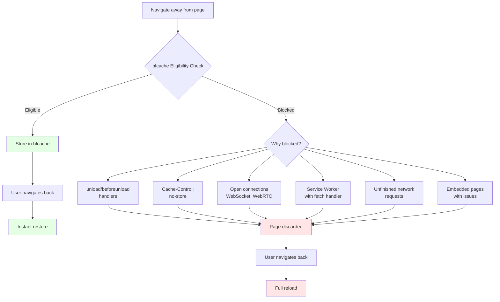

import snippet from "../../snippets/Loading/Back-Forward-Cache.js?raw";
import { Snippet } from "../../components/Snippet";

# Back/forward cache (bfcache)

Analyzes [Back/Forward Cache (bfcache)](https://web.dev/articles/bfcache) to determine if your page is eligible for instant back/forward navigations. When bfcache works, users get instant (0ms) page loads when using browser back/forward buttons, dramatically improving perceived performance.

### Why this matters

bfcache is one of the most impactful performance optimizations available - it can make navigation instantaneous. However, many pages are unknowingly ineligible due to common patterns like `unload` handlers, `Cache-Control: no-store`, or open connections. This snippet reports the blockers it can detect and reads the `NotRestoredReasons` the browser reports after a back navigation, including those of embedded frames.

### bfcache impact

| Navigation Type     | Load Time | User Experience |
| ------------------- | --------- | --------------- |
| Normal navigation   | 1-3s      | Wait, spinner   |
| bfcache restoration | 0ms       | Instant         |

### How bfcache works

```mermaid
sequenceDiagram
    participant U as User
    participant B as Browser
    participant P1 as Page A
    participant P2 as Page B

    U->>P1: Visit Page A
    Note over P1: Page loads normally

    U->>B: Navigate to Page B
    B->>B: Check bfcache eligibility
    alt Page is eligible
        B->>B: Store Page A in bfcache
        Note over B: Full page state preserved<br/>(DOM, JS state, scroll)
    else Page is ineligible
        B->>B: Discard Page A
        Note over B: Reasons logged
    end

    B->>P2: Load Page B
    Note over P2: User on Page B

    U->>B: Click Back button
    alt Page in bfcache
        B->>P1: Restore from bfcache
        Note over P1: Instant restoration (0ms)
        B->>P1: Fire pageshow event<br/>with persisted=true
    else Page not cached
        B->>P1: Full page reload
        Note over P1: Normal load (1-3s)
    end

    style B fill:#E5F2FF
```

### Common blocking reasons


```mermaid
flowchart TD
    Start[Navigate away from page] --> Check{bfcache Eligibility Check}

    Check -->|Eligible| Cache[Store in bfcache]
    Check -->|Blocked| Reasons{Why blocked?}

    Reasons --> R1["unload/beforeunload<br/>handlers"]
    Reasons --> R2["Cache-Control:<br/>no-store"]
    Reasons --> R3["Open connections<br/>WebSocket, WebRTC"]
    Reasons --> R4["Service Worker<br/>with fetch handler"]
    Reasons --> R5["Unfinished network<br/>requests"]
    Reasons --> R6["Embedded pages<br/>with issues"]

    Cache --> Navigate[User navigates back]
    Navigate --> Restore[Instant restore]

    R1 --> Block[Page discarded]
    R2 --> Block
    R3 --> Block
    R4 --> Block
    R5 --> Block
    R6 --> Block

    Block --> Navigate2[User navigates back]
    Navigate2 --> Reload[Full reload]

    style Cache fill:#E5FFE5
    style Restore fill:#E5FFE5
    style Block fill:#FFE5E5
    style Reload fill:#FFE5E5
```

### Snippet

<Snippet code={snippet} />

### Understanding bfcache

### What is bfcache

The back/forward cache (bfcache) stores a complete snapshot of a page when you navigate away. When you press the browser back button, the page is restored instantly from memory instead of reloading.

### Benefits

- **0ms navigation**: Instant page restoration
- **Preserved scroll position**: Users return to exact scroll position
- **Preserved form state**: Form inputs maintain their values
- **Preserved JavaScript state**: Variables, timers, everything intact

### When bfcache works

```
User flow with bfcache:
Page A → Page B → [Back] → Page A (instant, 0ms)

User flow without bfcache:
Page A → Page B → [Back] → Page A (full reload, 1-3s)
```

### Common blockers and solutions

| Blocker                        | Why it blocks               | Solution                                     |
| ------------------------------ | --------------------------- | -------------------------------------------- |
| **unload event**               | Can't be reliably replayed  | Use `pagehide` or `visibilitychange`         |
| **beforeunload**               | Prevents navigation caching | Remove or use `pagehide` for cleanup         |
| **Cache-Control: no-store**    | Tells browser not to cache  | Change to `no-cache` or `private`            |
| **Open IndexedDB transaction** | State can't be serialized   | Close transactions on `pagehide`             |
| **WebSocket connection**       | Can't be suspended          | Close on `pagehide`, reconnect on `pageshow` |
| **Ongoing fetch/XHR**          | Incomplete network state    | Abort on `pagehide`                          |
| **BroadcastChannel**           | Can't be suspended          | Close on `pagehide`                          |

### What the snippet detects

Several blockers are invisible to JavaScript, so the snippet separates what it can verify from what only the browser knows:

| Source | What it reports | Result |
| ------ | --------------- | ------ |
| `NotRestoredReasons` (after a back navigation) | Every reason the browser found, for the page and for each frame | `blocked` |
| `window.onunload` set as a property | An `unload` handler | `likely-blocked` |
| `Cache-Control: no-store` header | Read with a `HEAD` request to the current URL | `likely-blocked` |
| iframes, Service Worker | Context only, never a blocker by themselves | `info` |

When none of these apply, the result is `no-blockers-detected`. That is not a guarantee: `unload` listeners added with `addEventListener`, and open WebSocket, BroadcastChannel or IndexedDB connections, cannot be detected from JavaScript. They appear in `NotRestoredReasons` after a back navigation, or in DevTools → Application → Back/forward cache.

### Fixing common issues

#### Issue 1: unload/beforeunload handlers

##### Bad

```javascript
window.addEventListener("unload", () => {
  saveData(); // Blocks bfcache
});

window.addEventListener("beforeunload", () => {
  return "Are you sure?"; // Blocks bfcache
});
```

##### Good

```javascript
window.addEventListener("pagehide", (event) => {
  // event.persisted tells you if page goes to bfcache
  if (event.persisted) {
    // Page will be cached, do minimal cleanup
    console.log("Page going to bfcache");
  } else {
    // Page being discarded, do full cleanup
    saveData();
  }
});
```

#### Issue 2: Cache-Control: no-store

The header is part of the HTTP response of the page. A `<meta http-equiv="Cache-Control">` tag is ignored by browsers, so it has no effect on bfcache either way.

##### Bad

```http
Cache-Control: no-store
```

##### Good

```http
Cache-Control: no-cache
```

Keep `no-store` only for responses that contain sensitive data, and use `private` or `no-cache` for the rest.

#### Issue 3: Open WebSocket

##### Bad

```javascript
const ws = new WebSocket("wss://web.dev");
// Connection stays open, blocks bfcache
```

##### Good

```javascript
const ws = new WebSocket("wss://web.dev");

window.addEventListener("pagehide", () => {
  ws.close(); // Close on navigation
});

window.addEventListener("pageshow", (event) => {
  if (event.persisted) {
    // Reconnect after bfcache restore
    ws = new WebSocket("wss://web.dev");
  }
});
```

#### Issue 4: IndexedDB

##### Bad

```javascript
const request = indexedDB.open("myDB");
request.onsuccess = () => {
  const db = request.result;
  const transaction = db.transaction(["store"], "readwrite");
  // Transaction stays open, blocks bfcache
};
```

##### Good

```javascript
let db;
const request = indexedDB.open("myDB");
request.onsuccess = () => {
  db = request.result;
};

window.addEventListener("pagehide", () => {
  db?.close(); // Close connection
});
```

### Testing bfcache

### Method 1: Manual test (recommended)

1. Open your page and run the snippet. It reports the blockers it can detect and starts listening for the `pageshow` event.
2. Navigate to another page, for example by clicking a link.
3. Press the browser Back button.
4. Run the snippet again. The browser now reports `NotRestoredReasons` for the page and its frames.

A `pageshow` event with `persisted: true` is the only reliable sign that a page was restored. The snippet logs it as soon as it happens, but only if it was running before the navigation.

### Output when the page is restored

```
⚡ Page restored from bfcache!
```

### Method 2: Chrome DevTools

1. Open DevTools → Application tab
2. Click "Back/forward cache" in sidebar
3. Click "Test back/forward cache"
4. DevTools will navigate forward then back
5. See detailed blocking reasons

### NotRestoredReasons API (Chrome 123+)

Chrome 123+ exposes `notRestoredReasons` on the navigation entry. After a back or forward navigation that was not served from bfcache, it lists why. This is the most accurate way to diagnose bfcache issues.

### API structure

```javascript
const navEntry = performance.getEntriesByType("navigation")[0];
const nrr = navEntry.notRestoredReasons;

if (nrr) {
  console.log("URL:", nrr.url); // page URL
  nrr.reasons.forEach((detail) => {
    console.log("Reason:", detail.reason); // e.g. "unload-listener"
  });

  // Embedded frames, each with the same shape
  nrr.children.forEach((child) => {
    console.log("Frame:", child.src, child.reasons.map((d) => d.reason));
  });
}
```

Each entry of `reasons` is an object whose `reason` property holds the reason. The `notRestoredReasons` property is `null` when the page was restored, when the navigation was not a back or forward one, and in browsers without support.

**The snippet walks the frame tree and returns it in `details.notRestoredReasons`, with one error issue for every reason and the frame it comes from.**

### Reason values

### Common reason values

| Reason | What it means |
| ------ | ------------- |
| `unload-listener` | The page or a frame has an `unload` event listener |
| `response-cache-control-no-store` | The page response has `Cache-Control: no-store` |
| `websocket` | Open WebSocket connection |
| `broadcastchannel` | Open BroadcastChannel |
| `indexeddb-connection` | Open IndexedDB connection |
| `related-active-contents` | A related window (popup, opener) blocks caching |
| `masked` | The browser hides the exact reason, for example for a cross-origin frame |

### Example with an embedded frame

```json
{
  "url": "https://example.com/",
  "reasons": [{ "reason": "masked" }, { "reason": "unload-listener" }],
  "children": [
    { "src": "/frame", "reasons": [{ "reason": "unload-listener" }], "children": [] }
  ]
}
```

This tells us:

- The page was **not restored** from bfcache
- The page has an `unload` listener
- An embedded frame also has an `unload` listener, and it blocks the whole page
- `masked` means the browser does not disclose one of the reasons
- **Action**: replace both `unload` listeners with `pagehide`

### Interpreting your results

| Result | Meaning | Next step |
| ------ | ------- | --------- |
| `blocked` | The browser reported reasons after a back navigation | Fix each listed reason, in the page and in its frames |
| `likely-blocked` | The snippet found an `unload` handler or `Cache-Control: no-store` | Remove it and test a back navigation to confirm |
| `no-blockers-detected` | Nothing detectable was found | Test a back navigation; blockers that JavaScript cannot see only appear in `NotRestoredReasons` |

### Testing workflow

`notRestoredReasons` describes the navigation that just happened, so a fix is only confirmed by a new cycle:

1. Open the page and navigate away. The browser decides at this point whether the page goes into bfcache.
2. Press Back and run the snippet. Read the reasons.
3. Fix the blockers: remove `unload` listeners, close connections on `pagehide`.
4. Repeat from step 1. A `pageshow` event with `persisted: true` confirms the fix.

### Chrome DevTools shortcut

- DevTools → Application → Back/forward cache
- Click "Test back/forward cache"
- The panel lists the blocking reasons immediately

### Browser support

| Browser     | bfcache Support | NotRestoredReasons API |
| ----------- | --------------- | ---------------------- |
| Chrome 96+  | ✅              | ✅ (123+)              |
| Edge 96+    | ✅              | ✅ (123+)              |
| Safari 14+  | ✅              | ❌                     |
| Firefox 86+ | ✅              | ❌                     |

All modern browsers support bfcache, but diagnostics vary.

### Example output

#### Page with an unload handler, run before navigating away

```
🚀 bfcache Analysis
🟠 bfcache: Likely blocked

📊 Status:
   ℹ️  This page was loaded normally. Restoration is reported by a pageshow event.
   Navigation type: navigate

🔍 Findings:
┌─────────┬──────────┬──────────────────────────────┬─────────────────────────────────────────────────────────────────┐
│ (index) │ Severity │ Finding                      │ Detail                                                          │
├─────────┼──────────┼──────────────────────────────┼─────────────────────────────────────────────────────────────────┤
│ 0       │ 'HIGH'   │ 'window.onunload handler set'│ 'unload event listeners block bfcache. Use pagehide or ...'     │
└─────────┴──────────┴──────────────────────────────┴─────────────────────────────────────────────────────────────────┘

💡 Recommendations:
   1. unload event listeners block bfcache. Use pagehide or visibilitychange instead.
```

#### Same page after navigating away and pressing back

The page has an `unload` listener and an iframe with its own `unload` listener.

```
🔴 bfcache: Blocked (reported by the browser)

📊 Status:
   ℹ️  This page was loaded by a back/forward navigation, not restored from bfcache
   Navigation type: back_forward

🔬 NotRestoredReasons (reported by the browser)
   • masked
     💡 The browser does not disclose the exact reason (for example, a cross-origin frame).
   • unload-listener
     💡 unload event listeners block bfcache. Use pagehide or visibilitychange instead.
   Frame: /frame
      • unload-listener
        💡 unload event listeners block bfcache. Use pagehide or visibilitychange instead.
```

The `details.notRestoredReasons` property of the returned object carries the same tree, and `issues` has one `error` per reason and frame.

### Real-world impact

### Case studies

- **Wikipedia**: 40% faster back navigations with bfcache
- **E-commerce sites**: 50% reduction in bounce rate from back button
- **News sites**: 60% of back navigations became instant

### Measuring impact

Count restorations with the `pageshow` event: a restore fires it with `persisted: true`, while a regular back navigation loads the page again and reports `notRestoredReasons`.

### RUM integration

```js copy
// Track bfcache restoration in RUM
window.addEventListener("pageshow", (event) => {
  if (event.persisted) {
    // Page restored from bfcache
    gtag("event", "bfcache_restoration", {
      navigation_type: "back_forward",
      duration: 0,
    });
  }
});

// Track why a back/forward navigation did not use bfcache
const navEntry = performance.getEntriesByType("navigation")[0];
if (navEntry && navEntry.notRestoredReasons) {
  const reasons = navEntry.notRestoredReasons.reasons || [];

  gtag("event", "bfcache_not_restored", {
    reasons: reasons.map((detail) => detail.reason).join(", "),
  });
}
```

### Further reading

- [Back/forward cache (bfcache)](https://web.dev/articles/bfcache) | web.dev
- [NotRestoredReasons API](https://developer.chrome.com/docs/web-platform/bfcache-notrestoredreasons/) | Chrome Developers
- [Page Lifecycle API](https://developer.chrome.com/docs/web-platform/page-lifecycle-api/) | Chrome Developers
- [bfcache tester](https://back-forward-cache-tester.glitch.me/) | Interactive testing tool
