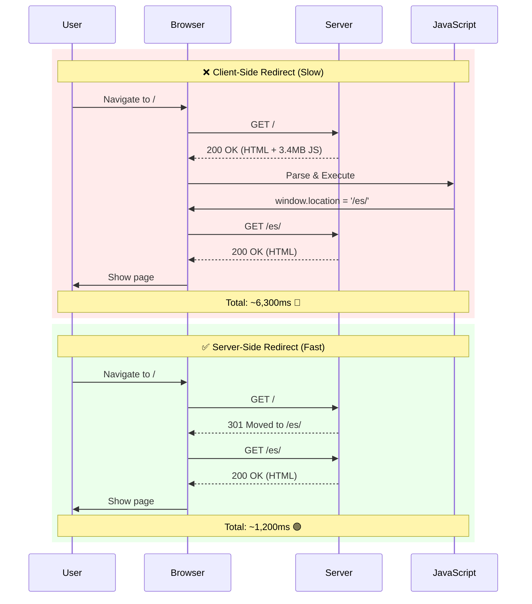

import snippet from '../../snippets/Loading/Client-Side-Redirect-Detection.js?raw'
import { Snippet } from '../../components/Snippet'

# Client-Side Redirect Detection

### Overview

Detects client-side redirects that add unnecessary latency to page load and impact Core Web Vitals, particularly LCP. Client-side redirects implemented via JavaScript or SPA routers can add seconds to the critical rendering path, yet they're often invisible to standard monitoring tools.

**Why this matters:**

Client-side redirects are one of the most impactful but hardest-to-detect performance issues:

- Add complete navigation overhead (HTML download, JS parsing, execution) just to redirect
- Can increase LCP by 3 to 6 seconds on first visit
- Waste bandwidth downloading resources that won't be displayed
- Not visible in basic performance metrics
- Often introduced accidentally during localization or A/B testing

**Common patterns that trigger client-side redirects:**

| Pattern | Example | Impact |
|---------|---------|--------|
| **Language detection** | `/` loads JS → redirects to `/es/` | Very high - entire page load wasted |
| **A/B testing** | Landing page → JS decides variant → redirects | High - experiment framework overhead |
| **Authentication check** | Public URL → JS checks auth → redirects to login | Moderate - blocking on auth check |
| **Legacy URLs** | Old URL → JS maps to new URL → redirects | High - should use 301 instead |
| **SPA routing** | Deep link → app loads → client router takes over | Low to moderate - depends on bundle size |

**Real-world example:**

```
User navigates to: https://example.com/

❌ What happens with client-side redirect:
• / responds with 2 KB HTML (757ms)
• Downloads main.js 3.4 MB (9,450ms)
• JS executes and redirects to /es/
• Downloads /es/ HTML and resources (2,430ms)
• Finally shows LCP image (6,320ms total)

✅ What should happen with server-side redirect:
• / responds with 301 redirect to /es/ (0-50ms)
• Browser navigates to /es/ directly
• Downloads /es/ HTML and resources
• Shows LCP image (1,200ms total)

Result: 81% improvement in LCP
```

**Redirect Flow Comparison:**



### Snippet

<Snippet code={snippet} />

### Understanding the Results

#### Current Page

Shows the current URL, path, and referrer information. If the referrer is from the same origin but a different path, this suggests a potential client-side redirect.

| Field | Description |
|-------|-------------|
| URL | Full current URL |
| Path | Current pathname |
| Referrer | Previous page URL (if available) |
| Referrer path | Previous pathname |

**No referrer** can mean:
- Direct navigation (user typed URL or used bookmark)
- Navigation from HTTPS → HTTP (browsers hide referrer)
- Referrer blocked by `Referrer-Policy`

#### Server-Side Redirects

Detects HTTP 301/302/307/308 redirects using the Navigation Timing API.

| Status | Meaning |
|--------|---------|
| ✅ No server-side redirects | Direct navigation, optimal |
| ⚠️ N redirect(s) detected | HTTP redirects occurred - check if necessary |

**Impact:**
- Each redirect adds one round-trip (50-300ms typically)
- Redirect chains (A→B→C) multiply the cost
- Mobile/slow connections amplify the impact

**When redirects are acceptable:**
- HTTPS enforcement (HTTP→HTTPS)
- www canonicalization (www→non-www or vice versa)
- Temporary redirects for maintenance (302)

**When to avoid:**
- Chains of 3+ redirects
- Client-side redirects that could be server-side
- Redirects on every page load

#### Client-Side Navigation Indicators

The snippet checks multiple signals to detect client-side redirects:

| Indicator | What it detects | Severity |
|-----------|----------------|----------|
| **Same-origin navigation** | Referrer from same domain, different path | ⚠️ Warning |
| **Document navigation** | Same-origin page loads detected in Resource Timing (excludes third-party iframes) | 🔴 Error |
| **Redirect parameter** | URL contains `?redirect=`, `?from=`, etc. | ℹ️ Info |
| **SPA router detected** | History API state present | ℹ️ Info |
| **Fast minimal-content navigation** | Small page (&lt;10KB) loaded quickly (&lt;500ms) - likely a redirect page | ⚠️ Warning |

**Severity levels:**

- 🔴 **Error**: High-confidence client-side redirect detection - fix immediately
- ⚠️ **Warning**: Likely redirect pattern - investigate
- ℹ️ **Info**: Supporting evidence - may be normal behavior

**Example output:**

```
📱 Client-Side Navigation Indicators:
   ⚠️ 2 indicator(s) found

   🔴 Document navigation
      url: https://example.com/es/
      duration: 2430.5ms

   ⚠️ Same-origin navigation
      from: /
      to: /es/
```

#### Performance Impact

When client-side redirects are detected, the snippet estimates their impact on LCP:

| Impact Level | Overhead | Rating | Action |
|--------------|----------|--------|--------|
| **CRITICAL** | &gt; 3000ms | 🔴 | Fix immediately - major LCP issue |
| **MODERATE** | 1000-3000ms | 🟡 | High priority - noticeable delay |
| **LOW** | &lt; 1000ms | 🟢 | Monitor - may be acceptable for SPAs |

**Calculating overhead:**

The overhead is the total duration of all document navigations detected in the Resource Timing API. This represents the additional time spent loading and processing pages that were only needed to redirect the user.

#### Recommendations

The snippet provides actionable recommendations based on the redirect type:

**For server-side redirects:**
- Minimize redirect chains
- Use direct links in your HTML/marketing campaigns
- Cache redirect responses

**For client-side redirects:**
- Replace with HTTP 301 (permanent) or 302 (temporary)
- Use language detection at the server/CDN level
- Implement redirects in Nginx, Apache, or CDN config

**Example server-side redirect configurations:**

See your web server documentation for implementing 301/302 redirects with language detection or path mapping.

#### Navigation Timing Table

Provides a complete breakdown of the current page load:

| Metric | Description |
|--------|-------------|
| TTFB | Time to First Byte - server response time |
| DOM Content Loaded | When HTML is parsed and DOM is ready |
| Load Complete | When all resources finish loading |
| Redirect Time | Time spent following redirects (if any) |
| DNS Lookup | Domain name resolution time |
| TCP Connect | Connection establishment time |
| Request/Response | Time to receive the response |

#### Document Navigations Table

If same-origin document navigations are detected, shows detailed timing for each. These are potential client-side redirects.

**Note:** Third-party iframes (analytics, ads, etc.) are automatically excluded from this analysis.

| Column | Description |
|--------|-------------|
| Type | `navigation` (same-origin page navigations) |
| Duration | Total time from start to load complete |
| TTFB | Time to first byte for this navigation |
| Transfer | Bytes transferred over the network |
| URL | The navigation URL (same origin as current page) |

### How to Use This Snippet

**1. Detect redirects on landing pages:**

Navigate to your site's homepage or common landing pages and run the snippet. Look for:
- Same-origin navigation indicators
- Document navigation entries
- High performance impact

**2. Compare direct vs. redirect navigation:**

```
Test 1: Navigate directly to /es/
→ Run snippet → Note timing

Test 2: Navigate to / (which redirects to /es/)
→ Run snippet → Note timing

Compare: Is Test 2 significantly slower?
```

**3. Test in different scenarios:**

- First visit (hard reload: Cmd+Shift+R)
- Repeat visit (normal reload: Cmd+R)
- With Service Worker active
- Different language preferences
- Different geographic locations

**4. Validate after fixes:**

After implementing server-side redirects:
- Retest with the snippet
- Verify no document navigation entries
- Confirm server-side redirects show in the "Server-Side Redirects" section
- Check that redirect time is minimal (under 50ms)

### Browser Support

| Feature | Chrome | Edge | Firefox | Safari |
|---------|--------|------|---------|--------|
| Navigation Timing | 57 | 12 | 58 | 11 |
| Resource Timing | 43 | 12 | 40 | 11 |
| document.referrer | All | All | All | All |

The snippet works in all modern browsers. Older browsers may show reduced information.

### Limitations

**Cannot detect:**
- Meta refresh redirects (`<meta http-equiv="refresh">`)
- Redirects that happen before the page loads
- Some SPA router navigations that don't create resource entries
- History.pushState/replaceState navigations without full page loads

**Automatically filtered out:**
- Third-party iframes (analytics, ads, social widgets)
- Cross-origin navigations
- Standard iframe embeds

**False positives:**
- SPAs that legitimately use client-side routing
- Preview/staging environments with redirect parameters
- A/B testing platforms that use URL parameters

**Accuracy notes:**
- Performance impact is estimated based on detected navigation entries
- Actual LCP impact may vary based on resource loading patterns
- Some redirect patterns may not leave traces in Performance APIs

### Further Reading

- [Avoid page redirects](https://developer.chrome.com/docs/lighthouse/performance/redirects) | Chrome Developers
- [Navigation Timing API](https://developer.mozilla.org/en-US/docs/Web/API/Navigation_timing_API) | MDN
- [Resource Timing API](https://developer.mozilla.org/en-US/docs/Web/API/Performance_API/Resource_timing) | MDN
- [Optimize LCP](https://web.dev/articles/optimize-lcp) | web.dev
- [TTFB](/Loading/TTFB) | Measure server response time affected by redirects
- [LCP Sub-Parts](/CoreWebVitals/LCP-Sub-Parts) | See how redirects impact LCP phases
