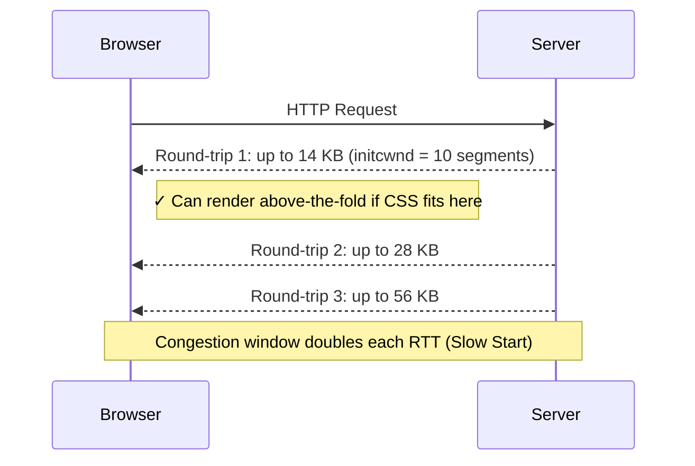

# Critical CSS Detection

### Overview

Analyzes the CSS loading strategy of a page — identifying render-blocking stylesheets, measuring their size against the critical 14 KB budget, and detecting whether critical CSS is properly inlined for above-the-fold content.

**What makes CSS "critical":**

| Type | Description | Performance Impact |
|------|-------------|-------------------|
| **Critical CSS** | Styles needed to render above-the-fold content | Must load before first paint |
| **Non-critical CSS** | Styles for below-the-fold or interactive content | Can be deferred |
| **Render-blocking CSS** | External `<link>` stylesheets without media targeting | Blocks FCP and LCP |

**Render-blocking CSS impact:**

| Stylesheet Status | FCP Impact | Recommendation |
|-------------------|-----------|----------------|
| Blocking (no media) | Delays FCP | Extract & inline critical portion |
| Blocking + preloaded | Reduced delay | Also consider deferring non-critical |
| Non-blocking (media query) | No blocking | Ideal pattern |
| Inline `<style>` | Eliminates request | Keep under 14 KB |

### The 14 KB Rule and TCP Slow Start

The 14 KB budget is not arbitrary — it comes from how TCP connections work at the network level.

When a browser opens a new TCP connection to a server, it cannot send all data at once. TCP starts in **Slow Start** mode: it begins with a small **initial congestion window (initcwnd)** and doubles it each round-trip until it reaches the network's capacity.

[RFC 6928](https://datatracker.ietf.org/doc/html/rfc6928) (2013) standardized the initial congestion window at **10 TCP segments**:

```
Maximum Segment Size (MSS) ≈ 1,460 bytes
  (Ethernet MTU: 1,500 bytes − 40 bytes TCP/IP headers)

First round-trip capacity:
  10 segments × 1,460 bytes = 14,600 bytes ≈ 14 KB
```

Everything that fits within those 14 KB arrives in a **single round-trip**. Anything beyond requires at least one more RTT before the browser receives it.



This is why the web performance community targets **HTML + critical CSS + critical JS under 14 KB** for the fastest possible First Contentful Paint — it means the browser can render above-the-fold content after just one network round-trip.

> The 14 KB figure is a practical approximation. IPv6 connections use a slightly smaller MSS (~1,440 bytes), and Path MTU Discovery can vary this further. But 14 KB is the widely adopted reference value in web performance.

### Snippet

```js copy
// Critical CSS Detection
// Analyzes render-blocking stylesheets, inline CSS budget, and loading strategy
// https://webperf-snippets.nucliweb.net

(() => {
  const formatBytes = (bytes) => {
    if (bytes === 0) return "0 B";
    const k = 1024;
    const sizes = ["B", "KB", "MB"];
    const i = Math.floor(Math.log(bytes) / Math.log(k));
    return (bytes / Math.pow(k, i)).toFixed(2) + " " + sizes[i];
  };

  const criticalBudget = 14 * 1024; // 14 KB (first TCP round-trip)

  // --- External stylesheets ---
  const linkStylesheets = Array.from(
    document.querySelectorAll('link[rel="stylesheet"]')
  );

  const perfEntries = performance.getEntriesByType("resource");

  const externalCSSData = linkStylesheets.map((link) => {
    const href = link.href;
    const media = link.getAttribute("media") || "all";

    // A stylesheet is render-blocking when it applies to screen without deferral
    const isRenderBlocking =
      media === "all" ||
      media === "" ||
      media === "screen" ||
      (media.toLowerCase().includes("screen") &&
        !media.toLowerCase().includes("print"));

    const perfEntry = perfEntries.find((e) => e.name === href);
    const transferSize = perfEntry ? perfEntry.transferSize : 0;
    const decodedSize = perfEntry ? perfEntry.decodedBodySize : 0;

    const preloadLink = document.querySelector(
      `link[rel="preload"][as="style"][href="${href}"]`
    );

    let ruleCount = 0;
    let corsBlocked = false;
    try {
      const sheet = Array.from(document.styleSheets).find(
        (s) => s.href === href
      );
      if (sheet && sheet.cssRules) ruleCount = sheet.cssRules.length;
    } catch (_) {
      corsBlocked = true;
    }

    return {
      filename: href.split("/").pop().split("?")[0] || href,
      href,
      media,
      isRenderBlocking,
      transferSize,
      decodedSize,
      ruleCount,
      corsBlocked,
      preloaded: preloadLink !== null,
    };
  });

  // --- Inline styles ---
  const inlineStyles = Array.from(document.querySelectorAll("style")).map(
    (style, i) => {
      const content = style.innerHTML;
      const size = new Blob([content]).size;
      const ruleCount = (content.match(/\{[^}]*\}/g) || []).length;
      return {
        index: i + 1,
        size,
        ruleCount,
        inHead: style.closest("head") !== null,
      };
    }
  );

  // --- Totals ---
  const renderBlockingCSS = externalCSSData.filter((s) => s.isRenderBlocking);
  const nonBlockingCSS = externalCSSData.filter((s) => !s.isRenderBlocking);
  const totalInlineBytes = inlineStyles.reduce((sum, s) => sum + s.size, 0);
  const totalRenderBlockingDecoded = renderBlockingCSS.reduce(
    (sum, s) => sum + s.decodedSize,
    0
  );
  const totalExternalTransfer = externalCSSData.reduce(
    (sum, s) => sum + s.transferSize,
    0
  );

  // --- Output ---
  console.group(
    "%c🎯 Critical CSS Detection",
    "font-weight: bold; font-size: 14px;"
  );

  console.log("");
  console.log("%cPage CSS Summary:", "font-weight: bold;");
  console.log(`   External stylesheets:        ${externalCSSData.length}`);
  console.log(`   Render-blocking:             ${renderBlockingCSS.length}`);
  console.log(`   Non-blocking (media query):  ${nonBlockingCSS.length}`);
  console.log(`   Inline <style> blocks:       ${inlineStyles.length}`);
  console.log(`   Total external CSS (wire):   ${formatBytes(totalExternalTransfer)}`);
  console.log(`   Total inline CSS:            ${formatBytes(totalInlineBytes)}`);

  // Render-blocking stylesheets
  if (renderBlockingCSS.length > 0) {
    console.log("");
    console.group(
      `%c🚫 Render-Blocking Stylesheets (${renderBlockingCSS.length})`,
      "color: #ef4444; font-weight: bold;"
    );

    console.table(
      renderBlockingCSS.map((s) => ({
        File: s.filename,
        Media: s.media,
        "Transfer Size": formatBytes(s.transferSize),
        "Decoded Size": formatBytes(s.decodedSize),
        Rules: s.corsBlocked ? "CORS blocked" : s.ruleCount,
        Preloaded: s.preloaded ? "✅ Yes" : "❌ No",
      }))
    );

    const budgetPct = Math.min(
      (totalRenderBlockingDecoded / criticalBudget) * 100,
      200
    );
    const barWidth = Math.min(Math.round(budgetPct / 10), 20);
    const bar = "█".repeat(barWidth) + "░".repeat(20 - barWidth);
    console.log(
      `\n   Total render-blocking: ${formatBytes(totalRenderBlockingDecoded)}`
    );
    console.log(`   vs. 14 KB budget:      [${bar}] ${budgetPct.toFixed(0)}%`);

    console.groupEnd();
  } else {
    console.log("");
    console.log(
      "%c✅ No render-blocking stylesheets detected.",
      "color: #22c55e; font-weight: bold;"
    );
  }

  // Non-blocking stylesheets
  if (nonBlockingCSS.length > 0) {
    console.log("");
    console.group(
      `%c✅ Non-Blocking Stylesheets (${nonBlockingCSS.length})`,
      "color: #22c55e; font-weight: bold;"
    );
    console.table(
      nonBlockingCSS.map((s) => ({
        File: s.filename,
        Media: s.media,
        "Transfer Size": formatBytes(s.transferSize),
        Rules: s.corsBlocked ? "CORS blocked" : s.ruleCount,
      }))
    );
    console.groupEnd();
  }

  // Inline styles
  if (inlineStyles.length > 0) {
    console.log("");
    const inlineBudgetPct = ((totalInlineBytes / criticalBudget) * 100).toFixed(0);
    const inlineRating =
      totalInlineBytes <= criticalBudget * 0.5
        ? { label: "Good", color: "#22c55e" }
        : totalInlineBytes <= criticalBudget
        ? { label: "Acceptable", color: "#f59e0b" }
        : { label: "Too Large", color: "#ef4444" };

    console.group(
      `%c📝 Inline CSS (${inlineStyles.length} block${inlineStyles.length > 1 ? "s" : ""})`,
      "color: #3b82f6; font-weight: bold;"
    );
    console.log(`   Total size:    ${formatBytes(totalInlineBytes)}`);
    console.log(`   Budget used:   ${inlineBudgetPct}% of 14 KB`);
    console.log(
      `   Rating:        %c${inlineRating.label}`,
      `color: ${inlineRating.color}; font-weight: bold;`
    );
    console.table(
      inlineStyles.map((s) => ({
        "#": s.index,
        Location: s.inHead ? "head" : "body",
        Size: formatBytes(s.size),
        "Rules (~)": s.ruleCount,
      }))
    );
    console.groupEnd();
  }

  // Issues
  const issues = [];

  if (renderBlockingCSS.length > 0 && inlineStyles.length === 0) {
    issues.push({
      severity: "high",
      message: "No critical CSS inlined — all CSS loads via render-blocking requests",
      suggestion:
        'Extract above-the-fold styles into a <style> tag in <head> and defer the rest',
    });
  }

  if (totalRenderBlockingDecoded > criticalBudget) {
    issues.push({
      severity: "high",
      message: `Render-blocking CSS (${formatBytes(totalRenderBlockingDecoded)}) exceeds the 14 KB critical budget`,
      suggestion:
        "Inline critical CSS and defer non-critical stylesheets using the media/onload pattern",
    });
  }

  const largeUnpreloaded = renderBlockingCSS.filter(
    (s) => !s.preloaded && s.transferSize > 10 * 1024
  );
  if (largeUnpreloaded.length > 0) {
    issues.push({
      severity: "medium",
      message: `${largeUnpreloaded.length} large render-blocking stylesheet(s) without preload`,
      details: largeUnpreloaded.map(
        (s) => `• ${s.filename} (${formatBytes(s.transferSize)})`
      ),
      suggestion: 'Add <link rel="preload" as="style" href="..."> to start download earlier',
    });
  }

  if (totalInlineBytes > criticalBudget) {
    issues.push({
      severity: "high",
      message: `Inline CSS (${formatBytes(totalInlineBytes)}) exceeds the 14 KB critical budget`,
      suggestion:
        "Keep inline critical CSS under 14 KB. Move non-critical styles to an external deferred file.",
    });
  }

  const bodyInlineStyles = inlineStyles.filter((s) => !s.inHead);
  if (bodyInlineStyles.length > 0) {
    issues.push({
      severity: "medium",
      message: `${bodyInlineStyles.length} inline style block(s) found in <body>`,
      suggestion:
        "Move critical styles to <head> to avoid potential render-blocking reflows",
    });
  }

  if (issues.length > 0) {
    console.log("");
    console.group("%c⚠️ Issues Found", "color: #f59e0b; font-weight: bold;");
    issues.forEach((issue) => {
      const icon =
        issue.severity === "high" ? "🔴" : issue.severity === "medium" ? "🟡" : "🔵";
      console.log(`\n${icon} ${issue.message}`);
      if (issue.details) issue.details.forEach((d) => console.log(`   ${d}`));
      console.log(`   → ${issue.suggestion}`);
    });
    console.groupEnd();
  } else {
    console.log("");
    console.log(
      "%c✅ No critical CSS issues detected.",
      "color: #22c55e; font-weight: bold;"
    );
  }

  // Best practices
  console.log("");
  console.group(
    "%c📖 Critical CSS Best Practices",
    "color: #3b82f6; font-weight: bold;"
  );
  console.log("");
  console.log("• Inline critical above-the-fold CSS in <head> (target: < 14 KB)");
  console.log("• Defer non-critical CSS:");
  console.log(
    '  <link rel="stylesheet" href="styles.css" media="print" onload="this.media=\'all\'">'
  );
  console.log('• Preload critical external CSS: <link rel="preload" as="style" href="...">');
  console.log("• Use Chrome DevTools Coverage tab (Ctrl+Shift+P → Coverage) to find unused CSS");
  console.log("• Automate critical CSS extraction with tools like critical or Critters");
  console.groupEnd();

  console.groupEnd();

  return {
    renderBlocking: renderBlockingCSS,
    nonBlocking: nonBlockingCSS,
    inline: inlineStyles,
    totals: {
      externalTransferBytes: totalExternalTransfer,
      renderBlockingDecodedBytes: totalRenderBlockingDecoded,
      inlineBytes: totalInlineBytes,
    },
  };
})();
```

### Understanding the Results

**Summary Section:**

- External stylesheets count, split by render-blocking vs non-blocking
- Inline `<style>` block count and combined size
- Total external CSS wire size

**Render-Blocking Stylesheets Table:**

| Column | Description |
|--------|-------------|
| File | Stylesheet filename |
| Media | `media` attribute value (blank = `all`) |
| Transfer Size | Compressed bytes over the wire |
| Decoded Size | Uncompressed bytes in memory |
| Rules | Number of CSS rules (CORS-blocked files cannot be read) |
| Preloaded | Whether a matching `<link rel="preload">` exists |

**Budget Bar:**

Shows total render-blocking CSS decoded size as a percentage of the 14 KB critical budget. Values over 100% indicate the budget is exceeded.

**Inline CSS Rating:**

| Rating | Threshold |
|--------|-----------|
| Good | Under 7 KB (50% of budget) |
| Acceptable | 7–14 KB |
| Too Large | Over 14 KB |

**Issues Detected:**

| Issue | Severity | Impact |
|-------|----------|--------|
| No critical CSS inlined | High | Every page load needs a render-blocking network request |
| Render-blocking CSS > 14 KB | High | Exceeds first TCP round-trip, delays FCP |
| Large stylesheets without preload | Medium | Browser discovers them late in the waterfall |
| Inline CSS > 14 KB | High | Bloats HTML, increases TTFB |
| Inline styles in `<body>` | Medium | Risk of reflows during HTML parsing |

### Deferring Non-Critical CSS

The recommended pattern to load CSS without blocking rendering:

```html
<link
  rel="stylesheet"
  href="non-critical.css"
  media="print"
  onload="this.media='all'"
>
<noscript><link rel="stylesheet" href="non-critical.css"></noscript>
```

This loads the stylesheet in the background (since `media="print"` does not block rendering) and switches it to `all` once loaded.

### Further Reading

- [Extract critical CSS](https://web.dev/articles/extract-critical-css) | web.dev
- [Defer non-critical CSS](https://web.dev/articles/defer-non-critical-css) | web.dev
- [Eliminate render-blocking resources](https://developer.chrome.com/docs/lighthouse/performance/render-blocking-resources) | Chrome for Developers
- [Critical rendering path](https://developer.mozilla.org/en-US/docs/Web/Performance/Critical_rendering_path) | MDN
