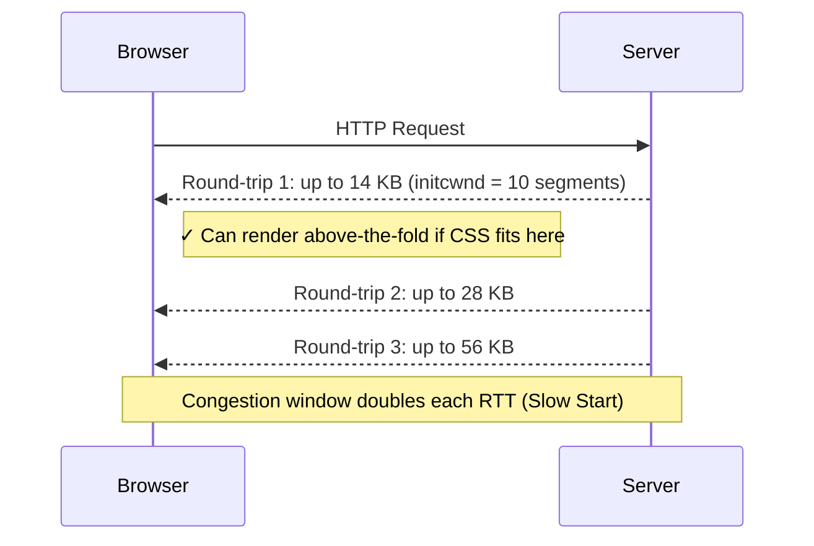

import snippet from '../../snippets/Loading/Critical-CSS-Detection.js?raw'
import { Snippet } from '../../components/Snippet'

# Critical CSS Detection

### Overview

Analyzes the CSS loading strategy of a page — identifying render-blocking stylesheets, measuring their size against the critical 14 KB budget, and detecting whether critical CSS is properly inlined for above-the-fold content.

**What makes CSS "critical":**

| Type | Description | Performance Impact |
|------|-------------|-------------------|
| **Critical CSS** | Styles needed to render above-the-fold content | Must load before first paint |
| **Non-critical CSS** | Styles for below-the-fold or interactive content | Can be deferred |
| **Render-blocking CSS** | External `<link>` stylesheets without media targeting | Blocks FCP and LCP |

**Render-blocking CSS impact:**

| Stylesheet Status | FCP Impact | Recommendation |
|-------------------|-----------|----------------|
| Blocking (no media) | Delays FCP | Extract & inline critical portion |
| Blocking + preloaded | Reduced delay | Also consider deferring non-critical |
| Non-blocking (media query) | No blocking | Ideal pattern |
| Inline `<style>` | Eliminates request | Keep under 14 KB |

### The 14 KB Rule and TCP Slow Start

The 14 KB budget is not arbitrary — it comes from how TCP connections work at the network level.

When a browser opens a new TCP connection to a server, it cannot send all data at once. TCP starts in **Slow Start** mode: it begins with a small **initial congestion window (initcwnd)** and doubles it each round-trip until it reaches the network's capacity.

[RFC 6928](https://datatracker.ietf.org/doc/html/rfc6928) (2013) standardized the initial congestion window at **10 TCP segments**:

```
Maximum Segment Size (MSS) ≈ 1,460 bytes
  (Ethernet MTU: 1,500 bytes − 40 bytes TCP/IP headers)

First round-trip capacity:
  10 segments × 1,460 bytes = 14,600 bytes ≈ 14 KB
```

Everything that fits within those 14 KB arrives in a **single round-trip**. Anything beyond requires at least one more RTT before the browser receives it.



This is why the web performance community targets **HTML + critical CSS + critical JS under 14 KB** for the fastest possible First Contentful Paint — it means the browser can render above-the-fold content after just one network round-trip.

> The 14 KB figure is a practical approximation. IPv6 connections use a slightly smaller MSS (~1,440 bytes), and Path MTU Discovery can vary this further. But 14 KB is the widely adopted reference value in web performance.

### Snippet

<Snippet code={snippet} />

### Understanding the Results

**Summary Section:**

- External stylesheets count, split by render-blocking vs non-blocking
- Inline `<style>` block count and combined size
- Total external CSS wire size

**Render-Blocking Stylesheets Table:**

| Column | Description |
|--------|-------------|
| File | Stylesheet filename |
| Media | `media` attribute value (blank = `all`) |
| Transfer Size | Compressed bytes over the wire |
| Decoded Size | Uncompressed bytes in memory |
| Rules | Number of CSS rules (CORS-blocked files cannot be read) |
| Preloaded | Whether a matching `<link rel="preload">` exists |

**Budget Bar:**

Shows total render-blocking CSS decoded size as a percentage of the 14 KB critical budget. Values over 100% indicate the budget is exceeded.

**Inline CSS Rating:**

| Rating | Threshold |
|--------|-----------|
| Good | Under 7 KB (50% of budget) |
| Acceptable | 7–14 KB |
| Too Large | Over 14 KB |

**Issues Detected:**

| Issue | Severity | Impact |
|-------|----------|--------|
| No critical CSS inlined | High | Every page load needs a render-blocking network request |
| Render-blocking CSS > 14 KB | High | Exceeds first TCP round-trip, delays FCP |
| Large stylesheets without preload | Medium | Browser discovers them late in the waterfall |
| Inline CSS > 14 KB | High | Bloats HTML, increases TTFB |
| Inline styles in `<body>` | Medium | Risk of reflows during HTML parsing |

### Deferring Non-Critical CSS

The recommended pattern to load CSS without blocking rendering:

```html
<link
  rel="stylesheet"
  href="non-critical.css"
  media="print"
  onload="this.media='all'"
>
<noscript><link rel="stylesheet" href="non-critical.css"></noscript>
```

This loads the stylesheet in the background (since `media="print"` does not block rendering) and switches it to `all` once loaded.

### Further Reading

- [Extract critical CSS](https://web.dev/articles/extract-critical-css) | web.dev
- [Defer non-critical CSS](https://web.dev/articles/defer-non-critical-css) | web.dev
- [Eliminate render-blocking resources](https://developer.chrome.com/docs/lighthouse/performance/render-blocking-resources) | Chrome for Developers
- [Critical rendering path](https://developer.mozilla.org/en-US/docs/Web/Performance/Critical_rendering_path) | MDN
