# Event Processing Time

Analyzes the time spent in each phase of page navigation, from initial redirect to the load event. This helps identify bottlenecks in the page loading process and understand where time is being spent.

**Key phases in page load:**

```mermaid
gantt
    title Page Load Timeline
    dateFormat X
    axisFormat %s

    section Network
    Redirect           :0, 50
    DNS Lookup         :50, 80
    TCP Connection     :80, 120
    SSL/TLS            :120, 180
    Request/Response   :180, 350

    section Processing
    DOM Processing     :350, 500
    DOMContentLoaded   :500, 520
    Resources Loading  :520, 800
    Load Event         :800, 820
```



**What each phase means:**

| Phase | Description | Impact |
|-------|-------------|--------|
| **Redirect** | Time following HTTP redirects | Each redirect adds latency |
| **DNS Lookup** | Domain name resolution | Slow DNS affects all requests |
| **TCP Connection** | Establishing connection | Geographic distance matters |
| **SSL/TLS** | Secure handshake | Certificate chain complexity |
| **Request/Response** | Server processing time | Backend performance |
| **DOM Processing** | Parsing HTML, building DOM | HTML complexity |
| **DOMContentLoaded** | DOM ready, executing deferred scripts | Script execution time |
| **Load Event** | All resources loaded | Total page weight |

### Snippet

```js copy
// Event Processing Time - Analyze page load phases
// https://webperf-snippets.nucliweb.net

(() => {
  const phases = [
    { name: "Redirect", start: "redirectStart", end: "redirectEnd", icon: "🔄" },
    { name: "DNS Lookup", start: "domainLookupStart", end: "domainLookupEnd", icon: "🔍" },
    { name: "TCP Connection", start: "connectStart", end: "connectEnd", icon: "🔌" },
    { name: "SSL/TLS", start: "secureConnectionStart", end: "connectEnd", icon: "🔒" },
    { name: "Request", start: "requestStart", end: "responseStart", icon: "📤" },
    { name: "Response", start: "responseStart", end: "responseEnd", icon: "📥" },
    { name: "DOM Processing", start: "responseEnd", end: "domContentLoadedEventStart", icon: "🏗️" },
    { name: "DOMContentLoaded", start: "domContentLoadedEventStart", end: "domContentLoadedEventEnd", icon: "📄" },
    { name: "Resource Loading", start: "domContentLoadedEventEnd", end: "loadEventStart", icon: "📦" },
    { name: "Load Event", start: "loadEventStart", end: "loadEventEnd", icon: "✅" },
  ];

  new PerformanceObserver((list) => {
    const [entry] = list.getEntries();

    const formatMs = (ms) => ms.toFixed(2) + " ms";
    const formatBar = (ms, total) => {
      const pct = total > 0 ? (ms / total) * 100 : 0;
      const width = Math.min(Math.round(pct / 2.5), 40);
      return "█".repeat(width) + "░".repeat(Math.max(0, 20 - width));
    };

    // Calculate all phase durations
    const phaseData = phases
      .map((phase) => {
        const start = entry[phase.start] || 0;
        const end = entry[phase.end] || 0;
        let duration = end - start;

        // Handle SSL which shares end with TCP
        if (phase.name === "SSL/TLS" && entry.secureConnectionStart > 0) {
          duration = entry.connectEnd - entry.secureConnectionStart;
        } else if (phase.name === "TCP Connection" && entry.secureConnectionStart > 0) {
          duration = entry.secureConnectionStart - entry.connectStart;
        }

        return {
          ...phase,
          start,
          end,
          duration: Math.max(0, duration),
        };
      })
      .filter((p) => p.duration > 0 || p.name === "Redirect");

    const totalTime = entry.loadEventEnd - entry.startTime;
    const networkTime = (entry.responseEnd || 0) - entry.startTime;
    const processingTime = totalTime - networkTime;

    // Rating based on total load time
    let rating, color;
    if (totalTime <= 2500) {
      rating = "Fast";
      color = "#22c55e";
    } else if (totalTime <= 4000) {
      rating = "Moderate";
      color = "#f59e0b";
    } else {
      rating = "Slow";
      color = "#ef4444";
    }

    console.group(
      `%c⏱️ Page Load: ${totalTime.toFixed(0)}ms (${rating})`,
      `color: ${color}; font-weight: bold; font-size: 14px;`
    );

    // Summary
    console.log("");
    console.log("%cSummary:", "font-weight: bold;");
    console.log(`   Network time: ${networkTime.toFixed(0)}ms (${((networkTime / totalTime) * 100).toFixed(0)}%)`);
    console.log(`   Processing time: ${processingTime.toFixed(0)}ms (${((processingTime / totalTime) * 100).toFixed(0)}%)`);
    console.log(`   Total: ${totalTime.toFixed(0)}ms`);

    // Timeline visualization
    console.log("");
    console.log("%cTimeline:", "font-weight: bold;");

    phaseData.forEach(({ name, duration, icon }) => {
      const pct = (duration / totalTime) * 100;
      const bar = formatBar(duration, totalTime);
      const durationStr = formatMs(duration).padStart(12);
      const pctStr = `${pct.toFixed(1)}%`.padStart(7);

      // Color code long phases
      let phaseColor = "";
      if (duration > totalTime * 0.3) {
        phaseColor = "color: #ef4444;"; // Red for >30%
      } else if (duration > totalTime * 0.15) {
        phaseColor = "color: #f59e0b;"; // Orange for >15%
      }

      console.log(
        `%c${icon} ${name.padEnd(18)} ${durationStr} ${pctStr}  ${bar}`,
        phaseColor
      );
    });

    // Key milestones
    console.log("");
    console.log("%cKey Milestones:", "font-weight: bold;");
    console.log(`   TTFB (Time to First Byte): ${entry.responseStart.toFixed(0)}ms`);
    console.log(`   DOMContentLoaded: ${entry.domContentLoadedEventEnd.toFixed(0)}ms`);
    console.log(`   Load Complete: ${entry.loadEventEnd.toFixed(0)}ms`);

    // Find bottleneck
    const longestPhase = phaseData.reduce((a, b) =>
      a.duration > b.duration ? a : b
    );

    if (longestPhase.duration > totalTime * 0.25) {
      console.log("");
      console.log("%c💡 Bottleneck Detected:", "color: #3b82f6; font-weight: bold;");
      console.log(
        `   ${longestPhase.name} takes ${((longestPhase.duration / totalTime) * 100).toFixed(0)}% of total load time`
      );

      const tips = {
        "Redirect": "Minimize redirects. Update links to final URLs.",
        "DNS Lookup": "Use DNS prefetching (<link rel='dns-prefetch'>). Consider faster DNS.",
        "TCP Connection": "Enable HTTP/2 or HTTP/3. Use connection preconnect.",
        "SSL/TLS": "Enable TLS 1.3. Optimize certificate chain. Use session resumption.",
        "Request": "Optimize server response time. Add caching headers.",
        "Response": "Enable compression. Reduce HTML size. Use streaming.",
        "DOM Processing": "Simplify HTML structure. Defer non-critical scripts.",
        "DOMContentLoaded": "Reduce synchronous JavaScript. Use defer/async.",
        "Resource Loading": "Lazy load images. Prioritize critical resources.",
        "Load Event": "Reduce page weight. Optimize resource loading order.",
      };

      console.log(`   Tip: ${tips[longestPhase.name] || "Investigate this phase."}`);
    }

    console.groupEnd();
  }).observe({ type: "navigation", buffered: true });
})();
```

### Understanding the Results

The snippet displays a timeline of all page load phases with:

**Summary Section:**
- **Network time**: Time spent on network operations (DNS, TCP, SSL, request/response)
- **Processing time**: Time spent on DOM parsing and JavaScript execution
- **Total**: Complete page load time

**Timeline Section:**

Each phase shows:
- Duration in milliseconds
- Percentage of total load time
- Visual bar indicating relative duration
- Color coding: 🔴 Red (>30%), 🟠 Orange (>15%), default otherwise

**Key Milestones:**
- **TTFB**: When the first byte of HTML arrives
- **DOMContentLoaded**: When HTML is parsed and deferred scripts executed
- **Load Complete**: When all resources (images, styles, etc.) are loaded

**Bottleneck Detection:**

If any phase takes more than 25% of total load time, the snippet identifies it and provides optimization tips.

### Typical Values

| Metric | Good | Moderate | Slow |
|--------|------|----------|------|
| Total Load Time | < 2.5s | 2.5s - 4s | > 4s |
| TTFB | < 800ms | 800ms - 1800ms | > 1800ms |
| DOMContentLoaded | < 1.5s | 1.5s - 3s | > 3s |

### Further Reading

- [Navigation Timing API](https://developer.mozilla.org/en-US/docs/Web/API/Navigation_timing_API) | MDN
- [PerformanceNavigationTiming](https://developer.mozilla.org/en-US/docs/Web/API/PerformanceNavigationTiming) | MDN
- [Critical Rendering Path](https://web.dev/articles/critical-rendering-path) | web.dev
- [Optimize LCP](https://web.dev/articles/optimize-lcp) | web.dev
