import snippet from '../../snippets/Loading/Event-Processing-Time.js?raw'
import { Snippet } from '../../components/Snippet'

# Event Processing Time

Analyzes the time spent in each phase of page navigation, from initial redirect to the load event. This helps identify bottlenecks in the page loading process and understand where time is being spent.

**Key phases in page load:**

```mermaid
gantt
    title Page Load Timeline
    dateFormat X
    axisFormat %s

    section Network
    Redirect           :0, 50
    DNS Lookup         :50, 80
    TCP Connection     :80, 120
    SSL/TLS            :120, 180
    Request/Response   :180, 350

    section Processing
    DOM Processing     :350, 500
    DOMContentLoaded   :500, 520
    Resources Loading  :520, 800
    Load Event         :800, 820
```

**What each phase means:**

| Phase | Description | Impact |
|-------|-------------|--------|
| **Redirect** | Time following HTTP redirects | Each redirect adds latency |
| **DNS Lookup** | Domain name resolution | Slow DNS affects all requests |
| **TCP Connection** | Establishing connection | Geographic distance matters |
| **SSL/TLS** | Secure handshake | Certificate chain complexity |
| **Request/Response** | Server processing time | Backend performance |
| **DOM Processing** | Parsing HTML, building DOM | HTML complexity |
| **DOMContentLoaded** | DOM ready, executing deferred scripts | Script execution time |
| **Load Event** | All resources loaded | Total page weight |

### Snippet

<Snippet code={snippet} />

### Understanding the Results

The snippet displays a timeline of all page load phases with:

**Summary Section:**
- **Network time**: Time spent on network operations (DNS, TCP, SSL, request/response)
- **Processing time**: Time spent on DOM parsing and JavaScript execution
- **Total**: Complete page load time

**Timeline Section:**

Each phase shows:
- Duration in milliseconds
- Percentage of total load time
- Visual bar indicating relative duration
- Color coding: 🔴 Red (>30%), 🟠 Orange (>15%), default otherwise

**Key Milestones:**
- **TTFB**: When the first byte of HTML arrives
- **DOMContentLoaded**: When HTML is parsed and deferred scripts executed
- **Load Complete**: When all resources (images, styles, etc.) are loaded

**Bottleneck Detection:**

If any phase takes more than 25% of total load time, the snippet identifies it and provides optimization tips.

### Typical Values

| Metric | Good | Moderate | Slow |
|--------|------|----------|------|
| Total Load Time | < 2.5s | 2.5s - 4s | > 4s |
| TTFB | < 800ms | 800ms - 1800ms | > 1800ms |
| DOMContentLoaded | < 1.5s | 1.5s - 3s | > 3s |

### Further Reading

- [Navigation Timing API](https://developer.mozilla.org/en-US/docs/Web/API/Navigation_timing_API) | MDN
- [PerformanceNavigationTiming](https://developer.mozilla.org/en-US/docs/Web/API/PerformanceNavigationTiming) | MDN
- [Critical Rendering Path](https://web.dev/articles/critical-rendering-path) | web.dev
- [Optimize LCP](https://web.dev/articles/optimize-lcp) | web.dev
