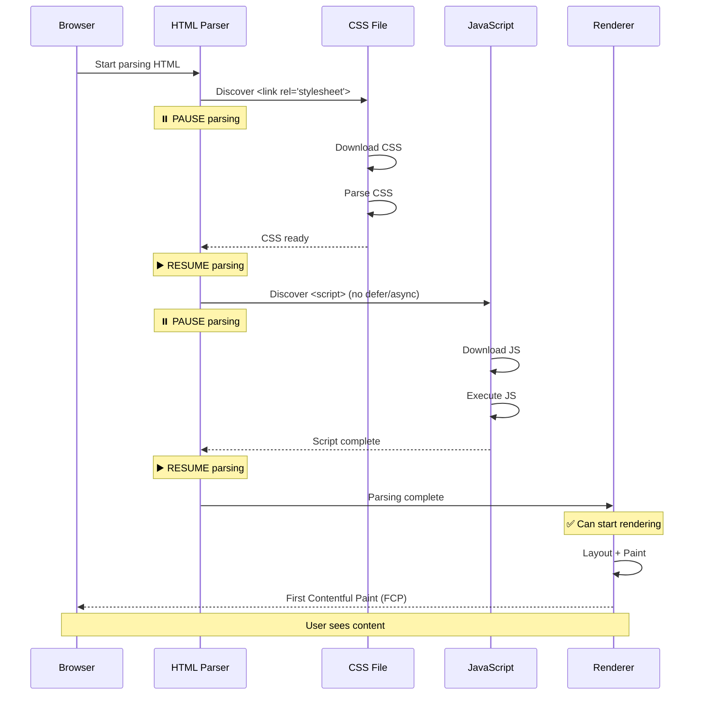
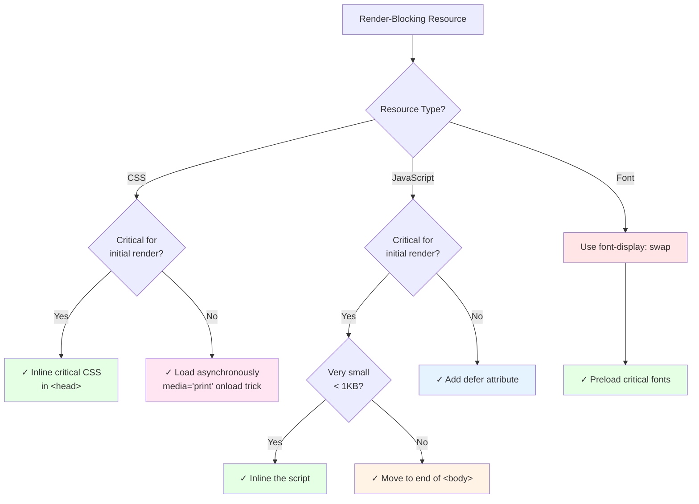

import snippet from '../../snippets/Loading/Find-render-blocking-resources.js?raw'
import { Snippet } from '../../components/Snippet'

# Find render-blocking resources

### Overview

Identifies resources that block the browser from rendering the page. These resources must be fully downloaded and processed before the browser can display any content, directly impacting First Contentful Paint (FCP) and Largest Contentful Paint (LCP).

**Why this matters:**

Render-blocking resources are the primary cause of slow initial page renders. Users see a blank white screen while CSS and JavaScript files download and parse. On slow connections or mobile networks, this can add several seconds to your load time. Eliminating or deferring render-blocking resources is one of the highest-impact optimizations you can make.

**What are render-blocking resources?**

| Resource Type | When it blocks rendering |
|---------------|-------------------------|
| **CSS** | All `<link rel="stylesheet">` in `<head>` block rendering by default |
| **JavaScript** | Scripts without `async` or `defer` in `<head>` block parsing and rendering |
| **Fonts** | `@font-face` fonts block text rendering until loaded |

**Impact on performance:**

- Delays First Contentful Paint (FCP)
- Can delay Largest Contentful Paint (LCP)
- Users see a blank page while resources load
- Particularly harmful on slow connections

**Render-Blocking Timeline:**



> **Browser Support:** The `renderBlockingStatus` property is currently Chromium-only (Chrome 107+, Edge 107+, Opera 93+). Firefox and Safari don't support this API yet.

### Snippet

<Snippet code={snippet} />

### Understanding the Results

**Summary Metrics:**

| Metric | Description |
|--------|-------------|
| **Rendering blocked until** | Time when the last blocking resource finishes loading - rendering can start after this point |
| **Total blocking resources** | Number of resources blocking initial render |
| **Total size** | Combined transfer size of all blocking resources |
| **By type** | Breakdown by resource type (script, link/css, font) |

**Timeline Visualization:**

Shows each resource with:
- Resource type
- When it finished loading (`responseEnd`)
- Visual bar showing relative timing
- Filename and size

Resources are sorted by completion time (latest first), so you can see which resource is the last to complete and thus determines when rendering can start.

### Optimization Decision Tree



### Common Render-Blocking Patterns

**Scripts in `<head>` without defer/async:**

```html
<!-- ❌ Render-blocking -->
<head>
  <script src="app.js"></script>
</head>

<!-- ✅ Non-blocking -->
<head>
  <script src="app.js" defer></script>
</head>
```

**External stylesheets:**

```html
<!-- ❌ Render-blocking (but often necessary) -->
<link rel="stylesheet" href="styles.css">

<!-- ✅ Preload + async load for non-critical CSS -->
<link rel="preload" href="non-critical.css" as="style" onload="this.rel='stylesheet'">
<noscript><link rel="stylesheet" href="non-critical.css"></noscript>
```

**Web fonts:**

```css
/* ❌ Blocks text rendering */
@font-face {
  font-family: 'MyFont';
  src: url('font.woff2') format('woff2');
}

/* ✅ Shows fallback font immediately */
@font-face {
  font-family: 'MyFont';
  src: url('font.woff2') format('woff2');
  font-display: swap;
}
```

### Further Reading

- [Eliminate render-blocking resources](https://developer.chrome.com/docs/lighthouse/performance/render-blocking-resources) | Chrome Developers
- [Render-blocking CSS](https://web.dev/articles/critical-rendering-path/render-blocking-css) | web.dev
- [Efficiently load JavaScript](https://web.dev/articles/efficiently-load-third-party-javascript) | web.dev
- [Preload critical assets](https://web.dev/articles/preload-critical-assets) | web.dev
- [FCP](/Loading/FCP) | See how render-blocking resources impact First Contentful Paint
