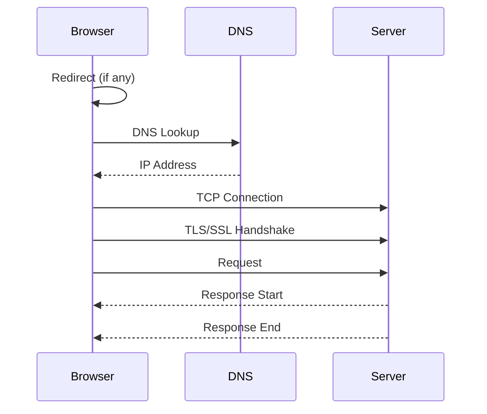

# First And Third Party Script Timings

Analyzes detailed timing phases for all scripts, comparing first-party vs third-party performance. This helps identify slow connection phases, DNS issues, or server response problems.

**Timing phases explained:**



| Phase | What it measures | Why it matters |
|-------|------------------|----------------|
| **DNS Lookup** | Time to resolve domain name | Slow DNS affects all requests to that domain |
| **TCP Connection** | Time to establish connection | Geographic distance, server load |
| **TLS/SSL** | Time for secure handshake | Certificate chain, protocol version |
| **Request** | Time from request sent to first byte | Server processing time (TTFB) |
| **Response** | Time to download the resource | File size, connection speed |
| **Total** | End-to-end loading time | Overall script impact |

> **CORS Note:** Third-party scripts without `Timing-Allow-Origin` header will show 0 for most timing phases. Only `startTime`, `responseEnd`, and `duration` are available.

> **Related:** Use [First And Third Party Script Info](/Loading/First-And-Third-Party-Script-Info) for a simpler overview focused on sizes and blocking status.

### Snippet

```js copy
// First and Third Party Script Timings Analysis
// https://webperf-snippets.nucliweb.net

(() => {
  // Auto-detect first-party by root domain
  function getRootDomain(hostname) {
    const parts = hostname.split(".");
    if (parts.length > 2) {
      const sld = parts[parts.length - 2];
      if (sld.length <= 3 && ["co", "com", "org", "net", "gov", "edu"].includes(sld)) {
        return parts.slice(-3).join(".");
      }
      return parts.slice(-2).join(".");
    }
    return hostname;
  }

  const currentRootDomain = getRootDomain(location.hostname);

  function isFirstParty(hostname) {
    return getRootDomain(hostname) === currentRootDomain;
  }

  // Gather script timing data
  const scripts = performance
    .getEntriesByType("resource")
    .filter((r) => r.initiatorType === "script")
    .map((r) => {
      const url = new URL(r.name);
      const firstParty = isFirstParty(url.hostname);

      // Check if timing data is available (CORS)
      const hasTiming = r.requestStart > 0;

      // Calculate timing phases
      const timings = {
        dns: r.domainLookupEnd - r.domainLookupStart,
        tcp: r.connectEnd - r.connectStart,
        tls: r.secureConnectionStart > 0 ? r.connectEnd - r.secureConnectionStart : 0,
        request: r.responseStart - r.requestStart,
        response: r.responseEnd - r.responseStart,
        total: r.responseEnd - r.startTime,
      };

      // Adjust TCP to exclude TLS time
      if (r.secureConnectionStart > 0) {
        timings.tcp = r.secureConnectionStart - r.connectStart;
      }

      return {
        name: r.name,
        shortName: url.pathname.split("/").pop() || url.hostname,
        host: url.hostname,
        firstParty,
        hasTiming,
        size: r.transferSize || 0,
        ...timings,
      };
    });

  const firstParty = scripts.filter((s) => s.firstParty);
  const thirdParty = scripts.filter((s) => !s.firstParty);

  // Calculate aggregate metrics
  function calcStats(list) {
    const withTiming = list.filter((s) => s.hasTiming);
    const phases = ["dns", "tcp", "tls", "request", "response", "total"];

    const stats = {};
    phases.forEach((phase) => {
      const values = withTiming.map((s) => s[phase]).filter((v) => v > 0);
      if (values.length > 0) {
        stats[phase] = {
          avg: values.reduce((a, b) => a + b, 0) / values.length,
          max: Math.max(...values),
          total: values.reduce((a, b) => a + b, 0),
        };
      } else {
        stats[phase] = { avg: 0, max: 0, total: 0 };
      }
    });

    return {
      count: list.length,
      withTiming: withTiming.length,
      withoutTiming: list.length - withTiming.length,
      stats,
    };
  }

  const firstStats = calcStats(firstParty);
  const thirdStats = calcStats(thirdParty);

  // Format helpers
  const formatMs = (ms) => (ms > 0 ? ms.toFixed(1) + "ms" : "-");
  const formatBar = (value, max) => {
    if (value <= 0 || max <= 0) return "";
    const width = Math.min(Math.round((value / max) * 15), 15);
    return "█".repeat(width) + "░".repeat(15 - width);
  };

  // Display results
  console.group("%c⏱️ Script Timing Analysis", "font-weight: bold; font-size: 14px;");

  // Summary comparison
  console.log("");
  console.log("%cSummary (averages):", "font-weight: bold;");

  const phases = [
    { key: "dns", name: "DNS Lookup", icon: "🔍" },
    { key: "tcp", name: "TCP Connection", icon: "🔌" },
    { key: "tls", name: "TLS/SSL", icon: "🔒" },
    { key: "request", name: "Request (TTFB)", icon: "📤" },
    { key: "response", name: "Response", icon: "📥" },
    { key: "total", name: "Total", icon: "⏱️" },
  ];

  console.log("");
  console.log("                        First-Party    Third-Party");
  console.log("                        ───────────    ───────────");

  phases.forEach(({ key, name, icon }) => {
    const fp = formatMs(firstStats.stats[key]?.avg || 0).padStart(10);
    const tp = formatMs(thirdStats.stats[key]?.avg || 0).padStart(10);
    console.log(`${icon} ${name.padEnd(18)} ${fp}       ${tp}`);
  });

  // First-party details
  console.log("");
  console.group(`%c🏠 First-Party Scripts (${firstParty.length})`, "color: #22c55e; font-weight: bold;");

  if (firstParty.length === 0) {
    console.log("No first-party scripts found.");
  } else {
    if (firstStats.withoutTiming > 0) {
      console.log(`%c⚠️ ${firstStats.withoutTiming} script(s) have no detailed timing (cached or same-origin)`, "color: #f59e0b;");
    }

    const maxTotal = Math.max(...firstParty.map((s) => s.total));

    const tableData = firstParty
      .sort((a, b) => b.total - a.total)
      .slice(0, 15)
      .map((s) => ({
        Script: s.shortName,
        DNS: formatMs(s.dns),
        TCP: formatMs(s.tcp),
        TLS: formatMs(s.tls),
        Request: formatMs(s.request),
        Response: formatMs(s.response),
        Total: formatMs(s.total),
        "": formatBar(s.total, maxTotal),
      }));

    console.table(tableData);

    if (firstParty.length > 15) {
      console.log(`... and ${firstParty.length - 15} more scripts`);
    }
  }
  console.groupEnd();

  // Third-party details
  console.log("");
  console.group(`%c🌐 Third-Party Scripts (${thirdParty.length})`, "color: #ef4444; font-weight: bold;");

  if (thirdParty.length === 0) {
    console.log("%c✅ No third-party scripts!", "color: #22c55e; font-weight: bold;");
  } else {
    const corsRestricted = thirdStats.withoutTiming;
    if (corsRestricted > 0) {
      console.log(`%c⚠️ ${corsRestricted} script(s) restricted by CORS (no Timing-Allow-Origin header)`, "color: #f59e0b;");
      console.log("   Only total duration available for these scripts.");
      console.log("");
    }

    const maxTotal = Math.max(...thirdParty.map((s) => s.total));

    const tableData = thirdParty
      .sort((a, b) => b.total - a.total)
      .slice(0, 15)
      .map((s) => ({
        Script: s.shortName,
        Host: s.host.length > 25 ? s.host.slice(0, 22) + "..." : s.host,
        DNS: formatMs(s.dns),
        TCP: formatMs(s.tcp),
        TLS: formatMs(s.tls),
        Request: formatMs(s.request),
        Response: formatMs(s.response),
        Total: formatMs(s.total),
        "": formatBar(s.total, maxTotal),
      }));

    console.table(tableData);

    if (thirdParty.length > 15) {
      console.log(`... and ${thirdParty.length - 15} more scripts`);
    }
  }
  console.groupEnd();

  // Identify slow scripts
  const slowThreshold = 500; // ms
  const slowScripts = scripts.filter((s) => s.total > slowThreshold);

  if (slowScripts.length > 0) {
    console.log("");
    console.group(`%c🐌 Slow Scripts (>${slowThreshold}ms)`, "color: #ef4444; font-weight: bold;");

    slowScripts
      .sort((a, b) => b.total - a.total)
      .forEach((s) => {
        const party = s.firstParty ? "1st" : "3rd";
        const phases = [];
        if (s.dns > 50) phases.push(`DNS: ${formatMs(s.dns)}`);
        if (s.tcp > 50) phases.push(`TCP: ${formatMs(s.tcp)}`);
        if (s.tls > 50) phases.push(`TLS: ${formatMs(s.tls)}`);
        if (s.request > 100) phases.push(`Request: ${formatMs(s.request)}`);
        if (s.response > 200) phases.push(`Response: ${formatMs(s.response)}`);

        console.log(`${party} ${formatMs(s.total).padStart(8)} - ${s.shortName}`);
        if (phases.length > 0 && s.hasTiming) {
          console.log(`%c         Slow phases: ${phases.join(", ")}`, "color: #666;");
        }
      });

    console.groupEnd();
  }

  // Recommendations
  const hasSlowDns = scripts.some((s) => s.dns > 100);
  const hasSlowTcp = scripts.some((s) => s.tcp > 100);
  const hasSlowRequest = scripts.some((s) => s.request > 200);
  const hasCorsIssues = thirdStats.withoutTiming > 0;

  if (hasSlowDns || hasSlowTcp || hasSlowRequest || hasCorsIssues) {
    console.log("");
    console.group("%c📝 Recommendations", "color: #3b82f6; font-weight: bold;");

    if (hasSlowDns) {
      console.log("");
      console.log("%c🔍 Slow DNS lookups detected:", "font-weight: bold;");
      console.log("   • Use <link rel='dns-prefetch'> for third-party domains");
      console.log("   • Consider using a faster DNS provider");
    }

    if (hasSlowTcp) {
      console.log("");
      console.log("%c🔌 Slow TCP connections detected:", "font-weight: bold;");
      console.log("   • Use <link rel='preconnect'> for critical third-party origins");
      console.log("   • Enable HTTP/2 or HTTP/3 for multiplexing");
    }

    if (hasSlowRequest) {
      console.log("");
      console.log("%c📤 Slow server response times detected:", "font-weight: bold;");
      console.log("   • Optimize server processing");
      console.log("   • Use a CDN closer to users");
      console.log("   • Consider self-hosting critical third-party scripts");
    }

    if (hasCorsIssues) {
      console.log("");
      console.log("%c🔒 CORS-restricted timing data:", "font-weight: bold;");
      console.log("   • Third-party servers need Timing-Allow-Origin header");
      console.log("   • Contact vendors to enable resource timing");
      console.log("   • Self-host scripts to get full timing data");
    }

    console.groupEnd();
  }

  console.groupEnd();
})();
```

### Understanding the Results

**Summary Table:**

Compares average timing for each phase between first-party and third-party scripts.

**Timing Phases:**

| Phase | Calculation | What 0 means |
|-------|-------------|--------------|
| DNS | `domainLookupEnd - domainLookupStart` | Cached or CORS restricted |
| TCP | `connectEnd - connectStart` (minus TLS) | Reused connection or CORS |
| TLS | `connectEnd - secureConnectionStart` | HTTP (not HTTPS) or CORS |
| Request | `responseStart - requestStart` | CORS restricted |
| Response | `responseEnd - responseStart` | Always available |
| Total | `responseEnd - startTime` | Always available |

**CORS Restrictions:**

Third-party scripts often show `-` for detailed timings because the server doesn't send the `Timing-Allow-Origin` header. Only `total` is always available.

```
# Server needs to send this header for full timing data:
Timing-Allow-Origin: *
```

**Slow Script Detection:**

Scripts taking more than 500ms are highlighted with their slowest phases identified.

### Typical Values

| Phase | Good | Slow | Very Slow |
|-------|------|------|-----------|
| DNS | < 20ms | 20-100ms | > 100ms |
| TCP | < 50ms | 50-150ms | > 150ms |
| TLS | < 50ms | 50-150ms | > 150ms |
| Request (TTFB) | < 100ms | 100-300ms | > 300ms |
| Response | Depends on size | - | - |
| Total | < 200ms | 200-500ms | > 500ms |

### Further Reading

- [Resource Timing API](https://developer.mozilla.org/en-US/docs/Web/API/Resource_Timing_API/Using_the_Resource_Timing_API) | MDN
- [Timing-Allow-Origin Header](https://developer.mozilla.org/en-US/docs/Web/HTTP/Headers/Timing-Allow-Origin) | MDN
- [ResourceTiming Visibility](https://nicj.net/resourcetiming-visibility-third-party-scripts-ads-and-page-weight/) | Nic Jansma
