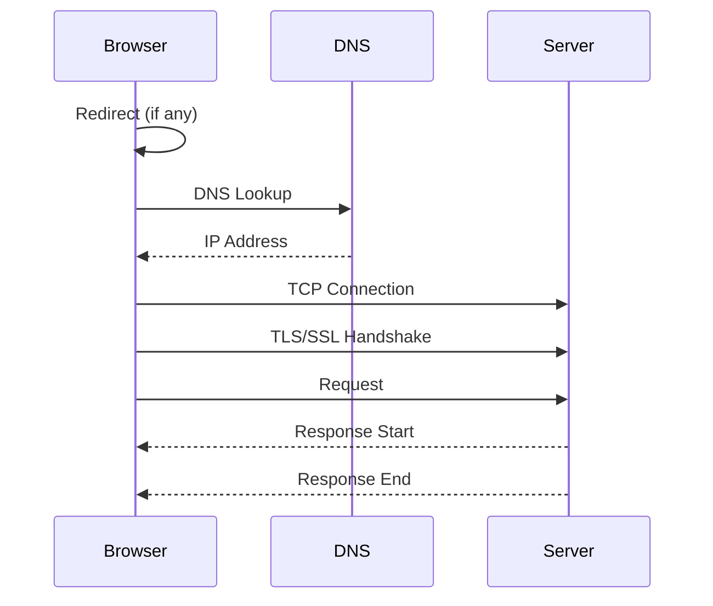

import snippet from '../../snippets/Loading/First-And-Third-Party-Script-Timings.js?raw'
import { Snippet } from '../../components/Snippet'

# First And Third Party Script Timings

Analyzes detailed timing phases for all scripts, comparing first-party vs third-party performance. This helps identify slow connection phases, DNS issues, or server response problems.

**Timing phases explained:**



| Phase | What it measures | Why it matters |
|-------|------------------|----------------|
| **DNS Lookup** | Time to resolve domain name | Slow DNS affects all requests to that domain |
| **TCP Connection** | Time to establish connection | Geographic distance, server load |
| **TLS/SSL** | Time for secure handshake | Certificate chain, protocol version |
| **Request** | Time from request sent to first byte | Server processing time (TTFB) |
| **Response** | Time to download the resource | File size, connection speed |
| **Total** | End-to-end loading time | Overall script impact |

> **CORS Note:** Third-party scripts without `Timing-Allow-Origin` header will show 0 for most timing phases. Only `startTime`, `responseEnd`, and `duration` are available.

> **Related:** Use [First And Third Party Script Info](/Loading/First-And-Third-Party-Script-Info) for a simpler overview focused on sizes and blocking status.

### Snippet

<Snippet code={snippet} />

### Understanding the Results

**Summary Table:**

Compares average timing for each phase between first-party and third-party scripts.

**Timing Phases:**

| Phase | Calculation | What 0 means |
|-------|-------------|--------------|
| DNS | `domainLookupEnd - domainLookupStart` | Cached or CORS restricted |
| TCP | `connectEnd - connectStart` (minus TLS) | Reused connection or CORS |
| TLS | `connectEnd - secureConnectionStart` | HTTP (not HTTPS) or CORS |
| Request | `responseStart - requestStart` | CORS restricted |
| Response | `responseEnd - responseStart` | Always available |
| Total | `responseEnd - startTime` | Always available |

**CORS Restrictions:**

Third-party scripts often show `-` for detailed timings because the server doesn't send the `Timing-Allow-Origin` header. Only `total` is always available.

```
# Server needs to send this header for full timing data:
Timing-Allow-Origin: *
```

**Slow Script Detection:**

Scripts taking more than 500ms are highlighted with their slowest phases identified.

### Typical Values

| Phase | Good | Slow | Very Slow |
|-------|------|------|-----------|
| DNS | < 20ms | 20-100ms | > 100ms |
| TCP | < 50ms | 50-150ms | > 150ms |
| TLS | < 50ms | 50-150ms | > 150ms |
| Request (TTFB) | < 100ms | 100-300ms | > 300ms |
| Response | Depends on size | - | - |
| Total | < 200ms | 200-500ms | > 500ms |

### Further Reading

- [Resource Timing API](https://developer.mozilla.org/en-US/docs/Web/API/Resource_Timing_API/Using_the_Resource_Timing_API) | MDN
- [Timing-Allow-Origin Header](https://developer.mozilla.org/en-US/docs/Web/HTTP/Headers/Timing-Allow-Origin) | MDN
- [ResourceTiming Visibility](https://nicj.net/resourcetiming-visibility-third-party-scripts-ads-and-page-weight/) | Nic Jansma
