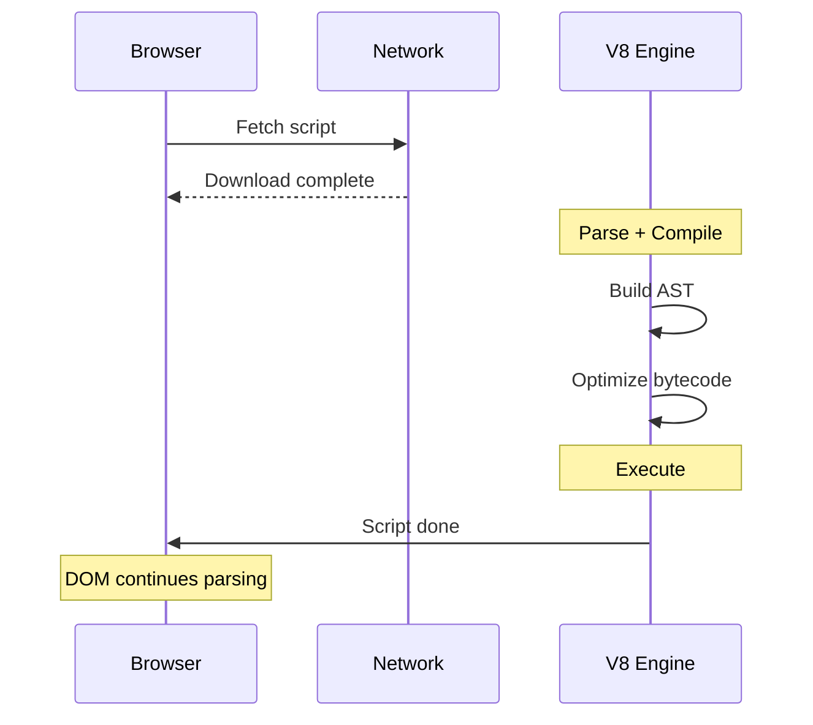
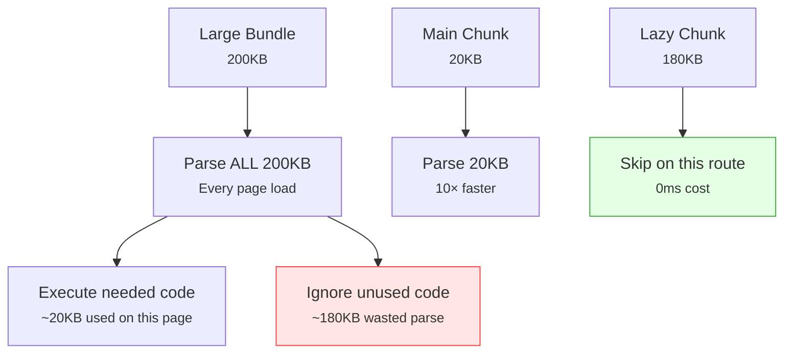

# JavaScript Execution Time Breakdown

### Overview

Identifies where JavaScript time goes during page load: network download vs browser parsing. Shows which scripts delay `domInteractive` (TTI proxy) and flags code splitting opportunities.

**Why this matters:**

Knowing a script is "slow" isn't enough — the bottleneck can be the network download or the browser parsing and compiling the code after downloading. These require different fixes:

| Bottleneck | Signal | Fix |
|------------|--------|-----|
| Download time | High `duration` vs small file | CDN, HTTP/2, caching |
| Parse/compile time | Large transfer size | Code splitting, tree-shaking |
| Render-blocking | In `<head>` without defer/async | Add `defer` or move to body |

**JS cost phases during page load:**



**How parse time relates to file size:**

V8 must parse every byte of JavaScript before executing it. Parse time scales roughly with file size:

| Script Size | Mobile (~1ms/KB) | Desktop (~0.3ms/KB) | Impact |
|-------------|-----------------|---------------------|--------|
| < 10 KB | < 10ms | < 3ms | Negligible |
| 50 KB | ~50ms | ~15ms | Noticeable on mobile |
| 100 KB | ~100ms | ~30ms | Significant on mobile |
| 200 KB | ~200ms | ~60ms | Major on mobile |
| 500 KB | ~500ms | ~150ms | Severe on mobile |
| 1 MB | ~1000ms | ~300ms | Critical — split this bundle |
| 10 MB | ~10000ms | ~3000ms | Unacceptable — must split |

> **Source:** [The cost of JavaScript in 2019](https://v8.dev/blog/cost-of-javascript-2019) (V8 blog) using Moto G4 as mobile baseline. Modern mid-range devices are faster; low-end devices can be slower. Parse time is always proportional to decoded (uncompressed) file size — caching eliminates download time but **not** parse time on first execution.

### Snippet

```js copy
// JavaScript Execution Time Breakdown
// https://webperf-snippets.nucliweb.net

(() => {
  const formatMs = (ms) => (ms > 0 ? ms.toFixed(0) + "ms" : "-");
  const formatBytes = (bytes) => {
    if (!bytes || bytes === 0) return "-";
    const k = 1024;
    const sizes = ["B", "KB", "MB"];
    const i = Math.floor(Math.log(Math.max(bytes, 1)) / Math.log(k));
    return (bytes / Math.pow(k, i)).toFixed(1) + " " + sizes[i];
  };
  const formatBar = (value, max, width = 16) => {
    if (value <= 0 || max <= 0) return "░".repeat(width);
    const filled = Math.min(Math.round((value / max) * width), width);
    return "█".repeat(filled) + "░".repeat(width - filled);
  };

  // 1. Page load timeline
  const nav = performance.getEntriesByType("navigation")[0];
  const domInteractive = nav?.domInteractive || 0;
  const domContentLoaded = nav?.domContentLoadedEventEnd || 0;
  const loadEvent = nav?.loadEventEnd || 0;
  const fetchStart = nav?.fetchStart || 0;

  // 2. Script resource timing (download phase)
  const scriptResources = performance
    .getEntriesByType("resource")
    .filter((r) => r.initiatorType === "script")
    .map((r) => {
      let shortName;
      try {
        const url = new URL(r.name);
        shortName = url.pathname.split("/").pop() || url.hostname;
      } catch {
        shortName = r.name.split("/").pop() || r.name;
      }

      const transferSize = r.transferSize || 0;
      const decodedSize = r.decodedBodySize || 0;
      const downloadDuration = Math.round(r.responseEnd - r.startTime);

      // CORS-restricted: third-party scripts without Timing-Allow-Origin return 0 for sizes
      const corsRestricted = transferSize === 0 && decodedSize === 0 && downloadDuration > 0;

      // Parse time estimates based on V8 data (v8.dev/blog/cost-of-javascript-2019)
      // Mobile (~1ms/KB): Moto G4 class device — worst-case baseline
      // Desktop (~0.3ms/KB): ~3x faster than mobile baseline
      const estimatedParseMobile = Math.round(decodedSize / 1024);
      const estimatedParseDesktop = Math.round(decodedSize / 1024 / 3);

      return {
        name: r.name,
        shortName: shortName.split("?")[0] || shortName,
        startTime: r.startTime,
        responseEnd: r.responseEnd,
        downloadDuration,
        transferSize,
        decodedSize,
        corsRestricted,
        estimatedParseMobile,
        estimatedParseDesktop,
        totalCostMs: downloadDuration + estimatedParseMobile,
      };
    })
    .sort((a, b) => a.startTime - b.startTime);

  // 3. Detect render-blocking scripts (in <head>, no async/defer/module)
  const blockingSet = new Set();
  Array.from(document.querySelectorAll("script[src]")).forEach((el) => {
    const isModule = el.type === "module";
    if (!el.async && !el.defer && !isModule && el.closest("head")) {
      blockingSet.add(el.src);
    }
  });

  const scripts = scriptResources.map((s) => ({
    ...s,
    isBlocking: blockingSet.has(s.name),
  }));

  // 4. Summary calculations
  const blocking = scripts.filter((s) => s.isBlocking);
  const nonBlocking = scripts.filter((s) => !s.isBlocking);
  const totalDownload = scripts.reduce((sum, s) => sum + s.downloadDuration, 0);
  const totalEstParse = scripts.reduce((sum, s) => sum + s.estimatedParseMobile, 0);
  const totalSize = scripts.reduce((sum, s) => sum + s.transferSize, 0);
  const totalDecodedSize = scripts.reduce((sum, s) => sum + s.decodedSize, 0);

  // Estimate how much blocking scripts delay domInteractive
  // The critical path ends when the last blocking script finishes download + parse
  const blockingCriticalPathEnd = blocking.reduce((max, s) => {
    const estimatedDone = s.responseEnd + s.estimatedParseMobile;
    return Math.max(max, estimatedDone);
  }, 0);

  const jsBlockingDelay =
    blocking.length > 0 && domInteractive > 0
      ? Math.min(blockingCriticalPathEnd, domInteractive)
      : 0;

  // Large script threshold (50KB compressed = good candidate for splitting)
  const SPLIT_THRESHOLD = 50 * 1024;
  const splitCandidates = scripts.filter((s) => s.decodedSize > SPLIT_THRESHOLD);

  // 5. Output
  console.group(
    "%c⚡ JavaScript Execution Time Breakdown",
    "font-weight: bold; font-size: 14px;"
  );

  // Page load timeline
  console.log("");
  console.log("%c📅 Page Load Timeline:", "font-weight: bold;");

  if (domInteractive > 0) {
    const timelineMax = loadEvent || domContentLoaded || domInteractive;
    const rows = [
      { label: "Navigation start", time: 0 },
      { label: "DOM Interactive", time: domInteractive },
      { label: "DOM Content Loaded", time: domContentLoaded },
      { label: "Load event", time: loadEvent },
    ].filter((r) => r.time > 0);

    rows.forEach(({ label, time }) => {
      const bar = formatBar(time, timelineMax, 20);
      console.log(`   ${label.padEnd(22)} ${formatMs(time).padStart(8)}  ${bar}`);
    });

    if (domInteractive > 0) {
      const jsPct =
        domInteractive > 0 ? ((jsBlockingDelay / domInteractive) * 100).toFixed(0) : 0;
      console.log("");
      console.log(
        `   JS blocking scripts contribute ~${jsPct}% of domInteractive (${formatMs(jsBlockingDelay)} est.)`
      );
    }
  } else {
    console.log("   %c⚠️ Navigation Timing unavailable", "color: #f59e0b;");
  }

  // Script overview
  console.log("");
  console.log("%c📊 Script Overview:", "font-weight: bold;");
  console.log(`   Total scripts:          ${scripts.length}`);
  console.log(`   Render-blocking:        ${blocking.length}`);
  console.log(`   Non-blocking:           ${nonBlocking.length}`);
  console.log(`   Total transfer size:    ${formatBytes(totalSize)}`);
  console.log(`   Total decoded size:     ${formatBytes(totalDecodedSize)}`);
  console.log(`   Compression ratio:      ${totalDecodedSize > 0 && totalSize > 0 ? (totalDecodedSize / totalSize).toFixed(1) + "x" : "-"}`);
  console.log("");
  console.log("%c   Cost Estimates (download + parse):", "color: #6b7280;");
  console.log(`   Total download time:    ${formatMs(totalDownload)}`);
  console.log(`   Est. total parse time:  ${formatMs(totalEstParse)} (~1ms/KB decoded)`);
  console.log(`   Est. total JS cost:     ${formatMs(totalDownload + totalEstParse)}`);

  // Per-script breakdown table
  if (scripts.length > 0) {
    console.log("");
    console.group("%c📋 Per-Script Breakdown", "color: #3b82f6; font-weight: bold;");

    console.log("%c📱 Parse estimates: mobile ~1ms/KB · desktop ~0.3ms/KB (source: v8.dev/blog/cost-of-javascript-2019)", "color: #6b7280;");
    console.log("");

    const corsCount = scripts.filter((s) => s.corsRestricted).length;
    if (corsCount > 0) {
      console.log(
        `%c⚠️ ${corsCount} script(s) show "CORS" — third-party size data blocked by missing Timing-Allow-Origin header`,
        "color: #f59e0b;"
      );
      console.log("   Parse columns unavailable for these scripts.");
      console.log("");
    }

    const maxCost = Math.max(...scripts.map((s) => s.totalCostMs));
    const tableData = scripts
      .sort((a, b) => b.totalCostMs - a.totalCostMs)
      .slice(0, 20)
      .map((s) => {
        const name = s.shortName.length > 35 ? s.shortName.slice(0, 32) + "..." : s.shortName;
        return {
          "": s.isBlocking ? "🔴" : "✅",
          Script: name,
          Download: formatMs(s.downloadDuration),
          "Parse(mob)": s.corsRestricted ? "CORS" : formatMs(s.estimatedParseMobile),
          "Parse(dsk)": s.corsRestricted ? "CORS" : formatMs(s.estimatedParseDesktop),
          "Transfer": s.corsRestricted ? "CORS" : formatBytes(s.transferSize),
          "Decoded": s.corsRestricted ? "CORS" : formatBytes(s.decodedSize),
          "": formatBar(s.totalCostMs, maxCost),
        };
      });

    console.table(tableData);

    if (scripts.length > 20) {
      console.log(`   ... and ${scripts.length - 20} more scripts`);
    }

    // Critical bundle warning (> 1 MB decoded)
    const criticalBundles = scripts.filter((s) => !s.corsRestricted && s.decodedSize > 1024 * 1024);
    if (criticalBundles.length > 0) {
      console.log("");
      console.log("%c🚨 Critically large bundles (> 1 MB decoded):", "color: #ef4444; font-weight: bold;");
      criticalBundles
        .sort((a, b) => b.decodedSize - a.decodedSize)
        .forEach((s) => {
          console.log(`   ${s.shortName}`);
          console.log(`      Decoded: ${formatBytes(s.decodedSize)} | Mobile parse: ~${formatMs(s.estimatedParseMobile)} | Desktop parse: ~${formatMs(s.estimatedParseDesktop)}`);
          console.log("      → Split with dynamic import() — only load what the current route needs");
        });
    }

    console.groupEnd();
  }

  // Blocking scripts TTI impact
  if (blocking.length > 0) {
    console.log("");
    console.group(
      `%c🚦 Render-Blocking Scripts (${blocking.length})`,
      "color: #ef4444; font-weight: bold;"
    );

    blocking
      .sort((a, b) => b.totalCostMs - a.totalCostMs)
      .forEach((s) => {
        const name = s.shortName.length > 40 ? s.shortName.slice(0, 37) + "..." : s.shortName;
        console.log(
          `   🔴 ${name}`
        );
        console.log(
          `      Download: ${formatMs(s.downloadDuration)} | Parse mob: ~${formatMs(s.estimatedParseMobile)} | Parse dsk: ~${formatMs(s.estimatedParseDesktop)} | Size: ${formatBytes(s.transferSize)}`
        );
      });

    console.log("");
    console.log("   These scripts block HTML parsing until fully downloaded and executed.");
    console.log("   → Add defer to execute after parsing without blocking.");
    console.log("   → Add async for independent scripts (analytics, ads).");
    console.groupEnd();
  }

  // Code splitting opportunities
  if (splitCandidates.length > 0) {
    console.log("");
    console.group(
      `%c✂️ Code Splitting Candidates (${splitCandidates.length} scripts > 50KB decoded)`,
      "color: #8b5cf6; font-weight: bold;"
    );

    splitCandidates
      .sort((a, b) => b.decodedSize - a.decodedSize)
      .forEach((s) => {
        const name = s.shortName.length > 40 ? s.shortName.slice(0, 37) + "..." : s.shortName;
        console.log(
          `   📦 ${name}`
        );
        console.log(
          `      Decoded: ${formatBytes(s.decodedSize)} | Parse mob: ~${formatMs(s.estimatedParseMobile)} | Parse dsk: ~${formatMs(s.estimatedParseDesktop)} | Transfer: ${formatBytes(s.transferSize)}`
        );
      });

    console.log("");
    console.log("   Large scripts increase parse time on every page load, even if cached.");
    console.log("   → Use dynamic import() to split at route or feature boundaries.");
    console.log("   → Enable tree-shaking to eliminate unused exports.");
    console.log("   → Consider module/nomodule pattern for modern browsers.");
    console.groupEnd();
  }

  // Recommendations
  const hasHighParseTime = totalEstParse > 500;
  const hasBlockingScripts = blocking.length > 0;
  const compressionRatio = totalDecodedSize / Math.max(totalSize, 1);
  const poorCompression = compressionRatio < 2 && totalSize > 10 * 1024;

  console.log("");
  console.group("%c📝 Recommendations", "color: #3b82f6; font-weight: bold;");

  if (!hasBlockingScripts && !hasHighParseTime && splitCandidates.length === 0) {
    console.log("   %c✅ No critical JS issues found.", "color: #22c55e; font-weight: bold;");
  }

  if (hasBlockingScripts) {
    console.log(`   🔴 ${blocking.length} render-blocking script(s) delay the page:`);
    console.log("      → defer: safe for most scripts (runs after parsing, in order)");
    console.log("      → async: for independent scripts with no DOM dependency");
  }

  if (hasHighParseTime) {
    console.log(`   ⚠️ High estimated parse cost (~${formatMs(totalEstParse)}):`);
    console.log("      → Split bundles with dynamic import() at route boundaries");
    console.log("      → Lazy-load non-critical features on demand");
    console.log("      → Use module preload for critical chunks: <link rel='modulepreload'>");
  }

  if (poorCompression) {
    console.log(`   📦 Low compression ratio (${compressionRatio.toFixed(1)}x) for ${formatBytes(totalSize)} transferred:`);
    console.log("      → Enable Brotli compression on your server/CDN");
    console.log("      → Ensure minification is enabled in your build");
  }

  console.log("");
  console.log("%c   💡 For measured execution time (not estimates):", "color: #6b7280;");
  console.log(
    "      Run the Long Animation Frames Script Attribution snippet to measure"
  );
  console.log("      actual execution time during user interactions.");

  console.groupEnd();

  console.groupEnd();
})();
```

### Understanding the Results

**Page Load Timeline:**

Shows when key milestones occur and estimates what percentage of `domInteractive` is attributable to render-blocking JavaScript. `domInteractive` is a reliable proxy for TTI on simple pages.

**Per-Script Breakdown:**

| Column | What it measures | Source |
|--------|-----------------|--------|
| 🔴/✅ | Render-blocking status | DOM `<script>` attributes |
| Download | Time from request to last byte | Resource Timing API |
| Parse(mob) | ~1ms/KB decoded — mobile worst-case (Moto G4 baseline) | Calculated estimate |
| Parse(dsk) | ~0.3ms/KB decoded — desktop (~3× faster than mobile) | Calculated estimate |
| Transfer | Compressed size over the wire | Resource Timing API |
| Decoded | Uncompressed size — what the browser actually parses | Resource Timing API |

**Why Est.Parse is an estimate:**

The browser does not expose parse/compile time through any web API. This snippet estimates it from decoded file size using a ~1ms/KB heuristic. Real values depend on:
- Device CPU speed (mobile devices can be 3–5× slower)
- JavaScript complexity (simple code parses faster)
- V8 caching (previously parsed scripts skip re-parsing)
- Script streaming (V8 can parse while still downloading)

For measured execution time, use [Long Animation Frames Script Attribution](/Interaction/Long-Animation-Frames-Script-Attribution).

**Code Splitting Candidates:**

Scripts over 50KB decoded are flagged because:
- Large bundles force the browser to parse all code upfront, even code not used on the current page
- Parsing cost applies even when the script is served from cache (no network, but still CPU work)
- Splitting at route or feature boundaries lets the browser skip parsing unused code



### Limitations

| Limitation | Details |
|-----------|---------|
| Parse time is estimated | Real parse time depends on device, CPU, code complexity, and V8 caching state |
| Cached scripts | Scripts served from cache show `transferSize = 0`; parse estimate uses decoded size |
| LoAF not included | Execution time during interactions requires the Long Animation Frames snippet |
| Cross-origin timing | CORS may restrict resource timing data for some third-party scripts |
| Script streaming | V8 can begin parsing before download finishes, making actual parse time lower than estimated |

### Further Reading

- [Script evaluation and long tasks](https://web.dev/articles/script-evaluation-and-long-tasks) | web.dev
- [Optimize JavaScript execution](https://developer.chrome.com/docs/devtools/performance/reference) | Chrome Developers
- [Code splitting](https://web.dev/articles/reduce-javascript-payloads-with-code-splitting) | web.dev
- [JavaScript parsing cost](https://v8.dev/blog/cost-of-javascript-2019) | V8 Blog
- [modulepreload](https://developer.mozilla.org/en-US/docs/Web/HTML/Attributes/rel/modulepreload) | MDN
- [Long Animation Frames Script Attribution](/Interaction/Long-Animation-Frames-Script-Attribution) | This site
