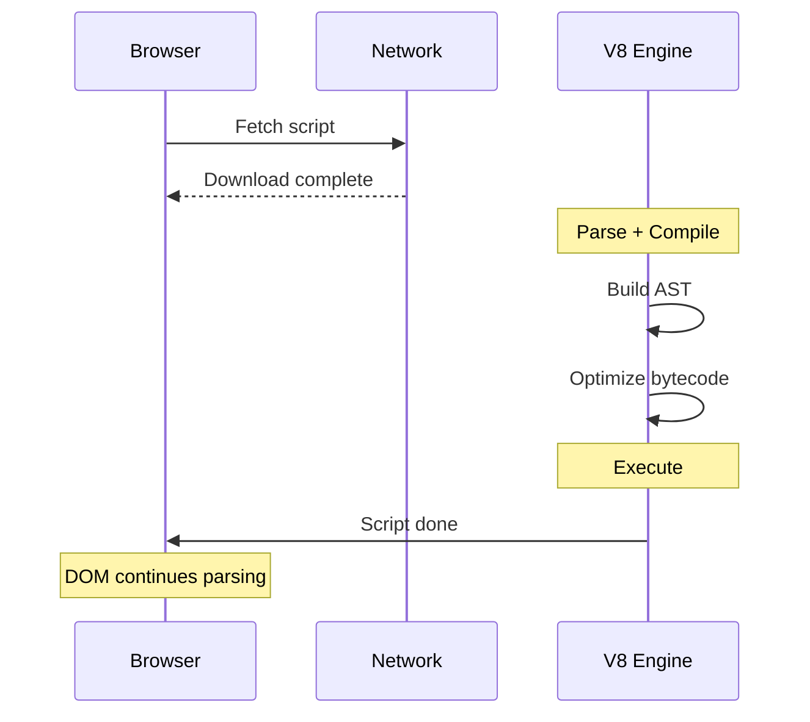
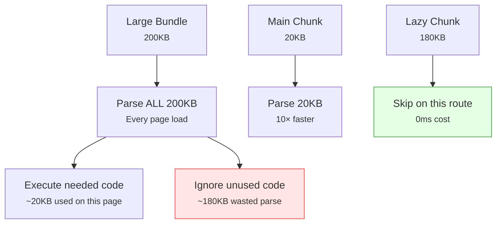

import snippet from '../../snippets/Loading/JS-Execution-Time-Breakdown.js?raw'
import { Snippet } from '../../components/Snippet'

# JavaScript Execution Time Breakdown

### Overview

Identifies where JavaScript time goes during page load: network download vs browser parsing. Shows which scripts delay `domInteractive` (TTI proxy) and flags code splitting opportunities.

**Why this matters:**

Knowing a script is "slow" isn't enough — the bottleneck can be the network download or the browser parsing and compiling the code after downloading. These require different fixes:

| Bottleneck | Signal | Fix |
|------------|--------|-----|
| Download time | High `duration` vs small file | CDN, HTTP/2, caching |
| Parse/compile time | Large transfer size | Code splitting, tree-shaking |
| Render-blocking | In `<head>` without defer/async | Add `defer` or move to body |

**JS cost phases during page load:**

**How parse time relates to file size:**

V8 must parse every byte of JavaScript before executing it. Parse time scales roughly with file size:

| Script Size | Mobile (~1ms/KB) | Desktop (~0.3ms/KB) | Impact |
|-------------|-----------------|---------------------|--------|
| < 10 KB | < 10ms | < 3ms | Negligible |
| 50 KB | ~50ms | ~15ms | Noticeable on mobile |
| 100 KB | ~100ms | ~30ms | Significant on mobile |
| 200 KB | ~200ms | ~60ms | Major on mobile |
| 500 KB | ~500ms | ~150ms | Severe on mobile |
| 1 MB | ~1000ms | ~300ms | Critical — split this bundle |
| 10 MB | ~10000ms | ~3000ms | Unacceptable — must split |

> **Source:** [The cost of JavaScript in 2019](https://v8.dev/blog/cost-of-javascript-2019) (V8 blog) using Moto G4 as mobile baseline. Modern mid-range devices are faster; low-end devices can be slower. Parse time is always proportional to decoded (uncompressed) file size — caching eliminates download time but **not** parse time on first execution.

### Snippet

<Snippet code={snippet} />

### Understanding the Results

**Page Load Timeline:**

Shows when key milestones occur and estimates what percentage of `domInteractive` is attributable to render-blocking JavaScript. `domInteractive` is a reliable proxy for TTI on simple pages.

**Per-Script Breakdown:**

| Column | What it measures | Source |
|--------|-----------------|--------|
| 🔴/✅ | Render-blocking status | DOM `<script>` attributes |
| Download | Time from request to last byte | Resource Timing API |
| Parse(mob) | ~1ms/KB decoded — mobile worst-case (Moto G4 baseline) | Calculated estimate |
| Parse(dsk) | ~0.3ms/KB decoded — desktop (~3× faster than mobile) | Calculated estimate |
| Transfer | Compressed size over the wire | Resource Timing API |
| Decoded | Uncompressed size — what the browser actually parses | Resource Timing API |

**Why Est.Parse is an estimate:**

The browser does not expose parse/compile time through any web API. This snippet estimates it from decoded file size using a ~1ms/KB heuristic. Real values depend on:
- Device CPU speed (mobile devices can be 3–5× slower)
- JavaScript complexity (simple code parses faster)
- V8 caching (previously parsed scripts skip re-parsing)
- Script streaming (V8 can parse while still downloading)

For measured execution time, use [Long Animation Frames Script Attribution](/Interaction/Long-Animation-Frames-Script-Attribution).

**Code Splitting Candidates:**

Scripts over 50KB decoded are flagged because:
- Large bundles force the browser to parse all code upfront, even code not used on the current page
- Parsing cost applies even when the script is served from cache (no network, but still CPU work)
- Splitting at route or feature boundaries lets the browser skip parsing unused code

### Limitations

| Limitation | Details |
|-----------|---------|
| Parse time is estimated | Real parse time depends on device, CPU, code complexity, and V8 caching state |
| Cached scripts | Scripts served from cache show `transferSize = 0`; parse estimate uses decoded size |
| LoAF not included | Execution time during interactions requires the Long Animation Frames snippet |
| Cross-origin timing | CORS may restrict resource timing data for some third-party scripts |
| Script streaming | V8 can begin parsing before download finishes, making actual parse time lower than estimated |

### Further Reading

- [Script evaluation and long tasks](https://web.dev/articles/script-evaluation-and-long-tasks) | web.dev
- [Optimize JavaScript execution](https://developer.chrome.com/docs/devtools/performance/reference) | Chrome Developers
- [Code splitting](https://web.dev/articles/reduce-javascript-payloads-with-code-splitting) | web.dev
- [JavaScript parsing cost](https://v8.dev/blog/cost-of-javascript-2019) | V8 Blog
- [modulepreload](https://developer.mozilla.org/en-US/docs/Web/HTML/Attributes/rel/modulepreload) | MDN
- [Long Animation Frames Script Attribution](/Interaction/Long-Animation-Frames-Script-Attribution) | This site
