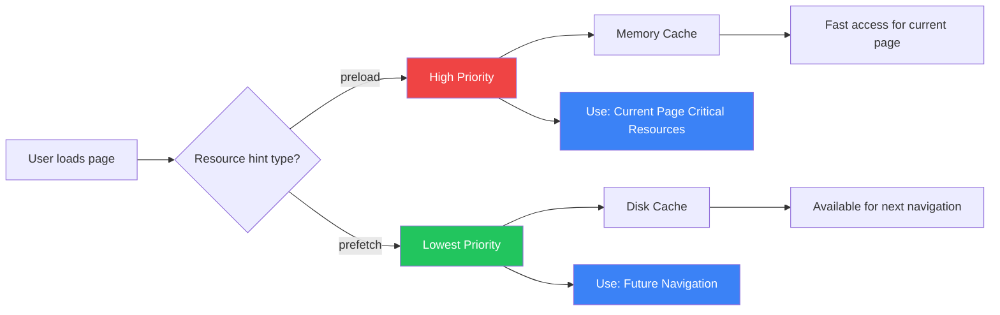
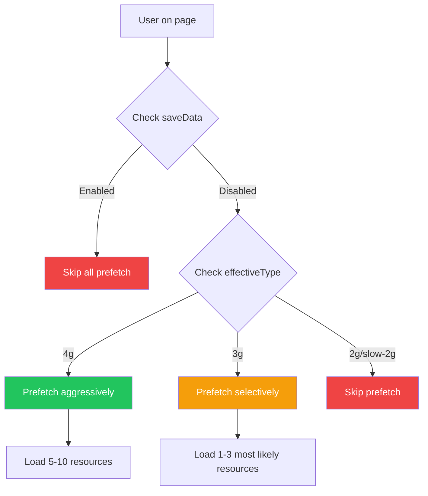
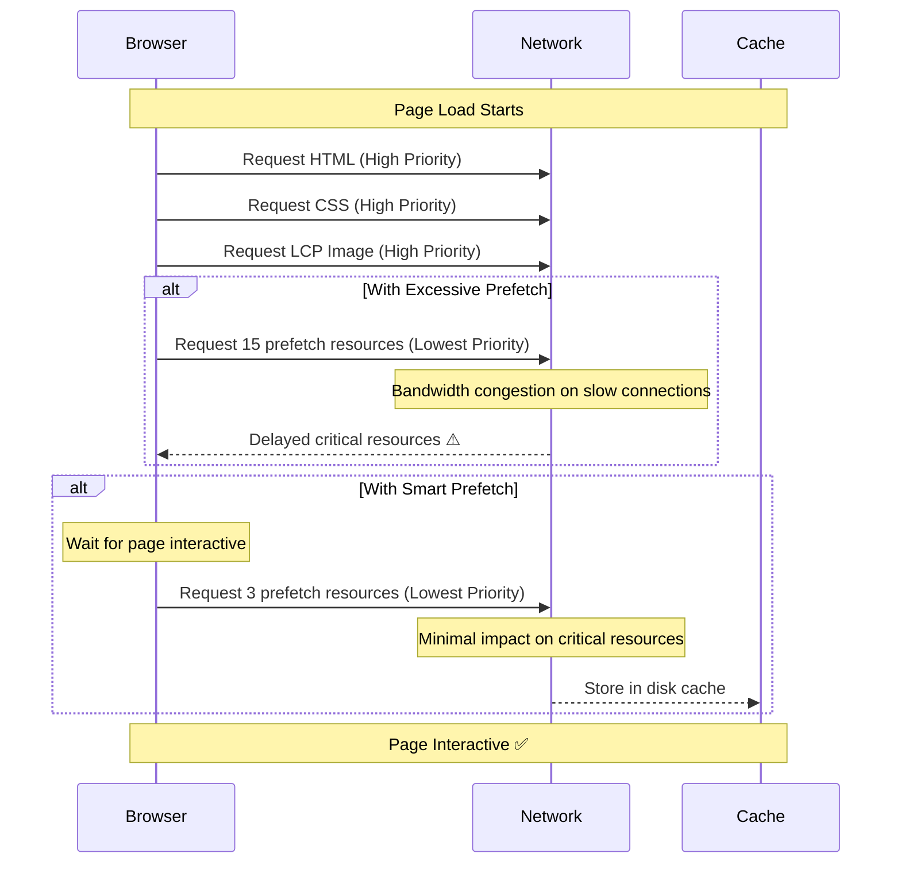
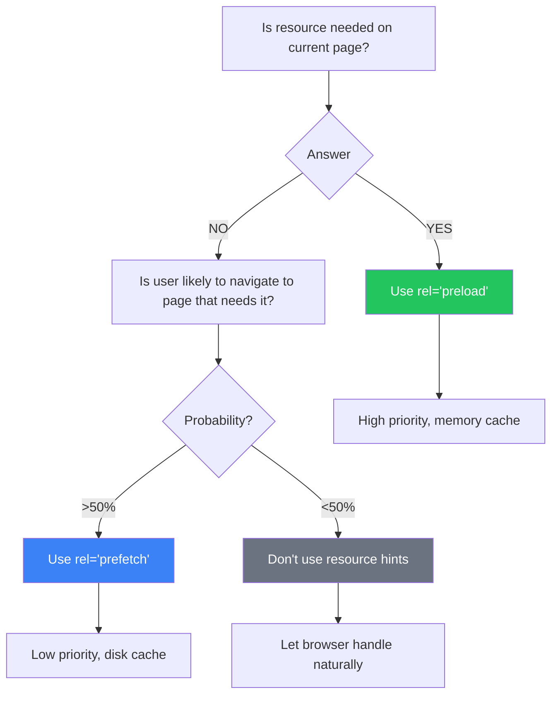
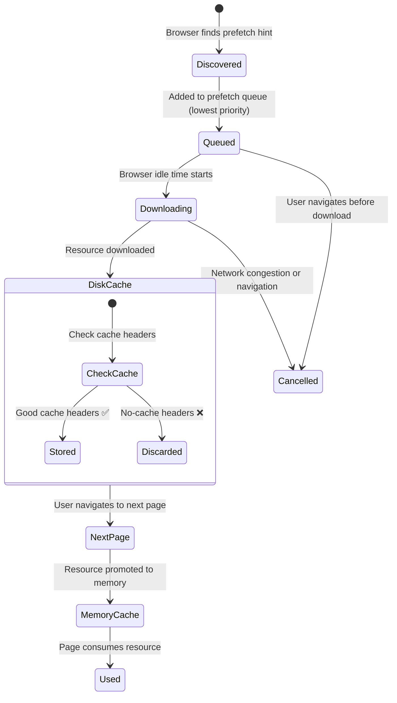

import snippet from '../../snippets/Loading/Prefetch-Resource-Validation.js?raw'
import { Snippet } from '../../components/Snippet'

# Prefetch Resource Validation

### Overview

Detects potential performance issues with `rel="prefetch"` resource hints by analyzing quantity, size, type, and appropriateness of prefetched resources. Excessive or incorrect prefetch usage can waste bandwidth, delay critical resources, and negatively impact mobile users.

**What is prefetch?**

`rel="prefetch"` is a resource hint that tells the browser to fetch and cache resources that may be needed for future navigations, during idle time. Unlike `preload`, which is for the current page, prefetch is for anticipated next-page resources.

**Difference between preload and prefetch:**

| Hint       | Priority | Timing            | Cache        | Use Case                                  |
| ---------- | -------- | ----------------- | ------------ | ----------------------------------------- |
| `preload`  | High     | Current page      | Memory cache | Critical resources for current page (LCP) |
| `prefetch` | Lowest   | Future navigation | Disk cache   | Resources for likely next pages           |

**Visual comparison:**



**Problems commonly detected:**

| Issue                      | Impact                   | Detection                                 |
| -------------------------- | ------------------------ | ----------------------------------------- |
| **Excessive prefetch**     | Wasted bandwidth         | More than 10-15 resources prefetched      |
| **Large files**            | Mobile data consumption  | Individual resources &gt;500KB            |
| **Total size**             | Network congestion       | Cumulative prefetch &gt;2MB               |
| **Wrong resource types**   | Ineffective optimization | Large images/videos instead of code       |
| **Current page resources** | Wrong hint type          | Should use `preload` instead              |
| **Missing cache headers**  | Prefetch won't be used   | Resources without proper cache directives |

### Snippet

<Snippet code={snippet} />

### Understanding the Results

**Summary Section:**

Shows the overall state of prefetch usage:

- Total number of prefetch hints
- How many were actually loaded
- Total size (decompressed and transfer size)
- Number of issues detected

**Issue Categories:**

| Category               | Severity | Description                                                          |
| ---------------------- | -------- | -------------------------------------------------------------------- |
| **Wrong hint type**    | Error    | Resource used on current page - should use `preload` not `prefetch` (\*) |
| **Missing as**         | Warning  | Missing `as` attribute prevents correct MIME type matching           |
| **Invalid as**         | Warning  | Invalid `as` attribute value (typo or unsupported type)              |
| **Duplicate prefetch** | Warning  | Same URL is prefetched multiple times (wasteful)                     |
| **Excessive count**    | Warning  | Too many prefetch hints (&gt;10) wastes bandwidth                    |
| **Large file**         | Warning  | Individual resource &gt;500KB may be too large                       |
| **Excessive size**     | Error    | Total prefetch &gt;5MB significantly impacts mobile users            |
| **High size**          | Warning  | Total prefetch &gt;2MB should be reduced                             |
| **Inappropriate type** | Warning  | Resource type/size not suitable (video, large image/script)          |
| **Not loaded**         | Info     | Prefetch hint present but resource not loaded yet                    |

> **(\*) Note on "Wrong hint type" detection:** This check uses a 5-second heuristic (resources loaded in the first 5s are considered current-page resources). On very slow-loading pages (>5s), this may produce false positives. The heuristic works well for most pages but consider the page load time when evaluating this error.

**Resource Analysis:**

The snippet shows detailed information for each prefetched resource:

| Column       | Description                                                             |
| ------------ | ----------------------------------------------------------------------- |
| **Resource** | Filename of the prefetched resource                                     |
| **Type**     | Resource type from `as` attribute                                       |
| **Size**     | Decompressed size in KB (from Performance API)                          |
| **Duration** | Download time in milliseconds (from Performance API)                    |
| **Status**   | Whether resource was loaded or is pending (valid prefetch table only)   |
| **Cache**    | Cache status - cached vs network fetch (valid prefetch table only)      |
| **Issue**    | Specific problems detected (issues tables only)                         |

**Thresholds:**

| Metric               | Warning          | Critical | Rationale                                  |
| -------------------- | ---------------- | -------- | ------------------------------------------ |
| Resource count       | &gt;10 resources | -        | Excessive prefetch wastes mobile bandwidth |
| Individual file size | &gt;500KB        | -        | Large files may not be used immediately    |
| Total prefetch size  | &gt;2MB          | &gt;5MB  | Mobile data consumption and network impact |

### Real-World Examples

**Common prefetch scenarios:**

| Scenario              | Recommendation                    | When to Use                       | Probability |
| --------------------- | --------------------------------- | --------------------------------- | ----------- |
| **Multi-step Forms**  | ✅ Prefetch next step             | User filling current step         | High (>80%) |
| **Product Listings**  | ⚠️ Prefetch on hover/intent only  | User shows interest signal        | Medium      |
| **Article Pages**     | ✅ Prefetch related articles      | Analytics show 60%+ click rate    | High        |
| **SPA Route Chunks**  | ✅ Prefetch visible link targets  | Framework handles automatically   | Variable    |
| **Dashboard Widgets** | ✅ Prefetch after initial render  | User will likely interact         | High        |
| **Image Galleries**   | ⚠️ Prefetch on viewport proximity | User scrolling towards content    | Medium      |
| **Search Results**    | ❌ Don't prefetch all results     | Unknown user intent               | Low         |
| **Video Content**     | ❌ Too large for prefetch         | Use adaptive streaming instead    | N/A         |

**✅ Good: Next.js route prefetching**

```html
<!-- Next.js automatically prefetches visible <Link> components -->
<link rel="prefetch" href="/_next/static/chunks/pages/checkout-a1b2c3.js" as="script" />
<link rel="prefetch" href="/_next/static/chunks/pages/products-d4e5f6.js" as="script" />

<!-- Small scripts for likely next pages - excellent use of prefetch -->
```

**✅ Good: Predictable user journey**

```html
<!-- Multi-step form: prefetch step 2 while user fills step 1 -->
<link rel="prefetch" href="/step-2-validation.js" as="script" />
<link rel="prefetch" href="/step-2-styles.css" as="style" />

<!-- User intent is clear, resources are small -->
```

**❌ Bad: Prefetching current page hero image**

```html
<!-- WRONG: Hero image is needed NOW, not for future navigation -->
<link rel="prefetch" href="/hero-image.jpg" as="image" />

<!-- CORRECT: Use preload for current page critical resources -->
<link rel="preload" href="/hero-image.jpg" as="image" fetchpriority="high" />
```

**❌ Bad: Excessive prefetch without user intent**

```html
<!-- Prefetching 20+ product images "just in case" -->
<link rel="prefetch" href="/product-1.jpg" />
<link rel="prefetch" href="/product-2.jpg" />
<!-- ... 18 more ... -->

<!-- PROBLEM: Wastes bandwidth, user may not visit product pages -->
<!-- SOLUTION: Use Intersection Observer to prefetch when user scrolls near links -->
```

**✅ Good: Analytics-driven prefetch**

```javascript
// Prefetch based on analytics: 80% of users go to /pricing after landing
if (currentPage === "/features") {
  const link = document.createElement("link");
  link.rel = "prefetch";
  link.href = "/pricing-page.js";
  link.as = "script";
  document.head.appendChild(link);
}
```

### Framework-Specific Guidance

**Next.js:**

Next.js automatically prefetches routes for `<Link>` components in the viewport. This is generally good, but watch for:

```javascript
// Check prefetch behavior
<Link href="/heavy-page" prefetch={false}>
  Heavy Page
</Link>

// Disable prefetch for pages with large resources
// User must click before loading begins
```

**Remix / React Router:**

```javascript
// Intentional prefetch on hover
<Link to="/profile" prefetch="intent">
  Profile
</Link>

// Prefetch immediately
<Link to="/dashboard" prefetch="render">
  Dashboard
</Link>

// Only prefetch when user hovers/focuses (recommended)
```

**SvelteKit:**

```html
<!-- Default: prefetch on hover -->
<a href="/about" data-sveltekit-preload-data="hover">About</a>

<!-- Prefetch immediately when link is visible -->
<a href="/dashboard" data-sveltekit-preload-data="viewport">Dashboard</a>

<!-- Disable prefetch for heavy pages -->
<a href="/gallery" data-sveltekit-preload-data="off">Gallery</a>
```

### Advanced: Runtime Prefetch Strategies

**Adaptive prefetch decision flow:**



**Adaptive prefetch based on connection:**

```javascript
// Only prefetch on fast connections
if ("connection" in navigator) {
  const conn = navigator.connection;
  const shouldPrefetch = conn.effectiveType === "4g" && !conn.saveData;

  if (shouldPrefetch) {
    // Prefetch next page resources
    const link = document.createElement("link");
    link.rel = "prefetch";
    link.href = "/next-page.js";
    document.head.appendChild(link);
  }
}
```

**Intersection Observer for smart prefetch:**

```javascript
// Prefetch when user scrolls near a link
const observer = new IntersectionObserver(
  (entries) => {
    entries.forEach((entry) => {
      if (entry.isIntersecting) {
        const link = entry.target;
        const prefetch = document.createElement("link");
        prefetch.rel = "prefetch";
        prefetch.href = link.href;
        document.head.appendChild(prefetch);
        observer.unobserve(link);
      }
    });
  },
  { rootMargin: "200px" },
);

// Observe important navigation links
document.querySelectorAll("a.important-nav").forEach((link) => {
  observer.observe(link);
});
```

### Impact on Core Web Vitals

**How prefetch affects page load timeline:**



**Potential negative impacts:**

1. **LCP (Largest Contentful Paint):**
   - Prefetch competes with current page resources at network level
   - On slow connections, can delay LCP image/text
   - Monitor: Keep total prefetch &lt;2MB

2. **FCP (First Contentful Paint):**
   - Excessive prefetch during page load can delay FCP
   - Best practice: Delay prefetch until after page is interactive

3. **CLS (Cumulative Layout Shift):**
   - Indirect impact: If prefetch delays critical fonts, can cause layout shifts
   - Ensure fonts for current page use `preload`, not `prefetch`

**Mobile considerations:**

- **Data saver mode:** Respect `navigator.connection.saveData`
- **Slow connections:** Check `navigator.connection.effectiveType`
- **Battery impact:** Prefetch uses CPU and radio, draining battery
- **Data costs:** Mobile users may pay per MB

```javascript
// Respect user preferences
if (navigator.connection?.saveData) {
  // Skip all prefetch
  console.log("Data saver enabled, skipping prefetch");
  return;
}

// Only prefetch on good connections
const goodConnection = navigator.connection?.effectiveType === "4g";
if (!goodConnection) {
  console.log("Connection too slow for prefetch");
  return;
}
```

### When Prefetch vs Preload?

**Use `rel="preload"` when:**

- ✅ Resource is needed for **current page**
- ✅ Resource is **critical** for LCP or FCP
- ✅ You want **high priority** loading
- ✅ Resource will be used within **seconds**

```html
<!-- Current page critical resources -->
<link rel="preload" href="/hero-image.webp" as="image" fetchpriority="high" />
<link rel="preload" href="/critical-font.woff2" as="font" crossorigin />
<link rel="preload" href="/critical-styles.css" as="style" />
```

**Use `rel="prefetch"` when:**

- ✅ Resource is for **future navigation**
- ✅ User journey is **predictable**
- ✅ You want **low priority** loading (idle time)
- ✅ Resource won't be used for **several seconds**

```html
<!-- Future page resources -->
<link rel="prefetch" href="/next-page.js" as="script" />
<link rel="prefetch" href="/dashboard-styles.css" as="style" />
```

**Quick decision tree:**



### Browser Support & Caching

**Prefetch resource lifecycle:**



**Browser support:**

| Browser         | Prefetch Support | Notes                                     |
| --------------- | ---------------- | ----------------------------------------- |
| Chrome/Edge     | ✅ Full          | Prefetch during idle time                 |
| Firefox         | ✅ Full          | Prefetch in background                    |
| Safari          | ⚠️ Limited       | Supports prefetch but behavior differs    |
| Mobile browsers | ✅ Most          | May ignore on slow connections/data saver |

**Cache requirements:**

Prefetched resources MUST have proper cache headers to be effective:

```http
✅ Good: Resource will be reused
Cache-Control: public, max-age=31536000, immutable

✅ Good: Resource can be revalidated
Cache-Control: public, max-age=3600

❌ Bad: Resource won't be cached
Cache-Control: no-cache, no-store
```

**Verify cache headers:**

> **Note:** The following is a standalone example to check cache headers manually. It is NOT part of the diagnostic snippet above (it makes a real network request).

```javascript
// Standalone example: Check if a specific resource has good cache headers
// This makes a real HEAD request to inspect headers
fetch("/prefetched-script.js", { method: "HEAD" }).then((res) => {
  const cacheControl = res.headers.get("cache-control");
  console.log("Cache-Control:", cacheControl);

  if (cacheControl?.includes("no-cache")) {
    console.warn("⚠️ Prefetch won't be effective - no caching");
  }
});
```

### Further Reading

- [Resource Hints: `rel=prefetch`](https://developer.mozilla.org/en-US/docs/Web/HTML/Attributes/rel/prefetch) | MDN
- [Resource Hints Specification](https://www.w3.org/TR/resource-hints/#prefetch) | W3C
- [Prefetching in Chrome](https://developer.chrome.com/docs/web-platform/prerender-pages) | Chrome Developers
- [Optimize resource loading with Priority Hints](https://web.dev/articles/priority-hints) | web.dev
- [Fast load times with prefetch](https://web.dev/articles/link-prefetch) | web.dev
- [Resource Hints comparison](https://www.debugbear.com/blog/resource-hints-rel-preload-prefetch-preconnect) | DebugBear
- [The Network Information API](https://developer.mozilla.org/en-US/docs/Web/API/Network_Information_API) | MDN
