import snippet from '../../snippets/Loading/Script-Loading.js?raw'
import { Snippet } from '../../components/Snippet'

# Scripts Loading

### Overview

Analyzes all scripts on the page, showing their loading strategy and identifying potential performance issues. Scripts are often the biggest cause of main thread blocking and delayed rendering. This snippet helps you audit which scripts are blocking the critical rendering path.

**Why this matters:**

Render-blocking scripts in `<head>` without `async` or `defer` pause HTML parsing while they download and execute. This delays First Contentful Paint (FCP) and Largest Contentful Paint (LCP). Even a single blocking script can add hundreds of milliseconds to your load time, especially on slower connections.

**How scripts affect HTML parsing:**

```mermaid
sequenceDiagram
    participant Browser
    participant Parser as HTML Parser
    participant Script as Script

    Note over Browser,Script: Normal <script> - Blocks Everything

    Parser->>Script: Encounter <script>
    Note over Parser: ⏸️ PAUSE parsing
    Script->>Script: Download
    Script->>Script: Execute
    Note over Parser: ⏸️ Still waiting...
    Script-->>Parser: Done
    Note over Parser: ▶️ RESUME parsing

    Note over Browser,Script: <script async> - Execute When Ready

    Parser->>Script: Encounter <script async>
    Note over Parser: ✅ Continue parsing
    par Parallel Operations
        Parser->>Parser: Keep parsing HTML
    and
        Script->>Script: Download in background
    end
    Script->>Parser: Ready to execute
    Note over Parser: ⏸️ Brief pause
    Script->>Script: Execute
    Note over Parser: ▶️ Resume parsing

    Note over Browser,Script: <script defer> - Execute After Parsing

    Parser->>Script: Encounter <script defer>
    Note over Parser: ✅ Continue parsing
    par Parallel Operations
        Parser->>Parser: Keep parsing HTML
    and
        Script->>Script: Download in background
    end
    Parser->>Parser: Finish parsing
    Script->>Script: Execute (in order)
    Note over Script: All defer scripts run before DOMContentLoaded
```

**Loading strategy comparison:**

| Strategy | Downloads | Executes | Blocks Parsing | Order Guaranteed |
|----------|-----------|----------|----------------|------------------|
| **Normal** | When encountered | Immediately | ✅ Yes | ✅ Yes |
| **async** | In parallel | When ready | Briefly | ❌ No |
| **defer** | In parallel | After parsing | ❌ No | ✅ Yes |
| **module** | In parallel | After parsing | ❌ No | ✅ Yes |
| **async module** | In parallel | When ready | Briefly | ❌ No |

**When to use each:**

| Strategy | Best For |
|----------|----------|
| **Normal** | Critical scripts that must run before content (rare) |
| **async** | Independent scripts (analytics, ads) |
| **defer** | Scripts that need DOM, must run in order |
| **module** | Modern ES modules with imports |

> **Performance tip:** Most scripts should use `defer`. Use `async` only for truly independent scripts that don't rely on DOM or other scripts.

### Snippet

<Snippet code={snippet} />

### Understanding the Results

**Summary Section:**
- Total scripts (external and inline)
- Breakdown by loading strategy
- Overall rating based on blocking scripts

**Loading Strategy Legend:**
- 🔴 **Blocking**: Stops HTML parsing (bad for performance)
- ⚡ **Async**: Downloads in parallel, executes when ready
- 📋 **Defer**: Downloads in parallel, executes after parsing
- 📦 **Module**: ES module (deferred by default)

**Details Table:**

| Column | Description |
|--------|-------------|
| Script | Filename |
| Strategy | Loading strategy with indicator |
| Location | head or body |
| Party | 1st (your domain) or 3rd (external) |
| Size | Transfer size |
| Duration | Time to load |

**Issues Detected:**

| Issue | Severity | Why It Matters |
|-------|----------|----------------|
| Blocking scripts in `<head>` | Error | Delays all content below |
| Third-party blocking scripts | Error | External dependency blocking your page |
| Large blocking scripts (> 50 KB) | Warning | Significant parsing delay |

### Script Loading Decision Tree

```mermaid
flowchart TD
    Start[Script Loading Strategy] --> Critical{Critical for<br/>initial render?}

    Critical -->|Yes| Small{Very small<br/>< 1 KB?}
    Small -->|Yes| Inline[✓ Inline the script<br/><code>&lt;script&gt;...&lt;/script&gt;</code>]
    Small -->|No| EndBody[✓ Place at end of &lt;body&gt;<br/>or use preload]

    Critical -->|No| Order{Needs to run<br/>in order?}
    Order -->|Yes| Defer[✓ Use defer<br/><code>&lt;script defer&gt;</code>]
    Order -->|No| Async[✓ Use async<br/><code>&lt;script async&gt;</code>]

    style Inline fill:#E5FFE5
    style EndBody fill:#E5FFE5
    style Defer fill:#E5F2FF
    style Async fill:#FFE5F2
```

### Further Reading

- [Efficiently load JavaScript](https://web.dev/articles/efficiently-load-third-party-javascript) | web.dev
- [Script loading strategies](https://developer.chrome.com/docs/lighthouse/performance/render-blocking-resources) | Chrome Developers
- [JavaScript modules](https://developer.mozilla.org/en-US/docs/Web/JavaScript/Guide/Modules) | MDN
- [async vs defer](https://javascript.info/script-async-defer) | javascript.info
