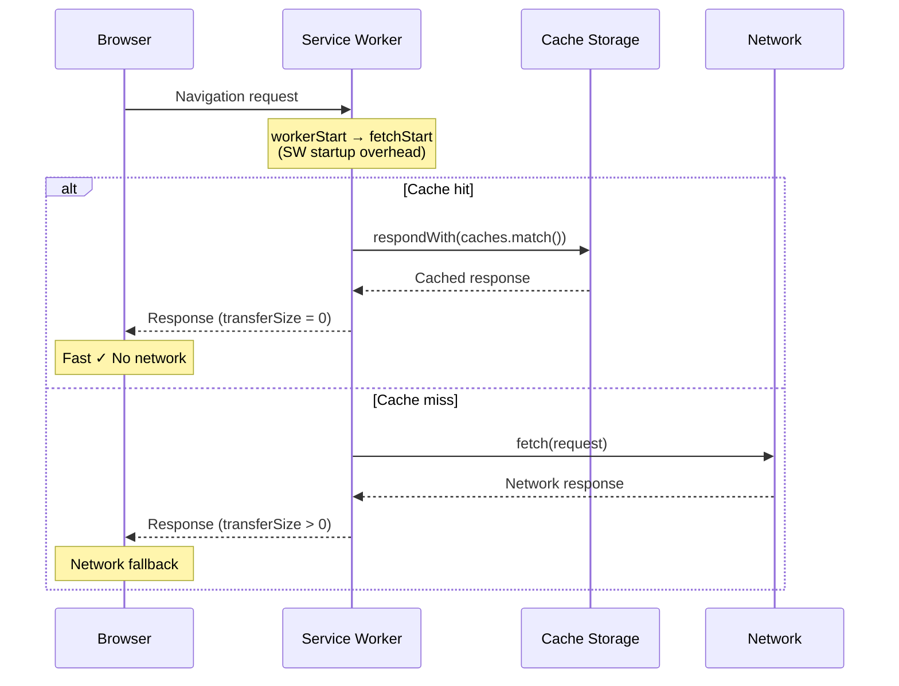
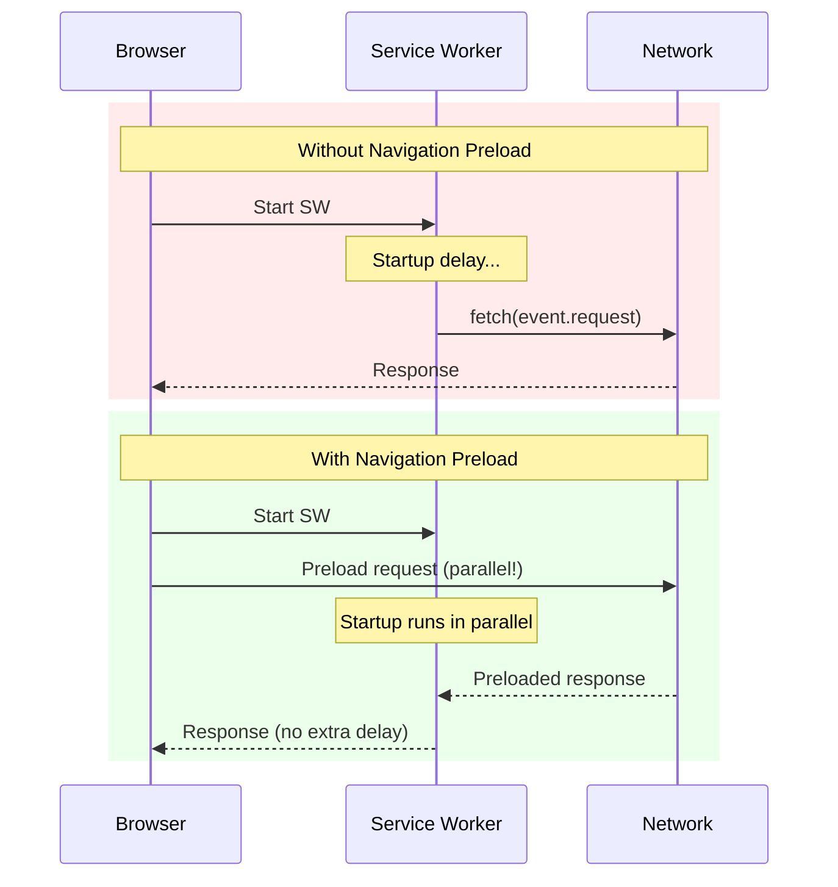

# Service Worker Analysis

Analyzes the Service Worker lifecycle, cache behavior, and its performance impact on resource loading. Service Workers can dramatically improve performance through caching strategies, but misconfigured workers can introduce startup delays and degrade TTFB.

**What this snippet measures:**

- Service Worker registration state and active/waiting/installing workers
- Navigation Preload status (reduces SW startup cost on navigation)
- SW startup overhead on page load (impact on TTFB)
- Resources intercepted by the SW vs. bypassed
- Cache hit rate for SW-intercepted resources
- Cache Storage inventory (caches and entry counts)

**SW impact on navigation timing:**



**Navigation Preload reduces SW startup cost:**



## Snippet

```js copy
// Service Worker Analysis
// https://webperf-snippets.nucliweb.net

(async () => {
  if (!('serviceWorker' in navigator)) {
    console.log(
      '%c⚠️ Service Workers not supported in this browser',
      'color: #f59e0b; font-weight: bold;'
    );
    return;
  }

  const registrations = await navigator.serviceWorker.getRegistrations();
  const controller = navigator.serviceWorker.controller;
  const navEntry = performance.getEntriesByType('navigation')[0];
  const resources = performance.getEntriesByType('resource');

  // Resources intercepted by SW (workerStart > 0)
  const swResources = resources.filter((r) => r.workerStart > 0);
  const fromCache = swResources.filter((r) => r.transferSize === 0);
  const fromNetwork = swResources.filter((r) => r.transferSize > 0);
  const notIntercepted = resources.filter((r) => r.workerStart === 0);

  console.group(
    '%c⚙️ Service Worker Analysis',
    'font-weight: bold; font-size: 14px;'
  );

  // Registrations
  console.log('');
  console.log('%c📋 Registrations:', 'font-weight: bold;');

  if (registrations.length === 0) {
    console.log('%c   ❌ No Service Workers registered', 'color: #ef4444;');
    console.groupEnd();
    return;
  }

  for (const reg of registrations) {
    console.log('');
    console.log(`%c   Scope: ${reg.scope}`, 'font-family: monospace;');

    if (reg.active) {
      console.log(
        `%c   ✅ Active: ${reg.active.state}`,
        'color: #22c55e;'
      );
      console.log(`      Script: ${reg.active.scriptURL}`);
    }
    if (reg.waiting) {
      console.log(
        '%c   ⏳ Waiting SW detected — update pending',
        'color: #f59e0b;'
      );
      console.log(`      Script: ${reg.waiting.scriptURL}`);
      console.log(
        '      💡 Call skipWaiting() to activate the new version'
      );
    }
    if (reg.installing) {
      console.log('%c   🔄 Installing...', 'color: #3b82f6;');
    }

    // Navigation Preload
    if (reg.navigationPreload) {
      try {
        const preload = await reg.navigationPreload.getState();
        console.log('');
        console.log('%c   🚀 Navigation Preload:', 'font-weight: bold;');
        if (preload.enabled) {
          console.log('%c      ✅ Enabled', 'color: #22c55e;');
          console.log(`      Header value: "${preload.headerValue}"`);
        } else {
          console.log('%c      ❌ Disabled', 'color: #ef4444;');
          console.log(
            '      💡 Enable with: registration.navigationPreload.enable()'
          );
        }
      } catch (_) {
        // Access may be restricted
      }
    }
  }

  // Controller
  console.log('');
  console.log('%c🎮 Controller:', 'font-weight: bold;');
  if (controller) {
    console.log('%c   ✅ Page is controlled by SW', 'color: #22c55e;');
    console.log(`   State: ${controller.state}`);
  } else {
    console.log('%c   ⚠️ Page is NOT controlled by SW', 'color: #f59e0b;');
    console.log('   Hard reload detected or first visit. Do a normal reload.');
  }

  // SW Startup overhead
  if (navEntry && navEntry.workerStart > 0) {
    const workerStart = navEntry.workerStart - navEntry.startTime;
    const fetchStart = navEntry.fetchStart - navEntry.startTime;
    const swOverhead = Math.max(fetchStart - workerStart, 0);

    console.log('');
    console.log('%c⏱️ SW Startup Overhead:', 'font-weight: bold;');
    console.log(`   Worker start:  ${workerStart.toFixed(1)}ms`);
    console.log(`   Fetch start:   ${fetchStart.toFixed(1)}ms`);
    console.log(`   SW overhead:   ${swOverhead.toFixed(1)}ms`);

    if (swOverhead > 100) {
      console.log(
        '%c   🔴 High SW startup time — enable Navigation Preload',
        'color: #ef4444;'
      );
    } else if (swOverhead > 50) {
      console.log(
        '%c   🟡 Moderate SW startup time',
        'color: #f59e0b;'
      );
    } else {
      console.log(
        '%c   🟢 SW startup overhead is low',
        'color: #22c55e;'
      );
    }
  }

  // Cache hit/miss ratio
  console.log('');
  console.log('%c📊 Resource Cache Analysis:', 'font-weight: bold;');
  console.log(`   Total resources:     ${resources.length}`);
  console.log(`   SW intercepted:      ${swResources.length}`);
  console.log(`   Not intercepted:     ${notIntercepted.length}`);

  if (swResources.length > 0) {
    const hitRate = ((fromCache.length / swResources.length) * 100).toFixed(1);
    const savedKB = (
      fromCache.reduce((sum, r) => sum + (r.encodedBodySize || 0), 0) / 1024
    ).toFixed(1);

    console.log('');
    console.log('   SW-intercepted breakdown:');
    console.log(`   ├─ Served from cache:   ${fromCache.length} (${hitRate}% hit rate)`);
    console.log(`   └─ Fetched from network: ${fromNetwork.length}`);
    console.log(`   Network bytes saved: ~${savedKB} KB`);

    const rate = parseFloat(hitRate);
    if (rate >= 80) {
      console.log('%c   🟢 Excellent cache hit rate', 'color: #22c55e;');
    } else if (rate >= 50) {
      console.log('%c   🟡 Good cache hit rate', 'color: #f59e0b;');
    } else {
      console.log(
        '%c   🔴 Low cache hit rate — review caching strategy',
        'color: #ef4444;'
      );
    }

    console.log('');
    console.log('%c📋 SW-intercepted Resources (top 20):', 'font-weight: bold;');
    console.table(
      swResources.slice(0, 20).map((r) => ({
        'Cache': r.transferSize === 0 ? '✅ Cache' : '🌐 Network',
        'Transfer (KB)': r.transferSize > 0 ? (r.transferSize / 1024).toFixed(1) : '0',
        'Duration (ms)': r.duration.toFixed(0),
        'Type': r.initiatorType,
        'URL': r.name.length > 60 ? '...' + r.name.slice(-57) : r.name,
      }))
    );
  }

  // Cache Storage inventory
  if ('caches' in window) {
    try {
      const cacheNames = await caches.keys();
      if (cacheNames.length > 0) {
        console.log('');
        console.log('%c💾 Cache Storage:', 'font-weight: bold;');
        let totalEntries = 0;
        for (const name of cacheNames) {
          const cache = await caches.open(name);
          const keys = await cache.keys();
          totalEntries += keys.length;
          console.log(`   ├─ "${name}": ${keys.length} entries`);
        }
        console.log(`   Total entries: ${totalEntries}`);
      }
    } catch (_) {
      // Cross-origin restrictions may prevent cache access
    }
  }

  console.groupEnd();
})();
```

## Interpreting the Results

### Service Worker not controlled (`⚠️ Page is NOT controlled by SW`)

The page was loaded with a hard reload (`Ctrl+Shift+R` / `Cmd+Shift+R`) or it's the very first visit. In this state the SW is registered but doesn't intercept requests.

**Fix:** Do a normal reload (`F5` / `Cmd+R`) and run the snippet again.

### Waiting SW detected (`⏳ Waiting SW detected`)

A new SW version was installed but it's waiting for all open tabs to close before activating. This is the default browser behavior to avoid version mismatches.

| Situation | Action |
|-----------|--------|
| Development | Call `skipWaiting()` in the SW to force activation |
| Production | Close all tabs and reopen, or add an "Update available" prompt |

### SW Startup Overhead

The overhead is the time between `workerStart` and `fetchStart` in the Navigation Timing entry — the time the browser spends starting the SW before the actual fetch can begin.

| Rating | Overhead | Meaning |
|--------|----------|---------|
| 🟢 Good | < 50ms | SW is running or starts fast |
| 🟡 Needs attention | 50–100ms | Consider Navigation Preload |
| 🔴 Poor | > 100ms | SW cold start adds visible latency to TTFB |

A high overhead on first load is normal (SW cold start). On subsequent navigations it should be near zero if the SW is already running. Enable **Navigation Preload** to eliminate this overhead regardless.

### Navigation Preload disabled (`❌ Disabled`)

Without Navigation Preload, the browser must wait for the SW to start before sending the navigation request to the network. Enable it in the SW `activate` event:

```js
self.addEventListener('activate', (event) => {
  event.waitUntil(self.registration.navigationPreload.enable());
});
```

Then consume the preloaded response in the `fetch` handler:

```js
self.addEventListener('fetch', (event) => {
  event.respondWith(async function () {
    const cached = await caches.match(event.request);
    if (cached) return cached;

    const preloadResponse = await event.preloadResponse;
    if (preloadResponse) return preloadResponse;

    return fetch(event.request);
  }());
});
```

### Cache hit rate

| Rating | Hit rate | Meaning |
|--------|----------|---------|
| 🟢 Excellent | ≥ 80% | Most resources served from cache |
| 🟡 Good | 50–79% | Mixed cache/network — review strategy |
| 🔴 Low | < 50% | Cache strategy too conservative or cache is cold |

A low hit rate on first visit is expected since the cache hasn't been populated yet. Run the snippet on a **second visit** to get a meaningful measurement.

### `transferSize = 0` vs. actual cache hit

`transferSize = 0` for SW-intercepted resources means no bytes came from the network — the response came from **Cache Storage or the HTTP cache**. It does **not** distinguish between the two. To confirm a response came specifically from Cache Storage, check your SW fetch handler logic or use the **Application → Cache Storage** panel in DevTools.

### Resources NOT intercepted by SW

Resources with `workerStart = 0` were not intercepted. Common reasons:

- Cross-origin requests excluded from the SW `fetch` scope
- Requests made before the SW finished activating
- Resources with `no-cors` mode that the SW skips
- The SW `fetch` handler doesn't match their URL pattern

### Cache Storage is empty

The SW is registered but hasn't cached anything yet. This happens on first visit before the `install` event pre-caches assets, or if the caching strategy is purely runtime (cache-on-first-use).

## Further Reading

- [Service Worker API](https://developer.mozilla.org/en-US/docs/Web/API/Service_Worker_API) | MDN
- [Speed up Service Worker with Navigation Preloads](https://developer.chrome.com/docs/workbox/navigation-preload/) | Chrome Developers
- [Service worker caching and HTTP caching](https://web.dev/articles/service-worker-caching-and-http-caching) | web.dev
- [Workbox](https://developer.chrome.com/docs/workbox/) | Production SW library by Google
- [TTFB](/Loading/TTFB) | Time To First Byte — affected by SW startup time
