# Time To First Byte

Time to First Byte (TTFB) measures the time from when the user starts navigating to a page until the first byte of the HTML response is received. It's a critical metric that reflects server responsiveness and network latency.

**TTFB includes:**
- Redirect time
- Service worker startup time (if applicable)
- DNS lookup
- TCP connection and TLS negotiation
- Request time until the first byte of the response arrives

**Thresholds (according to web.dev):**

| Rating | TTFB |
|--------|------|
| 🟢 Good | ≤ 800ms |
| 🟡 Needs Improvement | 800ms - 1800ms |
| 🔴 Poor | > 1800ms |

## Measure the time to first byte

### Snippet

```js copy
// Measure TTFB with threshold indicator
// https://webperf-snippets.nucliweb.net

new PerformanceObserver((entryList) => {
  const [pageNav] = entryList.getEntriesByType("navigation");
  const ttfb = pageNav.responseStart;

  let rating, color;
  if (ttfb <= 800) {
    rating = "Good";
    color = "#22c55e";
  } else if (ttfb <= 1800) {
    rating = "Needs Improvement";
    color = "#f59e0b";
  } else {
    rating = "Poor";
    color = "#ef4444";
  }

  console.log(
    `%cTTFB: ${ttfb.toFixed(0)}ms (${rating})`,
    `color: ${color}; font-weight: bold; font-size: 14px;`
  );
}).observe({
  type: "navigation",
  buffered: true,
});
```

## Measure TTFB sub-parts

Breaks down TTFB into its component phases to identify where time is being spent. This helps pinpoint whether slowness is due to DNS, TCP connection, SSL negotiation, or server processing.

Based on [pagespeed](https://github.com/corewebvitals/pagespeed) by [Arjen Karel](https://www.linkedin.com/in/arjenkarel/).

```mermaid
sequenceDiagram
    participant B as Browser
    participant SW as Service Worker
    participant DNS as DNS Server
    participant S as Server

    B->>B: Redirect/Wait
    B->>SW: Service Worker/Cache
    SW-->>B: Cache miss
    B->>DNS: DNS Lookup
    DNS-->>B: IP Address
    B->>S: TCP Connection
    B->>S: SSL/TLS Handshake
    B->>S: HTTP Request
    S-->>B: First Byte ✓
    Note over B,S: ← TTFB ends here
```



**Sub-parts explained:**

| Phase | Description | Common causes of delays |
|-------|-------------|------------------------|
| **Redirect** | Time spent following HTTP redirects | Too many redirects, redirect chains |
| **Service Worker** | SW startup and cache lookup time | Complex SW logic, cache misses |
| **DNS** | Domain name resolution | No DNS caching, slow DNS provider |
| **TCP** | TCP connection establishment | Geographic distance, no connection reuse |
| **SSL/TLS** | Secure connection negotiation | No TLS session resumption, slow handshake |
| **Request** | Time to first byte after connection | Slow server, database queries, no caching |

### Snippet

```js copy
// Measure TTFB sub-parts breakdown
// https://webperf-snippets.nucliweb.net

(() => {
  new PerformanceObserver((entryList) => {
    const [pageNav] = entryList.getEntriesByType("navigation");

    const activationStart = pageNav.activationStart || 0;
    const waitEnd = Math.max((pageNav.workerStart || pageNav.fetchStart) - activationStart, 0);
    const dnsStart = Math.max(pageNav.domainLookupStart - activationStart, 0);
    const tcpStart = Math.max(pageNav.connectStart - activationStart, 0);
    const sslStart = Math.max(pageNav.secureConnectionStart - activationStart, 0);
    const tcpEnd = Math.max(pageNav.connectEnd - activationStart, 0);
    const responseStart = Math.max(pageNav.responseStart - activationStart, 0);

    const formatMs = (ms) => ms.toFixed(2) + " ms";
    const formatBar = (ms, total) => {
      const pct = total > 0 ? (ms / total) * 100 : 0;
      const width = Math.round(pct / 5);
      return "█".repeat(width) + "░".repeat(20 - width) + ` ${pct.toFixed(1)}%`;
    };

    // Rating
    let rating, color;
    if (responseStart <= 800) {
      rating = "Good";
      color = "#22c55e";
    } else if (responseStart <= 1800) {
      rating = "Needs Improvement";
      color = "#f59e0b";
    } else {
      rating = "Poor";
      color = "#ef4444";
    }

    console.group(`%c⏱️ TTFB: ${responseStart.toFixed(0)}ms (${rating})`, `color: ${color}; font-weight: bold; font-size: 14px;`);

    // Sub-parts breakdown
    const subParts = [
      { name: "Redirect/Wait", duration: waitEnd, icon: "🔄" },
      { name: "Service Worker/Cache", duration: dnsStart - waitEnd, icon: "⚙️" },
      { name: "DNS Lookup", duration: tcpStart - dnsStart, icon: "🔍" },
      { name: "TCP Connection", duration: sslStart - tcpStart, icon: "🔌" },
      { name: "SSL/TLS", duration: tcpEnd - sslStart, icon: "🔒" },
      { name: "Server Response", duration: responseStart - tcpEnd, icon: "📥" },
    ];

    console.log("");
    console.log("%cBreakdown:", "font-weight: bold;");
    subParts.forEach(({ name, duration, icon }) => {
      if (duration > 0) {
        console.log(`${icon} ${name.padEnd(20)} ${formatMs(duration).padStart(10)}  ${formatBar(duration, responseStart)}`);
      }
    });

    console.log("");
    console.log(`%c${"─".repeat(60)}`, "color: #666;");
    console.log(`%c📊 Total TTFB${" ".repeat(15)} ${formatMs(responseStart).padStart(10)}`, "font-weight: bold;");

    // Recommendations based on longest phase
    const longestPhase = subParts.reduce((a, b) => (a.duration > b.duration ? a : b));
    if (longestPhase.duration > responseStart * 0.4 && responseStart > 800) {
      console.log("");
      console.log("%c💡 Recommendation:", "color: #3b82f6; font-weight: bold;");
      const tips = {
        "Redirect/Wait": "Minimize redirects. Use direct URLs where possible.",
        "Service Worker/Cache": "Optimize service worker. Consider cache-first strategies.",
        "DNS Lookup": "Use DNS prefetching. Consider a faster DNS provider.",
        "TCP Connection": "Enable HTTP/2 or HTTP/3. Use connection keep-alive.",
        "SSL/TLS": "Enable TLS 1.3. Use session resumption. Check certificate chain.",
        "Server Response": "Optimize server processing. Add caching. Check database queries.",
      };
      console.log(`   ${longestPhase.name} is ${((longestPhase.duration / responseStart) * 100).toFixed(0)}% of TTFB.`);
      console.log(`   ${tips[longestPhase.name]}`);
    }

    console.groupEnd();
  }).observe({
    type: "navigation",
    buffered: true,
  });
})();
```

## Measure TTFB for all resources

Analyzes TTFB for every resource loaded on the page (scripts, stylesheets, images, fonts, etc.). Helps identify slow third-party resources or backend endpoints.

> **Note**: Resources with TTFB of 0 are excluded (cached or cross-origin without `Timing-Allow-Origin` header).

### Snippet

```js copy
// Measure TTFB for all resources with sorting and summary
// https://webperf-snippets.nucliweb.net

new PerformanceObserver((entryList) => {
  const entries = entryList.getEntries();

  const resourcesData = entries
    .filter((entry) => entry.responseStart > 0)
    .map((entry) => {
      const url = new URL(entry.name);
      const isThirdParty = url.hostname !== location.hostname;

      return {
        ttfb: entry.responseStart,
        duration: entry.duration,
        type: entry.initiatorType,
        thirdParty: isThirdParty,
        resource: entry.name.length > 70 ? "..." + entry.name.slice(-67) : entry.name,
        fullUrl: entry.name,
      };
    })
    .sort((a, b) => b.ttfb - a.ttfb);

  if (resourcesData.length === 0) {
    console.log("%c⚠️ No resources with TTFB data available", "color: #f59e0b;");
    console.log("Resources may be cached or missing Timing-Allow-Origin header.");
    return;
  }

  // Summary statistics
  const ttfbValues = resourcesData.map((r) => r.ttfb);
  const avgTtfb = ttfbValues.reduce((a, b) => a + b, 0) / ttfbValues.length;
  const maxTtfb = Math.max(...ttfbValues);
  const minTtfb = Math.min(...ttfbValues);
  const thirdPartyCount = resourcesData.filter((r) => r.thirdParty).length;
  const slowResources = resourcesData.filter((r) => r.ttfb > 500).length;

  console.group(`%c📊 Resource TTFB Analysis (${resourcesData.length} resources)`, "font-weight: bold; font-size: 14px;");

  // Summary
  console.log("");
  console.log("%cSummary:", "font-weight: bold;");
  console.log(`   Average TTFB: ${avgTtfb.toFixed(0)}ms`);
  console.log(`   Fastest: ${minTtfb.toFixed(0)}ms | Slowest: ${maxTtfb.toFixed(0)}ms`);
  console.log(`   Third-party resources: ${thirdPartyCount}`);
  if (slowResources > 0) {
    console.log(`%c   ⚠️ Slow resources (>500ms): ${slowResources}`, "color: #f59e0b;");
  }

  // Table (sorted by TTFB, slowest first)
  console.log("");
  console.log("%cResources (sorted by TTFB, slowest first):", "font-weight: bold;");
  const tableData = resourcesData.slice(0, 25).map(({ fullUrl, ...rest }) => ({
    "TTFB (ms)": rest.ttfb.toFixed(0),
    "Duration (ms)": rest.duration.toFixed(0),
    Type: rest.type,
    "3rd Party": rest.thirdParty ? "Yes" : "",
    Resource: rest.resource,
  }));
  console.table(tableData);

  if (resourcesData.length > 25) {
    console.log(`... and ${resourcesData.length - 25} more resources`);
  }

  // Slowest resources highlight
  const slowest = resourcesData.slice(0, 5);
  if (slowest[0].ttfb > 500) {
    console.log("");
    console.log("%c🐌 Slowest resources:", "color: #ef4444; font-weight: bold;");
    slowest.forEach((r, i) => {
      const marker = r.thirdParty ? " [3rd party]" : "";
      console.log(`   ${i + 1}. ${r.ttfb.toFixed(0)}ms - ${r.type}${marker}: ${r.resource}`);
    });
  }

  console.groupEnd();
}).observe({
  type: "resource",
  buffered: true,
});
```

## Further Reading

- [Time to First Byte (TTFB)](https://web.dev/articles/ttfb) | web.dev
- [Optimize TTFB](https://web.dev/articles/optimize-ttfb) | web.dev
- [Navigation Timing API](https://developer.mozilla.org/en-US/docs/Web/API/Navigation_timing_API) | MDN
- [Resource Timing API](https://developer.mozilla.org/en-US/docs/Web/API/Performance_API/Resource_timing) | MDN
