import snippet from '../../snippets/Loading/TTFB.js?raw'
import snippet2 from '../../snippets/Loading/TTFB-Sub-Parts.js?raw'
import snippet3 from '../../snippets/Loading/TTFB-Resources.js?raw'
import { Snippet } from '../../components/Snippet'

# Time To First Byte

Time to First Byte (TTFB) measures the time from when the user starts navigating to a page until the first byte of the HTML response is received. It's a critical metric that reflects server responsiveness and network latency.

**TTFB includes:**
- Redirect time
- Service worker startup time (if applicable)
- DNS lookup
- TCP connection and TLS negotiation
- Request time until the first byte of the response arrives

**Thresholds (according to web.dev):**

| Rating | TTFB |
|--------|------|
| 🟢 Good | ≤ 800ms |
| 🟡 Needs Improvement | 800ms - 1800ms |
| 🔴 Poor | > 1800ms |

## Measure the time to first byte

### Snippet

<Snippet code={snippet} />

## Measure TTFB sub-parts

Breaks down TTFB into its component phases to identify where time is being spent. This helps pinpoint whether slowness is due to DNS, TCP connection, SSL negotiation, or server processing.

Based on [pagespeed](https://github.com/corewebvitals/pagespeed) by [Arjen Karel](https://www.linkedin.com/in/arjenkarel/).

```mermaid
sequenceDiagram
    participant B as Browser
    participant SW as Service Worker
    participant DNS as DNS Server
    participant S as Server

    B->>B: Redirect/Wait
    B->>SW: Service Worker/Cache
    SW-->>B: Cache miss
    B->>DNS: DNS Lookup
    DNS-->>B: IP Address
    B->>S: TCP Connection
    B->>S: SSL/TLS Handshake
    B->>S: HTTP Request
    S-->>B: First Byte ✓
    Note over B,S: ← TTFB ends here
```

**Sub-parts explained:**

| Phase | Description | Common causes of delays |
|-------|-------------|------------------------|
| **Redirect** | Time spent following HTTP redirects | Too many redirects, redirect chains |
| **Service Worker** | SW startup and cache lookup time | Complex SW logic, cache misses |
| **DNS** | Domain name resolution | No DNS caching, slow DNS provider |
| **TCP** | TCP connection establishment | Geographic distance, no connection reuse |
| **SSL/TLS** | Secure connection negotiation | No TLS session resumption, slow handshake |
| **Request** | Time to first byte after connection | Slow server, database queries, no caching |

### Snippet

<Snippet code={snippet2} />

## Measure TTFB for all resources

Analyzes TTFB for every resource loaded on the page (scripts, stylesheets, images, fonts, etc.). Helps identify slow third-party resources or backend endpoints.

> **Note**: Resources with TTFB of 0 are excluded (cached or cross-origin without `Timing-Allow-Origin` header).

### Snippet

<Snippet code={snippet3} />

## Further Reading

- [Time to First Byte (TTFB)](https://web.dev/articles/ttfb) | web.dev
- [Optimize TTFB](https://web.dev/articles/optimize-ttfb) | web.dev
- [Navigation Timing API](https://developer.mozilla.org/en-US/docs/Web/API/Navigation_timing_API) | MDN
- [Resource Timing API](https://developer.mozilla.org/en-US/docs/Web/API/Performance_API/Resource_timing) | MDN
- [FCP](/Loading/FCP) | First Contentful Paint — the next metric after TTFB
