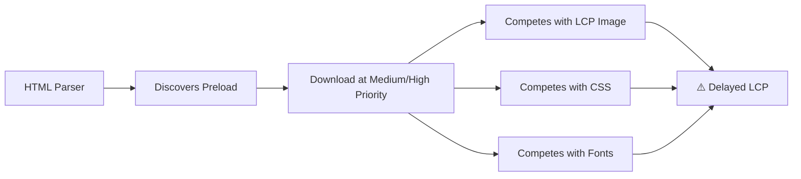
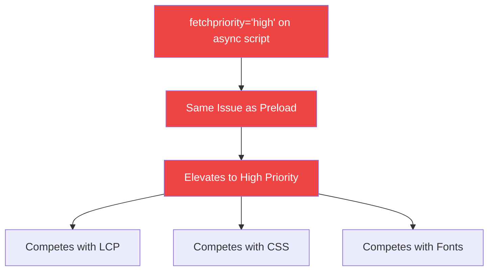
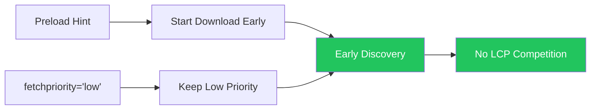
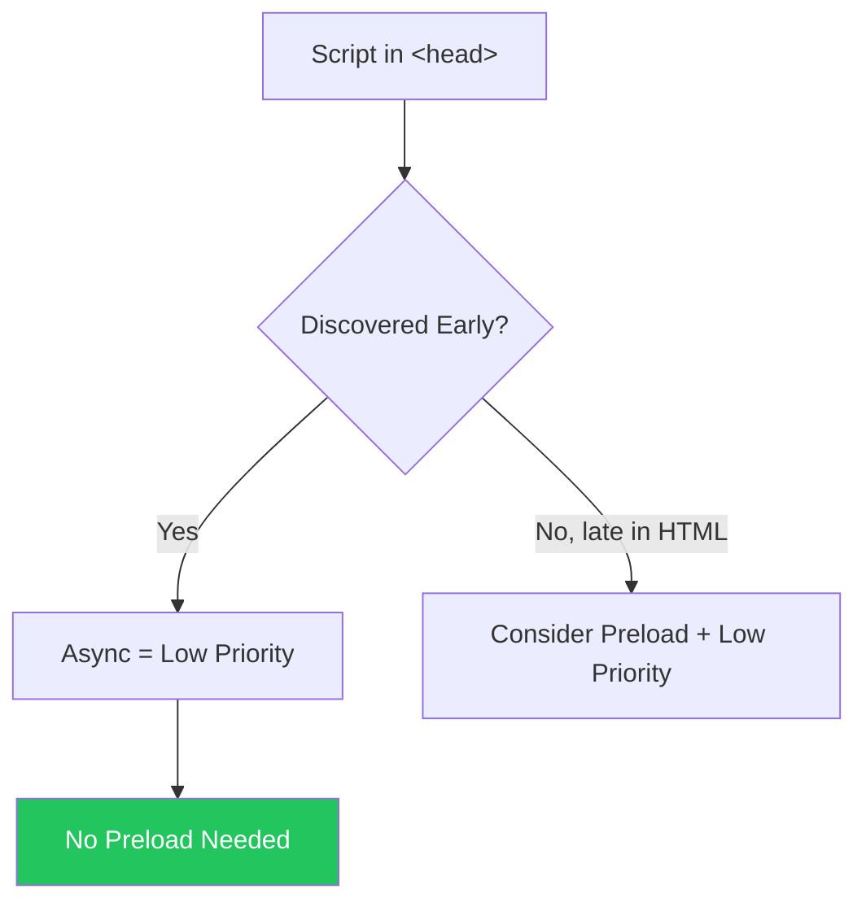
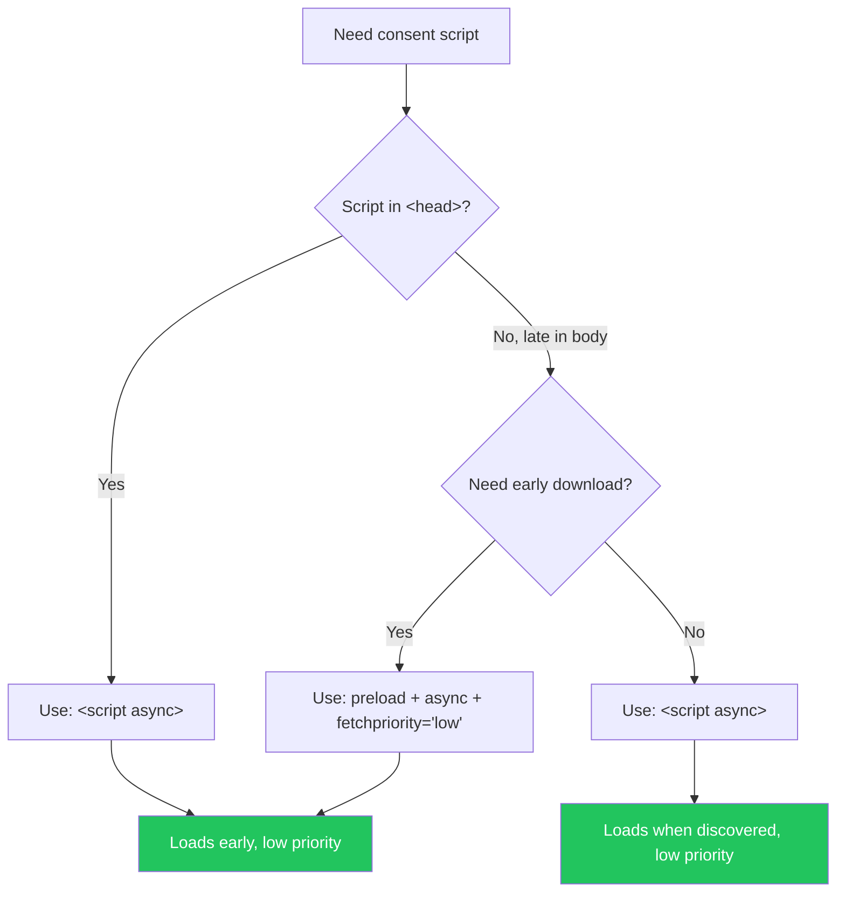

import snippet from '../../snippets/Loading/Validate-Preload-Async-Defer-Scripts.js?raw'
import { Snippet } from '../../components/Snippet'

# Validate Preload on Async/Defer Scripts

### Overview

Detects preload resource hints for scripts that use `async` or `defer` attributes. This is an anti-pattern that wastes bandwidth and can hurt performance by artificially elevating the priority of resources that should load at lower priority.

**Why this matters:**

| Issue                     | Impact                    | Explanation                                                                                      |
| ------------------------- | ------------------------- | ------------------------------------------------------------------------------------------------ |
| **Preload + async/defer** | Wrong priority escalation | Elevates async/defer scripts from Low to Medium/High priority, competing with critical resources |
| **Bandwidth competition** | Delays LCP                | Preloaded scripts compete with CSS, fonts, and LCP images for bandwidth                          |
| **Wasted bytes**          | Extra requests            | Browser may fetch the resource twice if preload doesn't match script attributes                  |
| **False optimization**    | Maintenance burden        | Adds complexity without performance benefit                                                      |

**Script loading priorities in Chrome:**

| Strategy                                                  | Network Priority   | Execution Priority | Blocks Parser | Use Case                                  |
| --------------------------------------------------------- | ------------------ | ------------------ | ------------- | ----------------------------------------- |
| `<script>` in `<head>`                                    | Medium/High        | VeryHigh           | ✅ Yes        | Critical scripts affecting FMP layout     |
| `<link rel=preload>` + `<script async>`                   | **Medium/High** ⚠️ | High               | Briefly       | ⚠️ Anti-pattern for most cases            |
| `<link rel=preload>` + `<script async fetchpriority=low>` | Lowest/Low         | High               | Briefly       | ✅ Early discovery + low priority (valid) |
| `<script async>`                                          | Lowest/Low         | High               | Briefly       | Independent scripts (analytics, ads)      |
| `<script defer>`                                          | Lowest/Low         | VeryLow            | ❌ No         | Scripts needing DOM, running in order     |
| `<script>` at end of `<body>`                             | Medium/High        | Low                | Briefly       | Legacy pattern (use defer instead)        |
| `<script defer>` at end of `<body>`                       | Lowest/Low         | VeryLow            | ❌ No         | Non-critical occasional features          |

> **Key insight:** Adding `preload` to an `async` or `defer` script elevates it from **Lowest/Low** to **Medium/High** network priority, causing it to compete with critical resources. This is rarely what you want! Source: [JavaScript Loading Priorities in Chrome](https://addyosmani.com/blog/script-priorities/) by [Addy Osmani](https://addyosmani.com/)

**How async/defer work:**


_Diagram comparing script loading strategies. Source: [JavaScript modules - module vs script | V8](https://v8.dev/features/modules#module-vs-script)_

**Why not to preload async/defer scripts:**

1. **Async scripts** naturally load at **Lowest/Low** network priority (good!)
2. **Defer scripts** also load at **Lowest/Low** network priority (also good!)
3. **Adding preload** escalates them to **Medium/High** priority (bad!)
4. **The result**: They compete with critical CSS, fonts, and LCP images for bandwidth
5. **Performance impact**: Can delay LCP by 100-500ms on slower connections

**Priority escalation example:**

```
Without preload:
├── CSS: Medium/High priority ✅
├── Fonts: Medium/High priority ✅
├── LCP image: Medium/High priority ✅
└── async script: Lowest/Low priority ✅
·
With preload on async script:
├── CSS: Medium/High priority (now competing) ⚠️
├── Fonts: Medium/High priority (now competing) ⚠️
├── LCP image: Medium/High priority (now competing) ⚠️
└── Preloaded async script: Medium/High priority ❌
```

> **Key insight:** If a script has `async` or `defer`, it's already declared as **"not critical for initial render"**. Preloading contradicts that by elevating its priority to compete with truly critical resources!

### Snippet

<Snippet code={snippet} />

### Understanding the Results

**Summary Section:**

- Total count of preloaded scripts
- Valid preloads (blocking scripts that may benefit)
- Issues detected

**Issue Types:**

| Type                      | Severity | Description                                                           |
| ------------------------- | -------- | --------------------------------------------------------------------- |
| **Preload + async/defer** | Error    | Anti-pattern: script already loads non-blocking without fetchpriority |
| **Module preload**        | Warning  | ES module using rel="preload" instead of rel="modulepreload"          |
| **Orphan preload**        | Warning  | Preloaded script not found or loaded                                  |

**Valid Preload Types:**

| Type                  | Description                                                                    |
| --------------------- | ------------------------------------------------------------------------------ |
| **Blocking scripts**  | Scripts without async/defer that may benefit from preload                      |
| **Mitigated pattern** | Preload + async/defer with fetchpriority="low" (early discovery, low priority) |
| **Dynamic scripts**   | Scripts loaded via import(), code-splitting, or injection                      |

> **Note:** Dynamic scripts (loaded via `import()` or code-splitting) don't appear in the DOM but are visible in the Performance API. The snippet detects these by checking resource timing entries and classifies them separately from truly orphaned preloads.

**Anti-patterns Table:**

| Column           | Description                                                       |
| ---------------- | ----------------------------------------------------------------- |
| Script           | Filename of the preloaded script                                  |
| Location         | Where the script is placed (head or body)                         |
| Attributes       | async, defer, or type='module' attributes found                   |
| Natural Priority | The script's network priority without preload                     |
| Preload Priority | The elevated priority caused by preload                           |
| fetchPriority    | Value of fetchpriority attribute (shows if mitigation is missing) |
| Issue            | Type of problem detected                                          |

**Recommendations:**

The snippet provides specific guidance on:

1. Which preloads to remove (async/defer scripts without fetchpriority="low")
2. How to mitigate if preload is needed (add fetchpriority="low" to script tag)
3. What to preload instead (critical resources like fonts, CSS, LCP images)
4. Correct usage of rel="modulepreload" for ES modules

### Real-World Example

**❌ Anti-pattern (hurts performance):**

```html
<!-- Preloading Google Analytics (async) - BAD -->
<link rel="preload" href="https://www.google-analytics.com/analytics.js" as="script" />
<script async src="https://www.google-analytics.com/analytics.js"></script>

<!-- Result: Analytics competes with critical resources like fonts/CSS -->
```

**✅ Correct approach:**

```html
<!-- No preload - async is enough -->
<script async src="https://www.google-analytics.com/analytics.js"></script>

<!-- Save preload for truly critical resources -->
<link rel="preload" href="/critical-font.woff2" as="font" type="font/woff2" crossorigin />
<link rel="preload" href="/hero-image.webp" as="image" fetchpriority="high" />
```

### Why This Matters for Core Web Vitals

**Impact on LCP (Largest Contentful Paint):**

If you preload non-critical async scripts, they compete for bandwidth with:

- LCP image
- Critical CSS
- Web fonts used above the fold

This can measurably delay your LCP, especially on slower connections and bandwidth-constrained devices. The actual impact depends on your site's resource size, connection speed, and number of competing resources.

**Priority order reality:**

```
Without preload:
├── CSS (high priority)
├── Fonts (high priority)
├── LCP image (high priority)
└── Async scripts (low priority) ✅
·
With wrong preload:
├── Preloaded async script (high priority) ❌
├── CSS (competing)
├── Fonts (competing)
└── LCP image (competing)
```

### When Is Preload + Script Actually Appropriate?

According to [JavaScript Loading Priorities](https://addyosmani.com/blog/script-priorities/), preload is appropriate only for very specific cases:

**Valid use case: `<link rel=preload>` + `<script async>`**

For scripts that:

1. **Generate critical content** needed for First Meaningful Paint
2. **Shouldn't affect above-the-fold layout**
3. **Are discovered late** in the HTML

```html
<!-- Valid: Critical content generator, discovered late -->
<link rel="preload" href="/critical-content-generator.js" as="script" />
<!-- ... lots of HTML ... -->
<script src="/critical-content-generator.js" async></script>
```

**⚠️ Warning:** This is a rare edge case. Most scripts should NOT be preloaded.

**Better alternatives for common cases:**

```html
<!-- For framework/polyfills needed early -->
<script src="/framework.js"></script>
<!-- In <head>, blocking -->

<!-- For scripts needing DOM -->
<script src="/app.js" defer></script>
<!-- Loads at Low priority, executes after parse -->

<!-- For independent scripts -->
<script src="/analytics.js" async></script>
<!-- Loads at Low priority, no preload needed -->
```

### ES Modules: Use `modulepreload`, Not `preload`

ES modules (`type="module"`) behave like `defer` scripts by default, loading at low priority. If you need to preload them, use the **`rel="modulepreload"`** attribute instead of `rel="preload"`:

**❌ Incorrect (detected as anti-pattern):**

```html
<link rel="preload" href="/app.js" as="script" />
<script type="module" src="/app.js"></script>
```

**✅ Correct approach for modules:**

```html
<link rel="modulepreload" href="/app.js" />
<script type="module" src="/app.js"></script>
```

**Key differences:**

- `rel="modulepreload"` understands module imports and preloads dependencies
- `rel="preload" as="script"` treats it as a regular script (wrong priority escalation)
- Module scripts already defer by default, so avoid unnecessary preloading

**Learn more:** [MDN: `<link rel="modulepreload">`](https://developer.mozilla.org/en-US/docs/Web/HTML/Attributes/rel/modulepreload)

### Alternative Fix: Using `fetchpriority="low"`

If you need to keep the preload for early discovery (e.g., the script is defined late in the HTML but needs to start downloading early), you can use `fetchpriority="low"` on the **script tag** to reduce its bandwidth priority while keeping the preload:

**❌ Problem: Preload escalates async script priority**

```html
<link rel="preload" href="/analytics.js" as="script" />
<!-- ... -->
<script async src="/analytics.js"></script>
<!-- Priority escalated to Medium/High, competes with critical resources -->
```

**✅ Solution: Keep preload for discovery, but lower script priority**

```html
<link rel="preload" href="/analytics.js" as="script" />
<!-- ... -->
<script async src="/analytics.js" fetchpriority="low"></script>
<!-- Downloaded early, but at low priority - doesn't compete with LCP -->
```

**When to use this approach:**

- Script is discovered late in HTML but should start downloading early
- You need early discovery but don't want bandwidth competition
- The script is truly async/defer and doesn't need high priority

**Note:** The `fetchpriority` attribute on the `<script>` tag takes precedence over the preload hint priority. However, **removing the preload entirely** is usually the simpler and safer fix for most cases.

**Learn more:** [MDN: `fetchpriority`](https://developer.mozilla.org/en-US/docs/Web/API/HTMLScriptElement/fetchPriority)

### Real-World Case: Third-Party Consent Scripts

A common scenario where this anti-pattern appears is with third-party consent management scripts (cookie banners, GDPR compliance, etc.). Developers often think: "I want it async, but I need it now" and reach for preload. Let's analyze the tradeoffs and solutions.

#### The Problem

**Common (incorrect) approach:**

```html
<!-- ❌ Anti-pattern: Preload + async without mitigation -->
<link rel="preload" href="https://cdn.example.com/consent.js" as="script" />
<script async src="https://cdn.example.com/consent.js"></script>
```

**Why developers do this:**

- Want the consent banner to appear quickly (early discovery)
- Don't want to block page rendering (async)
- Assume preload + async is the best of both worlds

**What actually happens:**



#### Proposed Alternative: `fetchpriority="high"`

Some developers consider using `fetchpriority="high"` instead:

```html
<!-- ⚠️ Still problematic -->
<script async src="https://cdn.example.com/consent.js" fetchpriority="high"></script>
```

**Why this doesn't solve the problem:**



Using `fetchpriority="high"` on an async script has the **same negative effect** as preloading it - both artificially escalate the priority and cause bandwidth competition.

> **Note:** This priority escalation applies to scripts discovered during initial HTML parsing. Dynamically inserted scripts (via JavaScript) may behave differently depending on when they're injected.

#### Solution 1: Preload with Low Priority (Best Balance)

If you truly need early discovery but don't want priority escalation:

```html
<!-- ✅ Early discovery + low priority -->
<link rel="preload" href="https://cdn.example.com/consent.js" as="script" fetchpriority="low" />
<script async src="https://cdn.example.com/consent.js" fetchpriority="low"></script>
```

**How this works:**



**Benefits:**

- ✅ Script discovered and starts downloading early
- ✅ Stays at Low priority (doesn't compete with LCP)
- ✅ Still loads async (non-blocking)
- ✅ Best of both worlds

#### Solution 2: Just Use Async (Simplest)

If the script tag is already in `<head>`, preload may not be necessary:

```html
<!-- ✅ Simple and effective if script is in <head> -->
<head>
  <script async src="https://cdn.example.com/consent.js"></script>
  <!-- Other head content -->
</head>
```

**When this is sufficient:**



**Why this works:**

- Script in `<head>` is discovered immediately
- Async loads at Lowest/Low priority naturally
- No preload overhead or complexity needed

#### Priority Comparison: Consent Script Scenarios

| Approach                                                  | Network Priority | LCP Impact | Complexity | Recommendation                 |
| --------------------------------------------------------- | ---------------- | ---------- | ---------- | ------------------------------ |
| `<script async>` in `<head>`                              | Lowest/Low       | ✅ None    | Low        | **Best for most cases**        |
| `<link rel=preload>` + `<script async fetchpriority=low>` | Lowest/Low       | ✅ None    | Medium     | Good if script is late in HTML |
| `<link rel=preload>` + `<script async>`                   | ⚠️ Medium/High   | ❌ High    | Medium     | **Anti-pattern - avoid**       |
| `<script async fetchpriority=high>`                       | ⚠️ High          | ❌ High    | Low        | **Anti-pattern - avoid**       |

#### Decision Tree for Consent Scripts



> **Note:** For scripts late in `<body>` where early download is not needed, plain `<script async>` is appropriate because the consent banner is non-critical. The script will load when discovered by the parser, which is acceptable for this use case.

#### Key Takeaway

For consent scripts and other third-party resources:

1. **Don't use `fetchpriority="high"`** - it causes the same problems as preload
2. **If script is in `<head>`** - simple `async` is usually enough
3. **If you must preload** - always add `fetchpriority="low"` to the script tag
4. **Remember**: Consent banners are not critical for LCP - let them load at low priority

The goal is **early start, low priority** - not high priority. Users care more about fast LCP than seeing the consent banner 50ms earlier.

### Understanding Script Priorities (Chrome)

Based on [Addy Osmani's research](https://addyosmani.com/blog/script-priorities/), here's how different script loading strategies affect priorities:

**Scripts in `<head>` (framework/polyfills):**

- Network: Medium/High
- Execution: VeryHigh (blocks parser)
- Use for: Scripts affecting FMP layout, must run before other scripts

**`<script defer>` (recommended for most scripts):**

- Network: **Lowest/Low** ✅
- Execution: VeryLow (after parsing)
- Use for: Scripts needing DOM, non-critical content, interactive features used by >50% of sessions

**`<script async>` (analytics, ads):**

- Network: **Lowest/Low** ✅
- Execution: High (interrupts parser briefly)
- Use for: Independent scripts, but be careful - execution priority is inconsistent

**`<link rel=preload>` + `<script async>` (rare case):**

- Network: **Medium/High** ⚠️
- Execution: High
- Use for: Critical content generators (not layout), discovered late
- Warning: Rarely needed, often misused

**`<script>` at end of `<body>` (legacy):**

- Network: Medium/High
- Execution: Low
- Problem: Still scheduled at high network priority despite appearing late
- Better alternative: Use `defer` instead

**Key takeaway:** Defer gives you **Lowest/Low** network priority (good for non-critical scripts) while preload forces **Medium/High** priority (should only be used for truly critical resources).

### Common Sources of This Issue

| Source                      | Why It Happens                                                               |
| --------------------------- | ---------------------------------------------------------------------------- |
| **Tag managers**            | Auto-add preload to all scripts including async ones                         |
| **Performance plugins**     | Generic "preload all scripts" rules                                          |
| **Copy-paste optimization** | Adding preloads without understanding the script's loading strategy          |
| **Outdated advice**         | Old articles suggesting "preload everything"                                 |
| **Misunderstanding async**  | Assuming async always needs help, not realizing it already loads efficiently |

### Advanced Strategy: Server-Side Conditional Loading

For production scenarios with consent scripts, a more sophisticated approach involves server-side logic to conditionally prioritize the script only when needed (first visit). This strategy considers that:

- **First visit**: CMP banner IS critical (might even be the LCP element) - prioritize it
- **Returning visits**: CMP script can load at low priority (consent already stored in cookie)

**Key insight:** If you have a consent cookie, the user has already made their choice. The CMP script doesn't need high priority because the banner won't be shown. This server-side detection allows you to optimize resource prioritization dynamically based on user state.

This approach is beyond the scope of this validation snippet, as it requires architectural changes to your server-side rendering logic.

**For a complete implementation guide:** _A detailed blog post is coming soon on joanleon.dev_

### Further Reading

- [JavaScript Loading Priorities](https://addyosmani.com/blog/script-priorities/) | Addy Osmani - Detailed breakdown of network and execution priorities
- [Negative performance impact from preloading](https://www.debugbear.com/blog/resource-hints-rel-preload-prefetch-preconnect#negative-performance-impact-from-preloading) | DebugBear
- [Preload critical assets](https://web.dev/articles/preload-critical-assets) | web.dev
- [Script loading strategies](https://developer.chrome.com/docs/lighthouse/performance/render-blocking-resources) | Chrome Developers
- [Resource prioritization](https://web.dev/articles/prioritize-resources) | web.dev
- [Andy Davies on font preloading](https://andydavies.me/blog/2019/02/12/preloading-fonts-and-the-puzzle-of-priorities/) | Andy Davies
